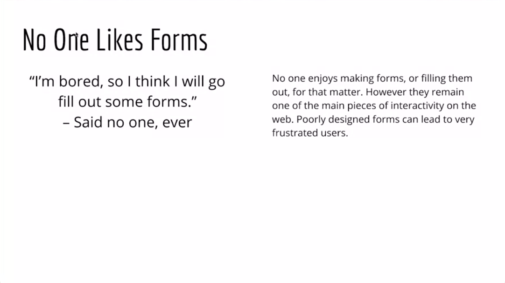
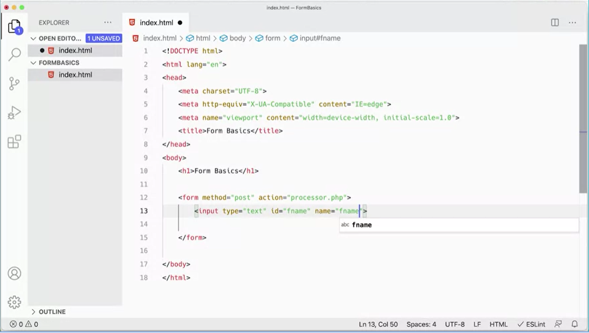
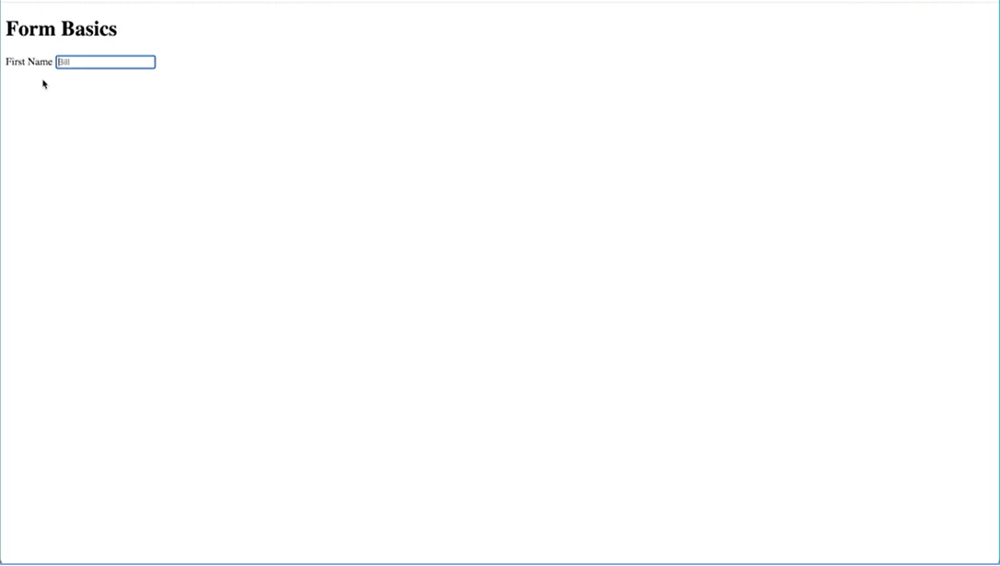
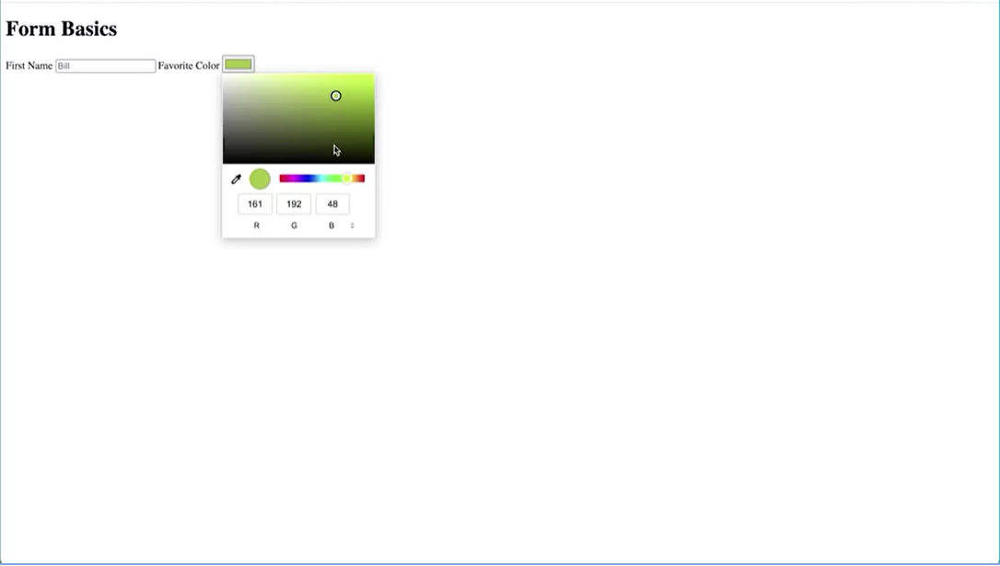
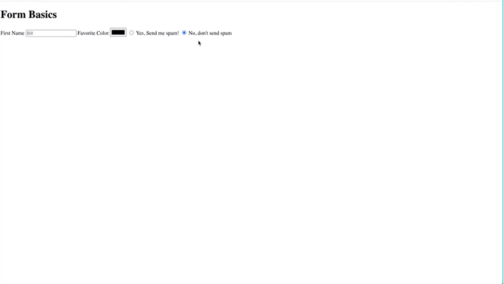
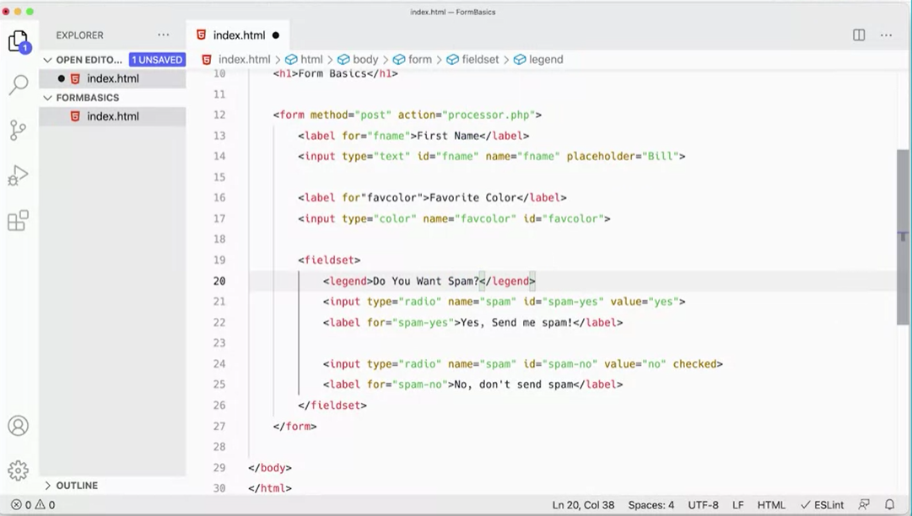
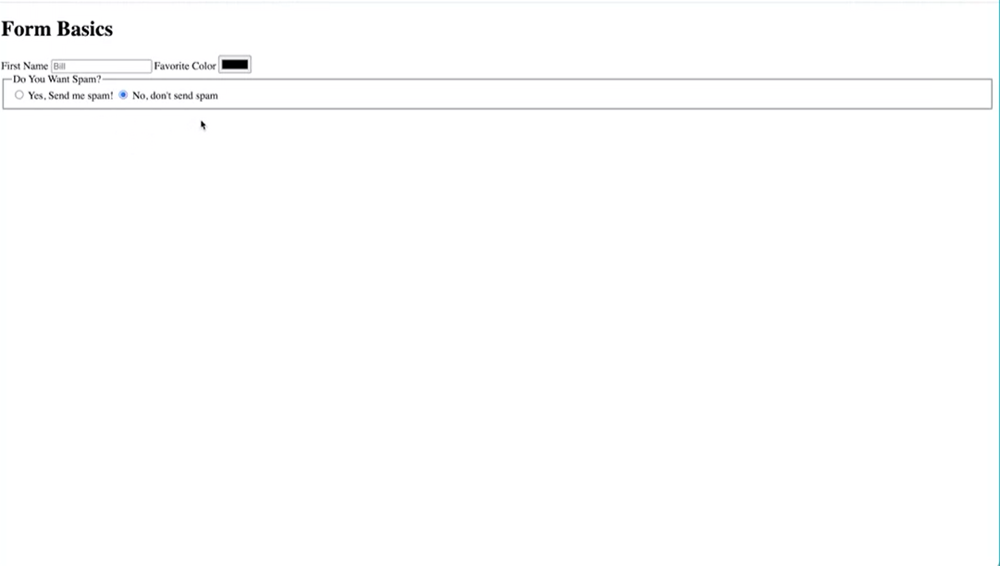
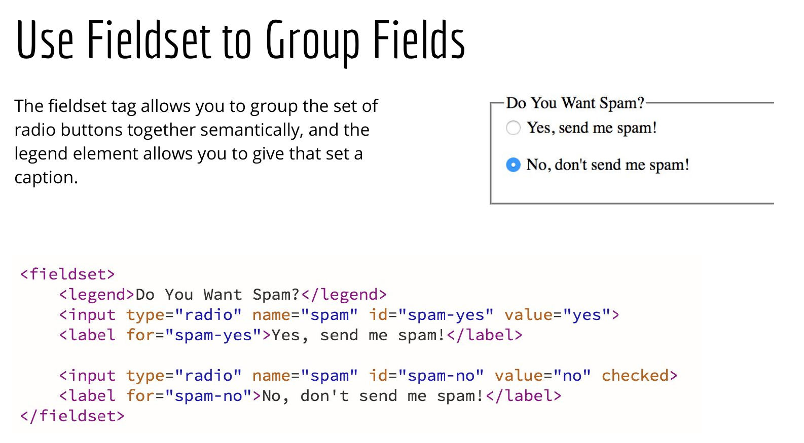
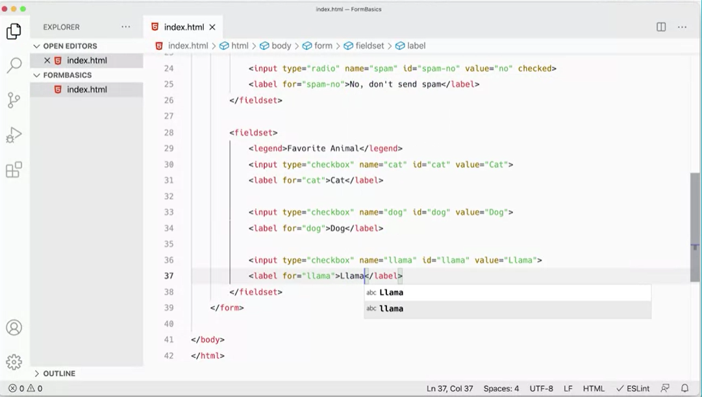

<h1 align="center">Data Manipulation in JavaScript</h1>
<h6 align="center">(by William Mead, Lecturer - University of California @Davis)</h6>
<!--~~~~~~~~~~~~~~~~~~~~~~~~~~~~~~~~~~~~~~~~~~~~~~~~~~~~~~~~~~~~~~~~~~~~~~~~~~~~~~~~~~~~~~~~~~~~-->
<!--~~~~~~~~~~~~~~~~~~~ readme.md of UC-Davis-JS-Basics in bbauska.github.io ~~~~~~~~~~~~~~~~~~~-->
<!--~~~~~~~~~~~~~~~~~~~~~~~~~~~~~~~~~~~~~~~~~~~~~~~~~~~~~~~~~~~~~~~~~~~~~~~~~~~~~~~~~~~~~~~~~~~~-->
<!--~~~~~~~~~~~~~~~~ 01/02. javascript (coffee cup) logo / uc davis logo (01) ~~~~~~~~~~~~~~~~~~-->

<h2><a href="#table-of-contents">Table of Contents</a></h2>

<a href="https://traceyh.hashnode.dev/animation-with-css-and-js?source=more_articles_bottom_blogs">
  Animation with CSS &amp; JS</a>

<a href="https://traceyh.hashnode.dev/guide-basic-template-for-creating-a-modal?source=more_articles_bottom_blogs">
  Basic Modal Template</a>

<a href="https://traceyh.hashnode.dev/overview-of-objects-prototypes?source=more_articles_bottom_blogs">
  Overview of Objects &amp; Prototypes:</a>

<a href="https://traceyh.hashnode.dev/javascript-dom-manipulation-cheat-sheet">JS DOM Manipulation Cheat Sheet</a>

<!--~~~~~~~~~~~~~~~~~~~~~~~~~~ about data manipulation in javascript ~~~~~~~~~~~~~~~~~~~~~~~~~~~-->
<h3>About this Course</h3>

This course builds on the skills from the previous course and goes
further into managing and manipulating data with JavaScript. You will
learn methods for validating and handling data provided by users or
coming from an external data source. This course includes a challenge in
the form of a seat reservation system, as well as a project that pulls
data in from an external data source.

The course objectives include validation basics in JavaScript and
jQuery; jQuery form validation plugin features; arrow functions;
asynchronous functions; and the JavaScript event loop.

<h2>Syllabus</h2>

<h2>Week 1</h2>

<h2>Getting Started & Collecting and Validating Data From Users</h2>

In this module, you will be able to review and create HTML form
elements, in preparation for doing form validation. You will be
introduced to basic form validation and be able to discuss the
differences between server side and client side validation, as well as
the purpose of each type. You will be able to explore some of the
advanced features available in the jQuery validation plugin, and take
full control of the way information is presented to users.

<h6>18 videos, 7 readings</h6>

>#### [**1.00 A Note from UC Davis**](#ch1-00-note)
>#### [**1.00 Welcome to this Course!**](#ch1-00-welcome)
>#### [**1.01 Introduction to HTML Forms**](#ch1-01)

<ul>
  <li><a href="./zip/1.01-Basic-Form-HTML-START.zip" 
    target="_blank" rel="noopener noreferrer">
	1.01 Basic Form HTML START (download ZIP)</a></li>
</ul>

>#### [**1.02 Adding a Label**](#ch1-02)
>#### [**1.03 Radio Button Input Types**](#ch1-03)
>#### [**1.04 Using the Checkboxes Input Types**](#ch1-04)
>#### [**1.05 Using Textarea Elements**](#ch1-05)
>#### [**1.06 Styling Your Forms**](#ch1-06)

<ul>
  <li><a href="./pdf/1.06-Basic-HTML-Form-Elements.pdf" 
    target="_blank" rel="noopener noreferrer">
	1.06 Basic HTML Form Elements (display PDF)</a></li>
</ul>

>#### [**1.07 Introduction to Basics of Form Validation**](#ch1-07)

<ul>
  <li><a href="./pdf/1.07-Basic-Form-Examples-START.zip" 
    target="_blank" rel="noopener noreferrer">
	1.07 Basic Form Examples START (download ZIP)</a></li>
</ul>

>#### [**1.08 Processing the Form**](#ch1-08)
>#### [**1.09 Backend Validation with PHP**](#ch1-09)
>#### [**1.10 Plain JavaScript Validation - HTML**](#ch1-10)
>#### [**1.11 jQuery Form Validation**](#ch1-11)
>#### [**1.12 jQuery Validator Plugin - Part 1**](#ch1-12)
>#### [**1.13 jQuery Validator Plugin - Part 2**](#ch1-13)

<ul>
  <li><a href="./pdf/1.13-Form-Validation-Basics.pdf" 
    target="_blank" rel="noopener noreferrer">
	1.13 Form Validation Basics (display PDF)</a></li>
</ul>

>#### [**1.14 Intro to Advanced Form Validation**](#ch1-14)

<ul>
  <li><a href="./zip/1.14-Advanced-Validation-START.zip" 
    target="_blank" rel="noopener noreferrer">
	1.14 Advanced Validation START (download ZIP)</a></li>
</ul>

>#### [**1.15 Starting the Script**](#ch1-15)
>#### [**1.16 Checking the Phone Number**](#ch1-16)
>#### [**1.17 Adding Messages**](#ch1-17)
>#### [**1.18 Styling Your Forms**](#ch1-18)

<ul>
  <li><a href="./pdf/1.18-Advanced-jQuery-Validator-Plugin.pdf" 
    target="_blank" rel="noopener noreferrer">
	1.18 Advanced jQuery Validator Plugin (display PDF)</a></li>
  <li><a href="./shortcut to module 1 reflection"
    target="_blank" rel="noopener noreferrer">
	1.18 Module 1 Reflection (shortcut URL)</a></li>
</ul>

<h2>Week 2</h2>

<h2>A Deeper Dive Into JavaScript</h2>

In this module, you will be introduced to the concept of prototypical
inheritance in JavaScript, and be able to demonstrate how it affects
objects. You will be able to take a deeper look at arrow functions as an
alternative to traditional function expression syntax. You will be able
to convert function expressions into arrow functions when appropriate.
You will be introduced to a larger scripting project with more
functionality and complexity, which you will be able to start in the
next module.

<h6>9 videos, 5 readings</h6>

>#### [**2.00 Module 2 Introduction**](#ch2-00-intro)
>#### [**2.01 Introduction to Prototypes &amp; Inheritance**](#ch2-01)
>#### [**2.02 iPhone Example**](#ch2-02)
>#### [**2.03 Overriding Inheritance**](#ch2-03)
>#### [**2.04 Another Inheritance Example**](#ch2-04)
>#### [**2.05 hasOwnProperty()**](#ch2-05)

<ul>
  <li><a href="./pdf/2.05-Prototypes-Inheritance.pdf" 
    target="_blank" rel="noopener noreferrer">
	2.05 Prototypes &amp; Inheritance (display PDF)</a></li>
</ul>

>#### [**2.06 Introduction to Arrow Functions**](#ch2-06)
>#### [**2.07 Parameters and Arrow Functions**](#ch2-07)
>#### [**2.08 Constructor Function Expression**](#ch2-08)

<ul>
  <li><a href="./pdf/2.08-Arrow-Functions.pdf" 
    target="_blank" rel="noopener noreferrer">
	2.08 Arrow Functions (display PDF)</a></li>
  <li><a href="./pdf/2.08-Arrow-Function-Challenges.zip" 
    target="_blank" rel="noopener noreferrer">
	2.08 Arrow Function Challenges (display PDF)</a></li>
</ul>

>#### [**2.09 Seat Reservation Program Introduction**](#ch2-09)

<ul>
  <li><a href="./zip/2.09-Seat-Reservation-Part-1-START.zip" 
    target="_blank" rel="noopener noreferrer">
	2.09 Seat Reservation Part 1 START (download ZIP)</a></li>
  <li><a href="./pdf/2.09-Seat-Reservation-Program.pdf" 
    target="_blank" rel="noopener noreferrer">
	2.09 Seat Reservation Program (display PDF)</a></li>
  <li><a href="./shortcut to module 2 reflection"
    target="_blank" rel="noopener noreferrer">
	2.09 Module 2 Reflection (shortcut URL)</a></li>
</ul>

<h2>Week 3</h2>

<h2>Seat Reservation Program</h2>

In this module, you will given a possible solution to the challenge
presented to you in the previous module. You will be able to refactor
code using best practices and fix final bugs in the application. You
will be able to create a general function for getting data from the
seatReservations object and use DOM manipulation techniques and logical
flow control structures to update the necessary elements on the web
page. 

You will be able to use JavaScript to create 300 unique objects
following a specific naming pattern and be able to demonstrate
refactoring code and DRY principles in programming. You will be able to
solve possible errors the user may encounter when reserving seats and be
able to display and hide the seat reservation form. You will be able to
add data to an object based on user selection in the interface and
practice DOM manipulation techniques.

<h6>29 videos, 8 readings</h6>

>#### [**3.00 Module 3 Introduction**](#ch3-00-intro)
>#### [**3.01 Introduction to Creating the Seats**](#ch3-01)

<ul>
  <li><a href="./zip/3.01-Seat-Reservation-Part-1-START.zip" 
    target="_blank" rel="noopener noreferrer">
	3.01 Seat Reservation - Part 1 START (download ZIP)</a></li>
  <li><a href="./zip/3.01-Seat-Reservation-Data-HTML.zip" 
    target="_blank" rel="noopener noreferrer">
	3.01 Seat Reservation - Data &amp; HTML (download ZIP)</a></li>
</ul>

>#### [**3.02 The Left Section**](#ch3-02)
>#### [**3.03 The Right Section**](#ch3-03)
>#### [**3.04 The Middle Section**](#ch3-04)
>#### [**3.05 Figuring Out Variables**](#ch3-05)
>#### [**3.06 Adding Switch Statements**](#ch3-06)
>#### [**3.07 Adding the Loop and HTML**](#ch3-07)
>#### [**3.08 Using an Arrow Function**](#ch3-08)

<ul>
  <li><a href="./pdf/3.08-Seat-Reservation-Part-1.pdf" 
    target="_blank" rel="noopener noreferrer">
	3.08 Seat Reservation Part 1 (display PDF)</a></li>
</ul>

>#### [**3.09 The reservedSeats Object**](#ch3-09)
>#### [**3.10 Affecting the DOM**](#ch3-10)
>#### [**3.11 With IIFE Closure**](#ch3-11)

<ul>
  <li><a href="./pdf/3.11-Seat-Reservation-Part-2.pdf" 
    target="_blank" rel="noopener noreferrer">
	3.11 Seat Reservation Part 2 (display PDF)</a></li>
</ul>

>#### [**3.12 Adding an Array**](#ch3-12)
>#### [**3.13 Two Pieces Needed**](#ch3-13)
>#### [**3.14 Getting the Seat ID**](#ch3-14)
>#### [**3.15 Getting the Index**](#ch3-15)
>#### [**3.16 Adding the If Statement**](#ch3-16)
>#### [**3.17 The Finished Function**](#ch3-17)

<ul>
  <li><a href="./pdf/3.17-Seat-Reservation-Part-3.pdf" 
    target="_blank" rel="noopener noreferrer">
	3.17 Seat Reservation Part 3 (display PDF)</a></li>
</ul>

>#### [**3.18 Adding the Form HTML**](#ch3-18)

<ul>
  <li><a href="./zip/3.18-Index-HTML-START.zip" 
    target="_blank" rel="noopener noreferrer">
	3.18 Index HTML START (download ZIP)</a></li>
</ul>

>#### [**3.19 Open and Close Form Event Handlers**](#ch3-19)
>#### [**3.20 manageConfirmForm Function**](#ch3-20)
>#### [**3.21 Updating the Else Statement**](#ch3-21)
>#### [**3.22 Fixing Bugs on the Form**](#ch3-22)
>#### [**3.23 Fixing More Bugs**](#ch3-23)
>#### [**3.24 Additional Condition Statement**](#ch3-24)

<ul>
  <li><a href="./pdf/3.24-Seat-Reservation-Part-4.pdf" 
    target="_blank" rel="noopener noreferrer">
	3.24 Seat Reservation Part 4 (display PDF)</a></li>
</ul>

>#### [**3.25 Setting Up the Final Steps**](#ch3-25)

<ul>
  <li><a href="./zip/3.25-Styles-CSS-START.zip" 
    target="_blank" rel="noopener noreferrer">
	3.25 Styles CSS START (download ZIP)</a></li>
</ul>

>#### [**3.26 Back to the Object**](#ch3-26)
>#### [**3.27 Adding Each Record**](#ch3-27)
>#### [**3.28 Clean Up**](#ch3-28)
>#### [**3.29 Final Fixes**](#ch3-29)

<ul>
  <li><a href="./pdf/3.29-Seat-Reservation-Part-5.pdf" 
    target="_blank" rel="noopener noreferrer">
	3.29 Seat Reservation Part 5 (display PDF)</a></li>
  <li><a href="./shortcut to module 3 Reflection"
    target="_blank" rel="noopener noreferrer">
	3.29 Module 3 Reflection (shortcut URL)</a></li>
</ul>

<h2>Week 4</h2>

<h2>Working with Data Asynchronously in JavaScript</h2>

In this module, you will be introduced to asynchronous JavaScript and
explore methods for retrieving data asynchronously. You will be able to
explore the way JavaScript handles events in more detail and be able to
use methods in JavaScript to both send and receive data from a server
file, and build a usable contact form for a website. You will be
introduced to third party APIs and be able to use asynchronous methods
for retrieving and displaying information from these APIs. You\'ll also
be able to explore ways the data coming from third party APIs can be
manipulated. You will also have the chance to work on an Honors project
(if you desire).

<h6>42 videos, 12 readings</h6>

>#### [**4.00 Module 4 Introduction**](#ch4-00-intro)
>#### [**4.01 Introduction to Asynchronous JavaScript**](#ch4-01)

<ul>
  <li><a href="./zip/4.01-Asynchronous-JS-Examples-START.zip" 
    target="_blank" rel="noopener noreferrer">
	4.01 Asynchronous JavaScript Examples START (download ZIP)</a></li>
  <li><a href="https://developer.mozilla.org/en-US/docs/Web/API/FormData"
    target="_blank" rel="noopener noreferrer">
	4.01 Form Data API (shortcut URL)</a></li>
</ul>

>#### [**4.02 Example: XMLHttpRequst - getData();**](#ch4-02)
>#### [**4.03 Example: XMLHttpRequst - useResponse();**](#ch4-03)
>#### [**4.04 jQuery to the Rescue**](#ch4-04)
>#### [**4.05 The Fetch API and Promies - getData();**](#ch4-05)
>#### [**4.06 The Fetch API and Promies - response.text;**](#ch4-06)
>#### [**4.07 Async and Await Keywords**](#ch4-07)
>#### [**4.08 Working with JSON Data**](#ch4-08)
>#### [**4.09 Example 5: OutputHTML Function**](#ch4-09)
>#### [**4.10 Example 6: Async and Await with JSON**](#ch4-10)

<ul>
  <li><a href="./pdf/4.10-Asynchronous-JavaScript.pdf" 
    target="_blank" rel="noopener noreferrer">
	4.10 Asynchronous JavaScript (display PDF)</a></li>
</ul>

>#### [**4.11 Introduction to JavaScript Event Loop**](#ch4-11)

<ul>
  <li><a href="./zip/4.11-JavaScript-Event-Loop-START.zip" 
    target="_blank" rel="noopener noreferrer">
	4.11 JavaScript Event Loop START (download ZIP)</a></li>
</ul>

>#### [**4.12 Example 3**](#ch4-12)
>#### [**4.13 Example 4 &amp; 5**](#ch4-13)
>#### [**4.14 Example 6: setTimeout**](#ch4-14)

<ul>
  <li><a href="./pdf/4.14-no-name-yet.pdf" 
    target="_blank" rel="noopener noreferrer">
	4.14 PDF TITLE GOES HERE (display PDF)</a></li>
</ul>

>#### [**4.15 Creating a Basic jQuery Version**](#ch4-15)

<ul>
  <li><a href="./zip/4.15-Contact-Form-Project-START.zip" 
    target="_blank" rel="noopener noreferrer">
	4.15 Contact Form Project START (download ZIP)</a></li>
</ul>

>#### [**4.16 Loading and Validating Form Data**](#ch4-16)
>#### [**4.17 Sending the Data**](#ch4-17)
>#### [**4.18 Async / Await Version**](#ch4-18)
>#### [**4.19 Getting the Data**](#ch4-19)
>#### [**4.20 Creating a Contact Me Form**](#ch4-20)
>#### [**4.21 Working with Error Messages**](#ch4-21)
>#### [**4.22 The sendData() Function**](#ch4-22)
>#### [**4.23 Updated displayMessage() Function**](#ch4-23)

<ul>
  <li><a href="./pdf/4.23-Async-Sending-Data.pdf" 
    target="_blank" rel="noopener noreferrer">
	4.23 Asynchronous Sending Data (display PDF)</a></li>
</ul>

>#### [**4.24 Course Summary**](#ch4-24)
>#### [**4.25 Introduction to Third Party APIs**](#ch4-25)

<ul>
  <li><a href="./zip/4.25-Studio-Ghibli-Part-1-START.zip" 
    target="_blank" rel="noopener noreferrer">
	4.25 Studio Ghibli Part 1 START (download ZIP)</a></li>
  <li><a href="./shortcut to 4.25 additional resources"
    target="_blank" rel="noopener noreferrer">
	4.25 Module 4.25 Additional Resources (shortcut URL)</a></li>
</ul>

>#### [**4.26 Starting Your Project**](#ch4-26)
>#### [**4.27 Creating the Card**](#ch4-27)
>#### [**4.28 The Whole Function and Sorting Function**](#ch4-28)
>#### [**4.29 Adding a Form**](#ch4-29)
>#### [**4.30 setSort() Function**](#ch4-30)
>#### [**4.31 Running and Changing the Sort**](#ch4-31)
>#### [**4.32 Fixing the Current Flow**](#ch4-32)
>#### [**4.33 One More Thing**](#ch4-33)
>#### [**4.34 Getting Started and Updating createCard() Function**](#ch4-34)

<ul>
  <li><a href="./zip/4.34-Studio-Ghibli-Part-2-START.zip" 
    target="_blank" rel="noopener noreferrer">
	4.34 Studio Ghibli Part 2 START (download ZIP)</a></li>
  <li><a href="./shortcut to 4.34 additional resources"
    target="_blank" rel="noopener noreferrer">
	4.34 Module 4.34 Additional Resources (shortcut URL)</a></li>
</ul>

>#### [**4.35 Helper Function and People Card**](#ch4-35)
>#### [**4.36 Testing the People Card**](#ch4-36)
>#### [**4.37 Click Handlers, Alerts, and Variables**](#ch4-37)
>#### [**4.38 Data Promise and Update Create Card**](#ch4-38)
>#### [**4.39 Looking At Locations**](#ch4-39)
>#### [**4.40 Dealing With Errors**](#ch4-40)
>#### [**4.41 Species and Vehicle Cards**](#ch4-41)
>#### [**4.42 Fixing the Sort**](#ch4-42)

<ul>
  <li><a href="./pdf/4.42-no-name-yet.pdf" 
    target="_blank" rel="noopener noreferrer">
	4.42 Presentation (display PDF)</a></li>
</ul>

<h2 id="ch1-00-note">1.00 A Note from UC Davis (10 min)</h2>

<h3>Welcome to this course!</h3>

We are delighted to be a part of your continuing education. This course
will provide you with a variety of tools and learning opportunities, to
include video lectures, readings, assessments, peer reviews, and an
opportunity to contribute to the Coursera learning community in the
discussion forums.

In each of the lesson sections, you'll find learning objectives, lecture
videos, readings, activities, and an opportunity to test your knowledge
in quiz format. In some of the module sections you'll also work on
assignments and grade the work of your peers. A peer-review assignment,
is one where you and your fellow learners have an opportunity to review
and grade each other's work. We'll dive more into peer reviews later on
in this course.

When navigating the course, you can find available **course resources**
under each of the lecture videos in a section labeled
"[Downloads]{.underline}" -- here you can download the lecture video,
view transcripts, PDFs of the lecture slides, and **find additional
readings or files**.

If you run into any issues during this course, **learner support** is
available to all Coursera students. The link for Coursera's Learner
support is included below. The [Help Center/Learner
Support](https://learner.coursera.help/hc/en-us) includes topics such as
account setup, payments, enrollment questions, and troubleshooting
common problems.

If you find any content issues, be sure to let the course staff know by
**flagging the lecture**, assignment, reading, or quiz and this will
inform us of where these issues occur. Here is the link for more
information on how to [Flag an
Issue](https://learner.coursera.help/hc/en-us/articles/208280106-Report-a-problem-with-a-course) -
it is also listed below.

One of the great things about Coursera courses is that they are
self-paced. The course dates are based on the average time it takes to
complete a course. However, if you need additional time to complete a
course you can **reset your deadlines** with no penalties. More
information on resetting deadlines can be found here: [Assignment
Deadlines](https://learner.coursera.help/hc/en-us/articles/208279866-Assignment-deadlines)

Need additional help during your course session? Be sure to utilize the
**discussion forums** and interact with your fellow peers. In this area,
you can ask questions or search for similar issues that have already
been posted in the forums. Learner support is also a great place to find
answers, but specific course content questions can typically be found
and answered in the discussion forums. This is also a great place to
post your assignment if additional peer reviews are needed. Here is a
link with more information on the discussion forums: [Discussion
Forums](https://learner.coursera.help/hc/en-us/articles/208279996-Get-help-with-course-content-in-the-discussion-forums)

Because of the self-paced nature of Coursera courses, this is an
excellent opportunity to show your commitment to your work and the work
of your peers through academic integrity. Be sure to read the Coursera
guidelines and the **Coursera Honor Code** here: [Coursera Honor
Code](https://learner.coursera.help/hc/en-us/articles/209818863-Coursera-Honor-Code)

We look forward to having you in this course. Happy learning!

***UC Davis Coursera Team***

### **Additional Links**:

-   <a href="https://learner.coursera.help/hc/en-us">
  Coursera's Learner Support/Help Center:</a>

-   <a href="https://learner.coursera.help/hc/en-us/articles/208280106-Report-a-problem-with-a-course">
  Flagging a Lecture:</a>

-   <a href="https://learner.coursera.help/hc/en-us/articles/208279866-Assignment-deadlines">
  Assignment Deadlines:</a>

-   <a href="https://learner.coursera.help/hc/en-us/sections/201895903-Peer-reviewed-assignments">
  Peer Reviewed Assignments:</a>

-   <a href="https://learner.coursera.help/hc/en-us/articles/209818863-Coursera-Honor-Code">
  Coursera's Honor Code:</a>

<h2 id="ch1">Week 1 -- Collecting &amp; Validating Data from Users</h2>

<h2 id="ch1-00-obj">Learning Objectives</h2>

-   Create HTML forms using correct syntax.

-   Demonstrate best practices when creating form elements, labels and
    placeholder text.

-   Illustrate validation built into the browser to do basic form
    validation.

-   Use basic features in the jQuery validation plugin to have a little
    more control over the built in browser validation.

-   Practice with advanced features of the jQuery validation plugin.

-   Control feedback to users concerning errors while filling out forms.

<!--~~~~~~~~~~~~~~~~~~~~~~~~~~~~~~~~~~~~~~~~~~~~~~~~~~~~~~~~~~~~~~~~~~~~~~~~~~~~~~~~~~~~~~~~~~~~-->
<h2 id="ch1-00">1.00 Course Introduction (0:33)</h2>
<!--~~~~~~~~~~~~~~~~~~~~~~~~~~~~~~~~~~~~~~~~~~~~~~~~~~~~~~~~~~~~~~~~~~~~~~~~~~~~~~~~~~~~~~~~~~~~-->
<!--~~~~~~~~~~~~~ 03. course introduction to data manipulation in javascript (0x) ~~~~~~~~~~~~~~-->

Hello, and welcome to the first module in our fourth course on
JavaScript. In this module, we\'ll look at forms in HTML, and how to get
data out of forms and process it and validate it. This is a vital thing
to know, and it\'s really important that you learn these skills and
these techniques. Plus, there\'s lots of great practice, and you\'ll
gain a lot of skill along the way. So, let\'s get started, and I look
forward to working through this material with you.

<!--~~~~~~~~~~~~~~~~~~~~~~~~~~~~~~~~~~~~~~~~~~~~~~~~~~~~~~~~~~~~~~~~~~~~~~~~~~~~~~~~~~~~~~~~~~~~-->
<h2 id="ch1-01">1.01 Introduction to HTML Forms (7:28)</h2>
<!--~~~~~~~~~~~~~~~~~~~~~~~~~~~~~~~~~~~~~~~~~~~~~~~~~~~~~~~~~~~~~~~~~~~~~~~~~~~~~~~~~~~~~~~~~~~~-->
<!--~~~~~~~~~~~~~~~~~~~~~~~ 04. introduction to html forms (1.01) (0x) ~~~~~~~~~~~~~~~~~~~~~~~~~-->

Basic html form elements.
<!--~~~~~~~~~~~~~~~~~~~~~~~~~~~~~~~~~~~~~~~~~~~~~~~~~~~~~~~~~~~~~~~~~~~~~~~~~~~~~~~~~~~~~~~~~~~~-->
<!--~~~~~~~~~~~~~~~~~~~~~~~~~~~~~~~ 05. no one likes forms (0x) ~~~~~~~~~~~~~~~~~~~~~~~~~~~~~~~~-->

No one likes forms, I\'m bored, so I think I\'ll go fill out some forms
said no one ever, no one enjoys making forms or filling them out for
that matter. But they do remain one of the main pieces of interactivity
on the web or digital products of any sort. It\'s one of the main ways
that we collect data from users and poorly designed forms can lead to
very frustrated users.

If you have had to fill out a job application recently, you\'ve probably
come across a poorly designed form, they can be very frustrating and if
people don\'t take care to design them properly, then it becomes much
much worse. And as we go forward in this course, we\'ll be looking at
how we can collect data from users and what we can do to make sure that
we\'re getting the correct data from users. And looking at ways in which
we can improve the user experience by designing forms properly.
<!--~~~~~~~~~~~~~~~~~~~~~~~~~~~~~~~~~~~~~~~~~~~~~~~~~~~~~~~~~~~~~~~~~~~~~~~~~~~~~~~~~~~~~~~~~~~~-->
<!--~~~~~~~~~~~~~~~~~~~~~~~~~~~~ 06. example, starting a form (0x) ~~~~~~~~~~~~~~~~~~~~~~~~~~~~~-->

Let\'s get started with that, to start a form we would start with a form
element in HTML and usually there are two attributes that go with the
form element. One is the **method** which would either be set to post or
get generally. And that has to do with how the data is sent and we\'ll
explore that more later exactly what that means. And then the **action** is
the file that the form data is going to be sent to. It could be a
**php** file, like **processor.php** here. That file isn\'t going to
exist in our project, but that would be where the browser would think
okay, when somebody submits this form, that\'s where it\'s going to go
and we\'re going to send the form data, it\'s a **processor.php**. So it
could be a php file, it could be a **PERL** file, it could be any sort
of server side file that\'s going to take that data. Then, do something
with it like send it in an email to somebody or put it in a database or
process it in some other way. Those are the basics. And what I recommend
you do is make a folder on your desktop directory and open it in
**visual studio code.** I have a directory called form basics that I
created. And I\'m going to make a file in it called **index.html**.

<!--~~~~~~~~~~~~~~~~~~~~~~~~~~~~~~~~~~~~~~~~~~~~~~~~~~~~~~~~~~~~~~~~~~~~~~~~~~~~~~~~~~~~~~~~~~~~-->
<!--~~~~~~~~~~~~~~~~~~~~~~~~~~~~~~ 07. basic form template (0x) ~~~~~~~~~~~~~~~~~~~~~~~~~~~~~~~~-->

And just to get used to creating these basic form elements. I\'m going
to create a basic form here. It\'s not going to have a lot of styling
but we can see exactly how these elements get rendered with the default
styling in our web browser.

To get started, I\'m going to use an exclamation point and press tab to
generate my starting HTML here **(\![tab\])**. Let me call this form
basics. And then down here I\'m just going to add maybe in each one farm
basics and then I\'m going to add a form tech form and it opens and
closes. I\'m going to set the method to post now it doesn\'t matter what
order these attributes go in you could set the method first or the
action first or you can we\'re not going to actually process these
forms. You could leave off the action altogether, but I\'m going to put
it in calls process or php something like that.

Let\'s move forward and see what we can do with this, first I\'m going
to add a text field for someone\'s first name. So, let\'s take a look at
how we do that. I mean add an input and the input element is self
closing. So there\'s no closing one with a slash, it\'s self closing.
And I need to add a type attribute because there are a number of
different types of inputs. And I\'m going to start with text just the
most basic input text input. And then you could add an ID half name for
first name, you could add a name attribute 15. The name attribute is
important if you\'re sending the form data to a file like processor.php,
that\'s going to process the file process the form. Because the way this
processor.php would recognize this data is through the name attribute.
So even though these two things have the same value in them, they serve
different functions. This one gives this this particular field or input
an idea that I can target specifically with javascript and with
javascript and that kind of thing. And this one is something that I
would need when the data gets sent through.

These are the basic attributes that I need but there are other
attributes you could add, you could add a value. That will show up as a
default value in that field. If I come back over here and refresh this,
you\'ll see, it will show up as a default value in there. You could add
a tab order. So if you have your field set up arranged in a certain way
and you want people to be able to tab them tab through them in a certain
way, you could add a tab order. Something like that, but you can add
placeholder. The difference between placeholder and value is the place
holder will simply put in some text. As soon as I click in there, I can
start typing something else where it\'s not actual content of the field.
So these are some of the different attributes you could put in there.

<h3 id="ch1-01-start">1.01 Start Files: Basic Form HTML</h3>

<ul>
  <li><a href="./1.01-Basicform.HTML.zip">
    1.01 Basicform.HTML.ZIP</a></li>
</ul>

<!--~~~~~~~~~~~~~~~~~~~~~~~~~~~~~~~~~~~~~~~~~~~~~~~~~~~~~~~~~~~~~~~~~~~~~~~~~~~~~~~~~~~~~~~~~~~~-->
<h2 id="ch1-02">1.02 Adding a Label (5:28)</h2>
<!--~~~~~~~~~~~~~~~~~~~~~~~~~~~~~~~~~~~~~~~~~~~~~~~~~~~~~~~~~~~~~~~~~~~~~~~~~~~~~~~~~~~~~~~~~~~~-->
<!--~~~~~~~~~~~~~~~~~~~~~~~~~~~~~ 12. adding a label (1.02) (0x) ~~~~~~~~~~~~~~~~~~~~~~~~~~~~~~~-->

We\'ve got our form started and we\'ve added an input field of type
\'text\' with an id and a place holder here. Now we could also add a
label, and labels are how people know what data is supposed to go in
each field.

We\'d use the label element, like so, First name. The label element gets
a for attribute , for equals \'fname\'. Now this for attribute connects
very directly with the id, so that our browser knows that this label
goes with this field and it connects to the id. We might also have a
name attribute of fname that may be important for us. These may have the
same value in here, but specifically this attribute is talking
specifically to this attribute, they\'re connected to each other. In
fact, we can test this over here. Here I am on my form.

If I click on the words \"First Name\" here, you\'ll notice that it puts
me right into that field, and that\'s because by clicking on the label,
it knows that the label is connected to the field. That\'s actually an
important usability feature. Later we\'ll talk about checkboxes and
rather than having to be a surgeon with your mouse to be able to get
into a field, you can just click on the label and it\'ll put your cursor
in that field. Or if it\'s a checkbox or radio button, it\'ll actually
check it. We\'ll look at those in a few minutes here. That\'s one way of
working with labels.

There\'s an alternative syntax to labels, which is you can not use the
attribute and instead surround the entire text input with the label tag
so that the input tag is inside the label, this will also work. This is
a valid HTML. You can do it this way as well.

You refresh over here and click on \"First Name\", it goes in there, so
that\'s fine. But you\'re more likely to see it the other way around
like this with the for attribute. Partially because it makes it easier
for styling if these two elements are separate. If you wrap it inside
the label, then it can be a little bit more work to get the styling to
work the way you want it to work.

There are a number of different HTML5 form input type. Still using the
input element here, we\'ve used text, but you could do email or month or
number, range or tel or time or URL or week. There are a number of
different input types that you could use in place of text here. Here
I\'m showing the color one. Let\'s go ahead and give this a try. Not all
browsers will support these in the same way, but it\'s worth trying them
out, or they might support them, but they might style them differently,
that\'s another thing that can sometimes happen. It\'s going to have a
label for favcolor, favorite color, and then I\'m going to have it
input. Input type equals color, name equals favcolor, and then don\'t
forget the id, Id equals favcolor, like that.

Let\'s go back and see how that gets rendered. Now I have favorite
color. I click on this thing and it gives me this interface element here
and this is being provided by the browser. This might look different in
a different browser. Here I\'m using Chrome, but it might look different
in Firefox or Safari or Edge or some other browser, depending on how the
browser is set up. The other thing to notice is that by default, labels
and input elements are inline elements, so these are lining up in a
line. If you don\'t want them to line up in a line, if you want them to
get stacked vertically, which often you do, you can set them in your
style sheet to display block, and then that will make them line up
vertically.

<!--~~~~~~~~~~~~~~~~~~~~~~~~~~~~~~~~~~~~~~~~~~~~~~~~~~~~~~~~~~~~~~~~~~~~~~~~~~~~~~~~~~~~~~~~~~~~-->
<h2 id="ch1-03">1.03 Radio Button Input Types (5:47)</h2>
<!--~~~~~~~~~~~~~~~~~~~~~~~~~~~~~~~~~~~~~~~~~~~~~~~~~~~~~~~~~~~~~~~~~~~~~~~~~~~~~~~~~~~~~~~~~~~~-->
<!--~~~~~~~~~~~~~~~~~~~~~~~~ 19. radio button input types (1.03) (0x) ~~~~~~~~~~~~~~~~~~~~~~~~~~-->

Let\'s talk about Radio Button Input Types. For radio buttons and
checkboxes. It\'s considered better practice with the label after the
input element. Notice the name attribute for the two radio buttons match
name spam, name spam. That puts them as a set so that only one of the
two can be checked. And then the valley the the attribute down here
checked. Makes this one checked by default.

So let\'s go ahead and give this a try over on our code. I\'m just going
to add these on in here. So input type equals radio like that and name
equals spam and ID equals spam. Yes and value equals yes. You have to
add a value on these because when they get sent to the server, you need
to know which group it is. You need to know what the value of the
particular input that was checked is. So that value needs to be set
there and I\'m going to add a label. Do you want spam? Yes. We all love
extra email and the label again is going to connect to the ID for spam.
So that\'s one. I\'m going to copy it and just paste it to make the next
one and this one is going to be spam. No, the value is going to be no
and this one down here is going to be yeah.

Do you want spam? Yes and no or you could put let\'s say yes, send me
spam. No, don\'t send spam like that. And then for this one, perhaps I
want this one to be the one that\'s checked by default. I can put
checked and then let\'s give this a try. Coming back to my form here,
you can see I\'ve got two radio buttons because they are a set. They
both have the same name. You can only check one of the two, but this one
comes up checked by default. One quick final thing about this attribute
checked. This is a shortcut for checked equals quote checked. Probably
you learned at some point that whenever you have an attribute in HTML,
it has the name of the attribute, an equal sign and then the value
inside quotes.

So we have the same thing here, we have the name of the attribute, an
equal sign and then the value inside quotes. But when they worked on the
HTML five specification, they decided that checked equals quote checked
is awfully redundant. So when the name is the same as the value, you can
omit the equal sign and the quoted value in there and just be checked
and it\'s pretty much exclusively informs.

There are a few other places and forms where we\'ll see this happen, but
it\'s pretty rare that you don\'t see a name of an attribute, an equal
signing in the value of the attribute. This is just an exception here
because it seems awfully redundant and we want to cut down on those
types of redundancies, but you can see that that works just fine. Okay,
great. The next thing I want to do is group field sets together.

So we can actually say, all right, this is a field set here. Field set.
So I\'m going to group them together like so and then you can also add a
legend. Do you want spam? Yes, send me spam. No, don\'t send me spam. So
I can say that and come back here and test it and you\'ll see now I have
a field set. The field set can be styled with CSS the same way any other
element can be styled by default. It puts this square boxer in here, but
you can get rid of that and style it any way you like.

<!--~~~~~~~~~~~~~~~~~~~~~~~~~~~~~~~~~~~~~~~~~~~~~~~~~~~~~~~~~~~~~~~~~~~~~~~~~~~~~~~~~~~~~~~~~~~~-->
<h2 id="ch1-04">1.04 Using the Checkboxes Input Types (8:15)</h2>
<!--~~~~~~~~~~~~~~~~~~~~~~~~~~~~~~~~~~~~~~~~~~~~~~~~~~~~~~~~~~~~~~~~~~~~~~~~~~~~~~~~~~~~~~~~~~~~-->
<!--~~~~~~~~~~~~~~~~~~~~~ 09. using the checkboxes input types (1.04) (0x) ~~~~~~~~~~~~~~~~~~~~~-->

Next, we\'ll take a look at how to work with checkboxes. Checkboxes are
different from radio buttons, in that you can check any number of them.
Unlike radio buttons where you can only check one in the set, checkboxes
you can check as many of them as you want to. I\'m just going to copy
and paste this and I\'m going to change the legend to something like
favorite animal. I\'m having a hard time with spelling today. Instead of
radio, I\'m going to change this to checkbox. Checkbox. We could give
this a name cat, Id cat, value, maybe Cat with a capital C and then
label for cat.

Then the value for the label is going to be cat. It seems awfully
redundant in that we\'re using cat, cat, cat, cat, and cat. Five times
here for this one checkbox. I\'m going to do same thing down here, I
will change this one to name dog. Dog. Value dog with a capital D maybe,
and get rid of checked for the moment. Need for dog, and then the value
is dog. Just for fun, I\'m going to add just one more. Name llama, Id
llama, value llama, for llama, and llama. If we come back and test this,
you\'ll see I get checkboxes and I can check as many of them as I want.
That\'s a different interface and a different type of element there. You
can do that. We can also use checked if we want it to be checked by
default. Now if I refresh, both of this should come up checked, so you
can do that.

The final thing that\'s worth mentioning about checkboxes is unlike the
radio buttons that have the name set to the same value. Notice these
names are set to different values. If you want these to be treated in
the PHP backend as an array, you can do it like this. Square brackets.
If I name them all animal with square brackets, then it will be treated
on the backend when PHP gets the file as an array that you can loop
through and work with as a group of items. Sometimes that\'s useful on
the backend, and that\'s one way it works with PHP. I\'m not sure about
other languages that will process forms, but in PHP you can do that.
These now would be sent through to the processor.PHP as an array of
items, some of which may be checked and some of which may not be sent as
values in that array. But you can do it that way in PHP. Let\'s look
quickly at select lists, which is another way of collecting data and can
be very useful in forms. Here in select lists, we can have a label and
then the select gets the name and the Id.

Then we can have options and we can set values for these options within
the select list. Type one of these out to see what this feels like. Down
here, after my field set\'s here, I\'m going to make the label Favorite
Cheese. Then I\'m going to give the label and a for attribute, for
cheeses. Maybe I\'ll just do cheese since you can only pick one. There
we go. Then I\'m going to set up a select list, select like that.

In here, I\'m going to give it an Id. Id equals \"cheese\". It needs to
connect to that for attribute there, and I\'m going to give it a name.
Name equals \"favcheese\" or something like that. It could just be
cheese. Then inside the select list go Options, and we could say
American. Then it gets a value. Each option gets a value. Value equals
\"American\". Then we can just copy this, Swiss. Swiss. Brie, Brie. You
could add whatever more cheeses you want in here, let\'s see how this
renders over here.

We go back over to here and refresh my page. Now I\'ve got favorite
cheeses and I can pick from the list. Notice the first one came up
checked. We can do something like this, selected. If I come back and
refresh that, you\'ll notice Swiss comes up selected, it\'s the middle
one in the list. Again, selected as a shortcut for selected equals
\"selected\". We don\'t need to type out the whole long thing. We can
just use the shortcut, selected. It\'s not uncommon to have the first
option, not have a value, something like that. There\'s no value here,
and you want to make sure that users pick a value to make sure that one
of these is selected. But you want to start off with no value at the
top. That would give us something like this. Then we can pick one of
these. In our form validation, we can make sure that it isn\'t sent
through without any value at all.

<!--~~~~~~~~~~~~~~~~~~~~~~~~~~~~~~~~~~~~~~~~~~~~~~~~~~~~~~~~~~~~~~~~~~~~~~~~~~~~~~~~~~~~~~~~~~~~-->
<h2 id="ch1-05">1.05 Using Textarea Elements (6:48)</h2>
<!--~~~~~~~~~~~~~~~~~~~~~~~~~~~~~~~~~~~~~~~~~~~~~~~~~~~~~~~~~~~~~~~~~~~~~~~~~~~~~~~~~~~~~~~~~~~~-->
<!--~~~~~~~~~~~~~ 10. using textarea elements (1.05) (0x) ~~~~~~~~~~~~~~-->

Next, we\'ll look at using text area elements. So, let\'s take a look at
this. Text area elements are a little bit different from input elements.
First, they have an opening closing tag whereas the input elements are
self-closing. Secondly, you need this rows and cols attributes here,
which seems a little strange because it affects the way the field is
rendered in the browser, and usually that stuff is done in CSS, but you
can override that in CSS. Of course, the id is needed, and the name
attribute so that the label works and the data can be retrieved, so we
need those as well. So, let\'s go ahead and add this to our form that
we\'re working on over here. After my select list, I\'m just going to
add textarea. Open and closed textarea. And then, I\'m going to add a
name, comment, an id. Equals, comment. And then, rows equals. Maybe 10
rows is plenty, which should be in quotes. And then, cols equals quote,
maybe 50 columns. And that will create a text area. Of course, we need a
label for it, so I\'m going to add global for equals comment. Please
Tell Us What You Think. Something like that, there we go. And that will
give us a basic text field that we can type into. Let\'s check it out.

So now, I\'ve got please tell us what you think. Notice all these are in
line, which looks kind of terrible. But I can type in here and that will
work out just fine. If I want some default text in my field, I can put
something between the two textarea tags. So, instead of adding a value
attribute, you would put something in here. So, that\'s another thing
that\'s different, your comments here. Now, that\'s actual content that
you could come in and change. That\'s different than a placeholder. So,
don\'t forget, placeholders are better for placeholder text. If I wanted
to put your comments here, that might be better to put inside of a
placeholder attribute. Something like that. Now, when I click here, I
can just start typing, and that\'ll go away. I don\'t have to select it,
it\'s not actual content in the field. Okay, great, so that gets us a
text field. Our styling here is pretty awful but it is functional and
working. The last type of field that I\'m going to talk about is back to
the input type, but it\'s the submit button. This is what actually sends
the form to the actual form processor. So, let\'s go ahead and add one
of these to our file over here.

So, down here, I\'m going to add another input Like that. But this one,
instead of type text or color or something like that, it\'s going to get
a type equals submit. And you can give it a name, name equals submit.
You could give it an id if you wanted to. id equals quote submit. You
can give it a value, value equals send form, something like that. And
you\'ll notice, this will actually create a button on the page. Let\'s
go check it out. So, that creates a button.

Notice the value is what gets printed on the actual button, send form,
okay? And so, that will actually take whatever data somebody types in
here and send it to the processor.php. Now, it says processor.php
couldn\'t be accessed because we don\'t have a processor.php file in our
folder. So, it\'s looking for a file here called processor.php. And for
PHP to work, it has to be on a server, and I\'m just working locally on
my desktop, so it wouldn\'t even work if I had one. But if we put this
up on a server and the server had a processor.php file here, we could
actually capture this data and do something with it, and that would be
kind of an important thing to be able to do. Now, there are a couple
other things you can do to submit forms. You can also use input type
image.

So, if you want to set an image as a button instead of having the
browser render a button Like this one, you can actually use an image
there, you can actually use the button element if you want to, to submit
a form. But the most common way is type submit. It\'s the most common
way. And then, secondly, you could also add an input type reset if you
wanted to put a button on the page that will empty out the form.
Generally, it\'s considered bad practice these days to use reset
buttons. I mean, it\'s not very often that somebody fills out an entire
form and then says you know what, I really kind of want to do that again
so I\'m going to just click reset and fill it out again just for fun.
So, we don\'t use reset buttons much these days in the web, but they do
exist.

<!--~~~~~~~~~~~~~~~~~~~~~~~~~~~~~~~~~~~~~~~~~~~~~~~~~~~~~~~~~~~~~~~~~~~~~~~~~~~~~~~~~~~~~~~~~~~~-->
<h2 id="ch1-06">1.06 Styling Your Form (4:46)</h2>
<!--~~~~~~~~~~~~~~~~~~~~~~~~~~~~~~~~~~~~~~~~~~~~~~~~~~~~~~~~~~~~~~~~~~~~~~~~~~~~~~~~~~~~~~~~~~~~-->
<!--~~~~~~~~~~~~~ 11. styling your forms (1.06) (0x) ~~~~~~~~~~~~~~-->

Our form is looking pretty awful. It works, but the styling is just
terrible, so let\'s add a little bit of styling just to clean it up and
you can spend a lot of time styling forms, but I\'m just going to do a
little bit here to help things out. I could link an external style sheet
here, but I\'m just going to add style tags to just do something quick
here. In the style tags, I might add something like input comma labels,
this apply to both of these display block and that will help with the
display of the form considerably because instead of having everything go
in line except these field sets which they block elements by default,
that will make all the labels and the input elements turn into block
elements like that, and that really helps quite a bit.

Now, they\'re all kinds of squinched up together, so what we could do
from here is add a little bit of margin on the bottom of maybe the input
elements. We might do something like this; Input margin-bottom 15px or
something like that and see what that does. That\'s starting to get a
little bit better. This looks funny in here, so we might add something
for these field elements so they don\'t line up this way. Maybe we want
to leave those as in Y. I might add something down here for that;
fieldset input, fieldset label, so if the field is inside of a field,
fieldset in this case, I\'m going to set them back to display in line,
so those look a little bit better. There we go.

Those are lining up much better. We could do a lot, again, with forms to
really help them improve the way they look. We can do a lot with styling
forms. You can spend a long time getting forms to look the way you want
and that\'s an important thing to be able to do. But even with just a
few styles, you can do a lot to improve the overall look of a form and
that\'s really great. Now, the next thing is, in our forms, we can
require elements. We\'re going to talk more about form validation in our
next lesson because that\'s our next important topic. But what I can put
in here is I can put something like required. That\'s spelled right.
Required.

That again is short for required equals, quote, required. What that\'ll
do is it\'ll make it so that when I try to submit this form, if I don\'t
put something in here, and currently that\'s just a placeholder to our
text field. If I click Sign form, it will say, \"Please fill out this
field.\" This is being provided by the Chrome browser and different
browsers will support this in different ways and put different styling
for this kind of thing, but it\'s important to note that it\'s there.

Of course, I don\'t have an actual form processor. So if I do fill out
that field, it\'s going to try to send it and it doesn\'t have anywhere
to go. But it won\'t even try to send it if I don\'t have the field
filled out and that has to do with form validation. Form validation is
the next thing that we can look at and is a very important part of
collecting data from users, because we want to make sure we\'re
collecting the correct data from users. We want to make sure for
ourselves and that we\'re protecting our backend from bad data and we
want to make sure for our users so that they\'re filling out the forms
properly and they\'re having good user experience on the frontend as
well. That gives you a quick overview of how forms work in HTML and
they\'re very useful and we\'ll be using them a lot on any kind of
website or web application.

<ul>
  <li><a href="./pdf/1.06-HTML-FormElements.pdf">
  1.06 HTML-FormElements.pdf</a></li>
</ul>

<!--~~~~~~~~~~~~~~~~~~~~~~~~~~~~~~~~~~~~~~~~~~~~~~~~~~~~~~~~~~~~~~~~~~~~~~~~~~~~~~~~~~~~~~~~~~~~-->
<h2 id="ch1-07">1.07 Basics of Form Validation (5:36)</h2>
<!--~~~~~~~~~~~~~~~~~~~~~~~~~~~~~~~~~~~~~~~~~~~~~~~~~~~~~~~~~~~~~~~~~~~~~~~~~~~~~~~~~~~~~~~~~~~~-->
<!--~~~~~~~~~~~~~ 12. basics of form validation (1.07) (0x) ~~~~~~~~~~~~~~-->

Form validation basics, built-in browser validation, JavaScript, and
jQuery validation options. In this lesson, we\'re going to take a look
at how we can validate forms. Form validation is one of these things,
that\'s maybe not the funniest thing in the world or the fanciest thing
in the world but it\'s really, really important that you help users by
creating forms and validating forms in ways that really help users be
able to submit their data. Because nobody likes to fill up forms, nobody
wants to spend their time doing that. First of all, there\'s in-browser
validation, and I have a demo here, and these examples here, and I will
give you these links in the lesson so you can check out these examples
here. But if I just try to send this form with no information in here,
it\'s going to tell me to fill out my name. If I fill out my name and
click \"Send it\", it\'s going to tell me, please fill out this field.
If I put something in here other than an email address, it\'s going to
say please include an email address. So we want to do,
bill@somewhere.com, something like that, if I click \"Send it\", it\'s
going to tell me I need to fill out a comment. The website is optional.

So if I click \"Send it\" you\'ll see it goes through the URL was
optional, so it didn\'t require it, but it did go through, and I\'m
getting this process data, and this is being processed by PHP file on
the back-end. This is only front-end validation. We also need to do
back-end validation. We\'ll get to that in a minute. Let me go back to
the previous screen and show here, again, if I put in Bill and an email.
If I put in a bad URL for a website, it won\'t let it go through. It\'s
going to say, \"Please provide a URL\". It can\'t even just be
billssite.com, it needs to have the full HTTP, colon, slash, slash on
there for that to actually work. Now finally, that\'s coming through. So
this is just using front-end browser validation, and validation provided
by the browser.

So if we go look at these files, and I\'ll provide these files for you
to check out, if you look in the ex0 file here, make sure you\'re in the
right file here, you can see that I\'ve just set required here. This one
is set to an input type text, whereas this one is set to an input type
email.

So that\'s why I did the double validation there and saying that it\'s
required, and then if you put something that\'s not an email address, it
says it\'s got to be an email address. Down here, this one doesn\'t have
required on it, but because the type is set to URL, it won\'t let you
put data in, it doesn\'t look like a URL, and then the comments are
required. This is just using the built-in browser validation, and in the
process of doing your lessons, if you see something that looks like this
type of styling, then it\'s using the built-in browser validation. It
looks this way in Chrome, and it might look a little bit differently in
Firefox or Safari or Edge, where some of these other browsers that are
out there, there are a lot of other browsers out there. Those are just
some of the most popular ones. Or it might not work at all. So that\'s
something to consider in using the built-in browser validation.
Validation is one of these things that started in JavaScript and has
moved into either CSS or HTML. That\'s a very typical movement for
common technologies in the web world is that to do it initially you need
JavaScript and then eventually some of the features, or even maybe in
some cases all of the features end up moving into plain HTML or into
CSS. That\'s pretty normal. But if we want to take full control over our
browser validation, we\'re definitely going to need JavaScript for that.

It\'s important to note before we finish up with this lesson, that this
attribute required here is short for required equals quote required.
It\'s a shortcut because in HTML 5 they decided that if the name of the
attribute is the same as the value, you can have a shortcut by just
putting required. So that\'s important to note here. But you could put
\"required equals quote required\" and that would work just fine as
well.

<ul>
  <li><a href="https://www.coursera.org/learn/javascript-data-manipulation/supplement/CeY23/start-files-basic-form-examples">
    1.07 Basic-Form-Examples-START.zip</a></li>
</ul>

<!--~~~~~~~~~~~~~~~~~~~~~~~~~~~~~~~~~~~~~~~~~~~~~~~~~~~~~~~~~~~~~~~~~~~~~~~~~~~~~~~~~~~~~~~~~~~~-->
<h2 id="ch1-08">1.08 Processing the Form (7:43)</h2>
<!--~~~~~~~~~~~~~~~~~~~~~~~~~~~~~~~~~~~~~~~~~~~~~~~~~~~~~~~~~~~~~~~~~~~~~~~~~~~~~~~~~~~~~~~~~~~~-->
<!--~~~~~~~~~~~~~~~~~~~~~~~~~~~ 13. processing the form (1.08) (0x) ~~~~~~~~~~~~~~~~~~~~~~~~~~~~-->

An important thing to note about the Example 0 files is that there is no
validation on the back-end happening here at all. If you go look at the
PHP form, and this is not a class on PHP, but it\'s worth mentioning
this and looking at it anyway. If we go look at this form, it\'s just
checking to see if this field has been set. Meaning, has it been sent
with this form over here? It\'s going by the name. Name attribute is
what\'s required here. Comments, has that been sent over to this file?
If it\'s been sent over here, it\'s just going to take the data that
somebody typed into the field name. It\'s not going to check it or
anything and assign it to a variable name. Same thing with the email,
the URL, the comments, and the actual Send button. The value that gets
put into here, \"send it\" will end up into this variable over here
called Submit. Then we\'re just echoing these things out. I\'m just
printing them on the page with paragraphs, the name, the email, the URL.
I\'m not doing anything fancy with this data, but I\'m not checking it
either. That\'s really a problem. You really have to make sure you do
data validation on both the back-end and the front-end. The back-end
validation is to make sure that people aren\'t submitting malicious data
to your server. It\'s possible to send, say, a SQL statement in field,
and then it\'s possible that on the back-end that SQL statement could
get processed in SQL and do bad things to your database.

We\'re not doing anything with the database here, so there\'s nothing
really bad to do. But you always want to make sure that you\'re doing
validation on the server-side, because you can\'t count on somebody\'s
browser having JavaScript turned on or something like that, that could
be controlled on the front-end so you want to make sure that you\'re
doing validation on the server-side. The front-end validation is really
for the user and for helping the user fill out the form properly and
it\'s for that. Back-end validation is for the site owner or the product
owner and front-end validation is for the user. That\'s really
important. It\'s also important to note that if you were to take this
file, this index.html file, and just open it up in your browser directly
like this here. I have it here.

Open from users, from my webpage, from my desktop here. If I fill this
one out, I\'m going to skip the website, and I click \"Send\", I just
get a PHP file. That\'s because PHP needs to be processed on the server,
so that\'s why I provided these links so you can test these out on the
servers and these are on our server here. But if you do open it locally
and test it, if it goes through to the processor, if you get the
JavaScript right and it goes through the processor, if you get the form
validation right, it goes through the processor you\'ll just get a PHP
file. Honestly for these lessons, while we\'re playing around with this,
that\'s just fine. Notice that if you\'re seeing PHP here, it\'s just
because the browser says, \"That\'s PHP, I don\'t know what to do with
that.\" PHP should be processed on a server. Another option is to use a
local server. On my computer, I have MAMP running. This is that same
file running locally through MAMP. You can go to MAMP and download MAMP.
You can just use the free version and they actually have MAMPs for both
Windows and Mac. It initially stood for Mac, Apache, MySQL, and PHP. But
now they have it for Windows as well, which doesn\'t really make sense.
Another alternative product you could use is XAMPP, which they have a
version for Windows, for Linux, and for Mac OS so you can download XAMPP
and try that one. Or if you\'re on Windows, you could use WAMP. The AMP
stands for Apache, PHP, MySQL. You can run these on your local server.

What does that look like when you run it on your local server? Well,
when I installed MAMP in my hard drive and my applications folder, I
have MAMP installed here. If you go down and look through here and find
MAMP. Here it is. Inside MAMP is a folder called htdocs. I took those
same files that I downloaded and I put them here, formexamples. These
are the form examples we\'re going to look at and here\'s Example 0. By
coming over to here with MAMP running, when I run MAMP, it looks like
this. This is MAMP running. I click \"Start\" here and then it says
\"Stop\" up here. With MAMP running, I can go to localhost. I\'ve
changed the port so that it uses the default ports here, 80 and 80
rather than MAMP ports. But if I just go to localhost, I see all the
files that are in that htdocs folder that are inside the MAMP folder in
my Applications folder. I can click on form examples and load up Example
0 here. I can fill this out. Now it will work because it\'s going
through the local server. Let\'s skip the website. You can see that\'s
actually getting processed and working again. The PHP is actually
working because I\'m going through localhost, I\'m going through my
local server and you could set up any of these applications to run on
your desktop if you want to. But it\'s not really necessary because if
you do it just from the desktop, you\'ll just go through and you\'ll see
the PHP file show up.

Honestly, we\'re not really going to do a lot with server-side
validation here. I just want to introduce you to it so you\'re aware
that you have to have it. But we\'re going to be focusing on the actual
front-end browser validation on the front-end, and working with that
with the built-in validation that\'s built into the browser, JavaScript
validation and jQuery validation, as well as a jQuery plugin that will
do validation. We\'re going to really be focusing on the front end, but
it\'s important to note that you have to have back-end validation as
well.

<!--~~~~~~~~~~~~~~~~~~~~~~~~~~~~~~~~~~~~~~~~~~~~~~~~~~~~~~~~~~~~~~~~~~~~~~~~~~~~~~~~~~~~~~~~~~~~-->
<h2 id="ch1-09">1.09 Backend Validation with PHP (6:28)</h2>
<!--~~~~~~~~~~~~~~~~~~~~~~~~~~~~~~~~~~~~~~~~~~~~~~~~~~~~~~~~~~~~~~~~~~~~~~~~~~~~~~~~~~~~~~~~~~~~-->
<!--~~~~~~~~~~~~~~~~~~~~~~~ 14. backend validation with php (1.09) (0x) ~~~~~~~~~~~~~~~~~~~~~~~~-->

Backend validation with PHP. In the next version of this file and I\'ll
provide this link for you, but it\'s just basically ex1, we have the
same form. But this form doesn\'t have any front and validation, I\'ve
removed required from here. Instead we\'re using validation on the
backend only for this one. So you can see what some of that backend
validation might look like. And this is just simple backend validation.
We\'re not doing anything too complicated here. But if we come over and
look at this PHP file, it\'s worth taking a minute for it. Even though
this isn\'t a PHP course, it\'s worth understanding that this validation
is happening on the backend. So the same thing happens as before in that
the script doesn\'t run unless the form has been sent to the processor.
And when it is sent, we go and we assign the values that somebody typed
into these fields that match the name attribute.

Again, \$\_POST\[\'name\'\] is going to match the field over here that
has the name attribute name on here. And \$\_POST\[\'email\'\] is going
to match the name attribute that has email over here. So you have to
have those attributes in your fields and your inputs over there, url,
comments, send. Then it\'s going to check to make sure that the name is
not empty. The exclamation point or bang empty means not empty, and
email is not empty and the comments is not empty. The URL is optional,
so that can be empty if you wanted it to be. And then we\'re going to
check to make sure that the email, this is using a regular expression,
we\'ll talk about regular expressions more in a minute.

But it\'s using a simple regular expression to check what somebody typed
in the email field to make sure that what they typed into that email
field matches this pattern for what an email should look like. If it
does, then we\'re going to print this stuff out. If it doesn\'t, then
we\'re not going to print that stuff out. We\'re going to echo out one
of these errors. So we could do more, we could have a regular expression
for the URL to make sure that it\'s actually a URL. And make sure that
that passes if that\'s been passed in. But this is enough of a backend,
Backend validator to just check the backend. So let\'s go see what that
looks like, because on the front end you\'ll notice I\'ve removed the
required from all of these. So we don\'t have any validation going on
here on the front end at all. And we\'re just going to test it on the
back end. So let\'s see what happens over here. If I just click send it,
it\'s going to to say, you did not fill out the required fields.

So essentially we click send, so it got the comments. That comments
thing came through, but it was empty. And since it was empty, this else
statement fired down here, you did not fill in the required fields.
Let\'s try it again and see what some of the other ones are. But this is
backend data verification sort of in process there. So if I put Bill,
and I put a broken email address in here, and then a comment, you\'ll
see that it will say you did not format your email properly. So you can
see that this back endvalidation is in fact working. It\'s not very
sophisticated but it is working. bill@somewhere.com, and then again I
could put gobbledygook in for the website. I have not really checked
that.

And then that will go through. And you can see this is bad data here,
because I haven\'t actually checked for that. But this is enough of a
validator for us to be getting on with through the backend for the rest
of this lesson. If you were doing a something real on the web, you would
want to expand this script considerably to make sure that the URL is
checked and any other data, it won\'t allow any other bad data to get
through. You might want to make sure that it\'s only letters, only
letters and apostrophes. You can put a regular expression for name up
here. Or regular expression to make sure that you don\'t put in weird
content down here as well. If you\'re doing stuff with the database, you
have to do a little bit more to even sanitize it even a little bit
further.

For regular expressions, if you\'re wondering where I got this thing for
the email address and how do you come up with that? You can actually go
to a website to get things like this sort of regular expression here.
And you can go to this RegExLib.com and look up regular expressions. So
for example, if you said, I really want to make sure somebody types in
the ZIP code properly, I could look up ZIP code, search. And I\'ll find
a number of regular expressions that I could use. So this one here will
check to make sure that I\'ve got five numbers followed by a dash and
then four numbers. So these will pass, but these will fail.

And depending on where you are in the world, you might allow different
types of things for ZIP codes down here. These will pass, but these will
fail. So depending on where you are and what kind of regular expression
you need for your users, you could go and find a regular expression
here. This website has been useful for a long time for this kind of
thing. And there may be other places where you can go to get regular
expressions without having to write them yourself.

<!--~~~~~~~~~~~~~~~~~~~~~~~~~~~~~~~~~~~~~~~~~~~~~~~~~~~~~~~~~~~~~~~~~~~~~~~~~~~~~~~~~~~~~~~~~~~~-->
<h2 id="ch1-10">1.10 Plain JavaScript Validation - HTML (10:46)</h2>
<!--~~~~~~~~~~~~~~~~~~~~~~~~~~~~~~~~~~~~~~~~~~~~~~~~~~~~~~~~~~~~~~~~~~~~~~~~~~~~~~~~~~~~~~~~~~~~-->
<!--~~~~~~~~~~~~~~~~~~~~ 15. plain javascript validation - html (1.10) (0x) ~~~~~~~~~~~~~~~~~~~~-->

The next version of the script that will look at which is in the ex2
files here and I have it pulled up here so it\'ll be ex2 the end here.
In this version we\'re using old school javascript validation rather
than the built in validation that\'s built into the browser by adding
the required attribute instead. You\'ll notice that I\'ve added spans
with IEDs and they\'re empty here and javascript will fill them in.
Let\'s go ahead and give and try this out just to see what happens. If I
just click send down here, I\'m going to get some error messages coming
up telling me that I need to fill out the form.

But if I fill these out, if I felt that one out and click send, I\'ll
just get these bill at some Yeah or come and I\'m going to put in a bad
website. I\'m going to put in hello and click send now. It\'s as type of
valid. You are all in the form of that sort of form there I say dot com,
something like that and then it will go through and it will give me back
my data that has been processed by the processor. The processor file in
this version has not changed. So if we come over and look at this, I\'m
going to close that and close that and look at example to the processor
dot PHP is exactly the same as the one that we had in the previous
example and the rest of these examples will have the same processor file
because we don\'t we\'re not focused on back end validation. It\'s
important you have to have it but we\'re going to be focusing from here
and out on front and validation. Now I\'m not having you type the front
end validation out for this example because it\'s kind of old school to
do it this way and there are more modern, better ways of doing
validation but I still think it\'s important to see how this works and
what the strategy is here.

So you can understand it and understand sort of where front and
validation has been and where it\'s going. So you get kind of the scope
of the whole sort of history of front and validation here and you can
see again I\'ve added these spans which are currently empty. A span is
just a generic element like a div but it\'s an in line element. Notice
that the idea is the name of the field with -err. For error on it. So
it\'s that same name with that down there that\'s important to notice.
Down here, I have an event listener that\'s saying
document.getElementById(\'myform\').onsub- mit. I\'m using the onsubmit
property to capture when the form is submitted. So this form is
submitted when somebody clicks this input button here and then it runs a
function validate form.

And down here I\'ve got validate form. I could use it an event listener
here but I\'m using the un submit a special event property instead.
It\'s a little bit old school but it\'s perfectly fine. It works
perfectly fine. Down here I\'ve got a validate form and then I\'ve got
some regular expressions. I\'ve got a regular expression for names which
will allow letters and apostrophes and dashes uppercase or lowercase and
that\'s it. So you couldn\'t do a name with the number in it or
something like that or a weird character or something like that that
won\'t pass this validation. So be careful what you name your kids and
then and then email address again. This is the same regular expression I
use before this.

This regular expression is perhaps not up to date with some of the newer
domain domains that are available out there. Top level domains. I think
I\'d run into problems with this with this regular expression if I used
something like Bill at somewhere that design, I have a feeling yes,
it\'s not going to like that because this is a new top level domains. So
you\'d have to go find a regular expression that would allow that. But
for our purposes today, that\'s perfectly fine. Okay. And then I have a
regular expression that\'s going to check for you or else ftp, https.
And then you can kind of make out what it will accept here for you or
else. So I\'ve got these regular expressions get set up and then I\'m
getting these elements and I\'m clearing them out and I\'ll explain why
we need to clear them out in a minute. But we\'re clearing them out and
then I\'m setting a counter and this is the guts of the script.

So the counter starts at zero and if one of these fields does not pass,
the counter gets implemented. So down at the bottom of the script, if
the counter is ever greater than zero, it meant that one of the passes
did not happen. And then we return false and return false keeps the form
from being submitted from being submitted properly. This is similar to
using event prevent default and we could actually update this to use
event prevent default. This is a little bit old school here and that\'s
that\'s fine for this for this thing here. Okay, so we\'re going to
check each one of these fields, we\'re going to go and get the value out
of the name field and test it against the name regular expression.

And if it doesn\'t pass I\'m going to run a function called fix form
which is down at the bottom which gets the name. And then we pass in a a
message that we want to get printed if it did not pass and the counter
gets implemented and again if the counter gets implemented at all then
the form doesn\'t doesn\'t run. So down here under fixed form we say
what field are we checking and what\'s the message we\'re passing it. So
up here for the name field we\'re passing in this field and this message
we\'re passing that into this fixed form function. So we\'re passing in
the name field in the name message. And then what happens is that we
have variable called error message which gets the ID plus-error.

So the idea of the field for name up here, if we go back to our field up
here, the ID is named plus dash error. So that\'s going to give me this
name-err. So error message is going to be name-err. And then I can go in
and I can set that error message in our html to whatever the message
was, fill in your name and setting the color to red. And I\'m putting a
focus on that field, meaning that the user then and the cursor is put in
that field for them to fill out. So let\'s go and test that out really
quickly over here and just sort of see it again. So if I were to forget
just the first name and put in an email bill at somewhere dot com and
I\'m going to skip the website for now because that\'s optional. Hello.
And then click send it. It says please provide the property and it\'s
setting that color to red and it\'s adding that that span, it\'s putting
that in this span there. If I were to do inspect, you would see I\'m
going to move this down to the bottom here. Was that?

And look in here too. This one here, you\'ll see that the span has added
the style and it\'s added this message in your plus the form has not
been sent through because of the return false. So it\'s important to
understand how that works. The last thing to clear up is why do I have
these these things feel filled out here? And that\'s because each time I
submit the form, I want to clear out any error messages and check it
again and add error messages again. So if I put a name in here, but then
do the email incorrectly, I want to clear out this message but then add
a message there so that message will clear out and then when I run out
and then it checks this one because this one is wrong. If I didn\'t put
that clear up there, this message would still be there even though the
name is correct. So that\'s kind of important to understand. So again,
there\'s a lot going on here and this is old school javascript, plain
javascript validation.

And what\'s going on here is we have a form and as you what what the key
part of the script is. This counter here and the counter starts at zero.
And if any check each field and if each field does not pass, if any of
them don\'t pass, the counter gets implemented, If the counters ever
greater than zero then at least one of the fields was wrong and I\'m
going to not process the form. Meanwhile, I\'m also going to run this
fixed form function that\'s going to put the proper message on the
proper field saying what I did wrong so I can go back and fix it and and
all that should work properly. So that gives us, a javascript old school
javascript way of validating fields. And we did form validation like
this for many years now we\'ve got some better ways of doing it that
we\'ll look at in the next videos.

<!--~~~~~~~~~~~~~~~~~~~~~~~~~~~~~~~~~~~~~~~~~~~~~~~~~~~~~~~~~~~~~~~~~~~~~~~~~~~~~~~~~~~~~~~~~~~~-->
<h2 id="ch1-11">1.11 jQuery Form Validation (5:53)</h2>
<!--~~~~~~~~~~~~~~~~~~~~~~~~~~~~~~~~~~~~~~~~~~~~~~~~~~~~~~~~~~~~~~~~~~~~~~~~~~~~~~~~~~~~~~~~~~~~-->
<!--~~~~~~~~~~~~~~~~~~~~~~~~~~ 16. jquery form validation (1.11) (0x) ~~~~~~~~~~~~~~~~~~~~~~~~~~-->

In the next version of our script we\'re going to use jQuery to do the
same thing that we did with JavaScript. And this version, it\'s a little
bit shorter, it\'s a little bit more compact, but its following
basically the same principles that that the JavaScript version followed.
And that we have a counter that gets implemented, and if it gets
implemented then the field is not passing validation and the entire form
will not be validated but it is a little bit shorter.

So let\'s take a look at it. First, we can look at it and test it out
over here and it\'s notice up here, it says E X 3. So it\'s the same
your Albert E X 3 at the top. And I could put in, well if I just leave
the form empty and click set we\'ll get some validation coming up here.
And you\'ll notice I can fill this if I just fill in my first name and
click said that one goes away but these continue. If I feel in a bad
email address, you\'ll notice that it went to valid email address. If I
feel in a bad website, John lifts it says please enter a valid U R L.
And then we\'ve got our message and finally it\'ll go through if you
fill it all out properly.

On the back end, we\'re using the same PHP validation. Our PHP files,
we\'ve got some back end validation going on as well, but really the
front end validation should handle it if the front end validation fails
in the back end validation will handle it. So we\'ve got that working
and that all looks very similar to what we had before. So, let\'s take a
look at the example script over here in example 3.

And again, I\'m not having you type anything out for the script because,
this is a little bit old school and I think it\'s just important to
understand sort of build up an understanding of where we\'ve been with
this stuff by seeing it, but we\'ll be looking at some more modern ways
of doing form validation next. Okay, so here we are on our page, and
you\'ll notice that the html is all exactly the same with my span errors
here. It\'s the same as what I had in the plain JavaScript version
before. The html really hasn\'t changed. The one thing that has changed
is down here. I\'ve got jQuery plugged in. It\'s an older version of the
jQuery library, but that\'s okay. And again, I\'ve got my regular
expressions, so that\'s fine.

That\'s the same regular expressions I had before. I\'ve got my counter
set to zero. And here I am using the jQuery submit event to capture the
submit of our of our form and then we\'re running a function and passing
in the event object.

And just as before, I\'ve got a counter that set to zero approach to
have a bar in front of that for a counter equals zero. So I\'ve got a
counter set to zero. No, I set it up there, that\'s why it\'s not far
there. So I\'ve got the counter set to zero, and if any of the fields do
not pass the counter gets implemented. one thing that\'s different here,
is down here that if the counter is greater than zero, I\'m using event
that prevent default instead of return false. So I\'m using event,
prevent default. Using that event object to prevent the default behavior
of the submission of the form. And that\'s what keeps the form from
being submitted to the PHP to be processed if the counter gets
implemented. If it doesn\'t, then it gets submitted just fine if it
doesn\'t get sent in. Another thing that\'s different is I don\'t have a
separate function for fixing the fields here. I\'m just using a little
bit of jQuery to say go get that field named-err. Change its html.

Please add if a valid name and up here and I\'ve got this little thing
here that will turn that red automatically. And So that\'s all fine up
here. These variables here again, are just getting those fields, getting
the values out of those fields, so that that should all just work And
get kind of set up. So it\'s a much simpler version of the exact same
thing that we did with the plain old school JavaScript. Here these forms
are getting emptied out each time, because JQuery can work on a group of
objects, I don\'t have to set each one of them separately. I can just
set the html in all of these two empty but set the CSS to color and red
for them.

So, that kind of works sort of nicely there. So, it\'s kind of a nice
simple version of the script that we did. It\'s still a little bit
cumbersome. If you had a longer form, you would have to do this for each
and every field on the form. So imagine a long form. You would have a
lot of Chavez criteria Jake. We\'re here to do that. And it works. But
again, this is kind of an old school method for doing this.

<!--~~~~~~~~~~~~~~~~~~~~~~~~~~~~~~~~~~~~~~~~~~~~~~~~~~~~~~~~~~~~~~~~~~~~~~~~~~~~~~~~~~~~~~~~~~~~-->
<h2 id="ch1-12">1.12 jQuery Validator Plugin -- Part 1 (11:38)</h2>
<!--~~~~~~~~~~~~~~~~~~~~~~~~~~~~~~~~~~~~~~~~~~~~~~~~~~~~~~~~~~~~~~~~~~~~~~~~~~~~~~~~~~~~~~~~~~~~-->
<!--~~~~~~~~~~~~~ 17.  (0x) ~~~~~~~~~~~~~~-->

The next version of our script is going to use a jQuery plugin. The
jQuery Validate Plugin which is a fantastic plug-in for doing form
validation. It provides both simple and advanced ways of doing jQuery
validation and the documentation is spectacular. It\'s one of the oldest
jQuery plugins out there and it\'s a really great one to use for
validating forms. To give it a try, you can go to the same website, but
ex4 over here is the folder name instead and if I just click send it
here, you\'ll see, yo, give me a name.

You can see I\'ve styled this stuff a little bit. Not very nice, but
it\'s here. Then as I type in my name, notice that error goes away right
away. For email, if I type in an email, it\'ll immediately switch to
please enter a valid email address, somewhere.com like that. If I type
in a bad website and click \"Send\", it\'ll say enter a valid URL. If I
type in something, well, we already saw, so you just need to do HTTP
colon slash slash site.com. Then I can type my comments below and send
it. Then it will finally go through to the same PHP file that we\'ve
been using since we added our PHP validation in the second version of
our scripts I have an example one back there.

That\'s going through in working. That\'s great. In this version,
you\'ll finally going to get to type a little code and you\'ll see why
we didn\'t type all that code from the previous versions because this
one is so much easier to use. The first thing we need to do in order to
make this work, we go over to the example files, and we go down to
example 4 here. The first thing we need to do to make this work is we
need to add the jQuery library here. I\'m going to come over to a new
tab over here, and I\'m just going to Google jQuery CDN Google,
something like that. I go to the hosted libraries for Google developers
and go down to jQuery over here and just grab this snippet right here
for the latest version of jQuery.

I\'m just going to copy that and paste it here, \"Add link to jQuery
library\", I\'m going to stick that there. Great. Down here, I\'m going
to add a link for another script, \<script, src=\"\" and what am I going
to put in here? I\'m going to put my validator plugin. If we go over to
our slides here, and you can click this link, or I will provide a link
with less and that will take you over, or you can just Google jQuery
validation plugin and it will take you to this website here. This
website has great documentation about how you can use the plugin. It\'s
got all kinds of good stuff on here along with video. We\'re just going
to do a very basic version of the use of this plugin just so you can see
how that works.

For right now, they give you some different ways of linking to it. Here
we\'ve got the CDNJS. That\'s the one that I like to use. Notice we\'ve
got validate js, validate.min.js, and then we\'ve got some additional
methods and additionalmethodsmin. You would have to read about these in
the documentation. But really what we want is the minified version.
Oops, I\'m not sure why that\'s not coming up. There we go. I guess we
use this one. We want the minified version here. I\'m just going to copy
that URL right there. Again, the minified version will be smaller.

If you click on this one, you\'ll get the expanded version, but that\'s
going to be a larger download. The minified version has had all of the
whitespace removed. That\'s really what we want right there, is that
minified version. I\'m going to copy that version and then come over
here and stick it inside my source attribute here. Now we\'ve linked to
the jQuery validator plugin. Then down here, we need to run our own
script. Let me save this file, example 3. I\'m going to close my
explorer because that\'s long and sticking out there. But here I\'m
going to run my own script. This could go on to an external file, but
it\'s really simple. All I need to do is get my ID from my form and tell
it to validate. Start, of course, with our jQuery object. What am I
getting? I\'m getting myform, this ID, to the form itself and
myform.validate. This validate method is a method that\'s provided
because we have the validation plugged in here. This is not a native
part of a jQuery, it\'s part of the plugin. Because we have the plug-in
we can use validate.

Let\'s see what happens. Before we can test this, we just need to
require some fields. Come up to the input here and add required in here,
also on the email one, and we\'re going to skip the URL, but you\'ll see
that it will test the URL. Also in the text area, add it there. Make
sure you add it before that angle bracket, before the closing text area
tag. I save that, and then I\'m going to come back over to myform. I\'m
just loading this locally. The PHP is not going to work properly. If it
goes through to the PHP, we\'ll actually see the PHP on the page. But we
don\'t really care about that, we know that our server-side validation
is working, so that\'s okay, we can just run this locally off here.

Alternatively, you could run it through MAMP or XAMPP or WAMP, or one of
those local servers, or put it up on a web server somewhere and it will
work exactly the same way that this one up on the webserver here works.
For now, this should work just fine. I\'m just going to refresh this
page. If I just click \"Send It\", you\'ll see we\'re getting, this
field is required, this field is required, this field is required. If I
type something in here, that message will go away. Down here, if I start
typing an email address, you\'ll notice that it will switch to, \"Please
enter a valid email address.\" \@somewhere.com. Then website, if I put
in a bad website, you\'ll notice it will pick that up. \"Please enter a
valid URL.\" As soon as I clicked into this next field, it picked that
up. Even though it didn\'t say that that field is required, because
it\'s type URL, the validator is picking it up, /somesite.com, I don\'t
know, something like that. Hello. Then if I click \"Send It\", I get my
PHP, which is not really what I wanted, rather get the returned file,
but I\'m just running it locally off my desktop.

The browser doesn\'t know what to make of all this PHP, so it just shows
them to me. But the validation is actually working. I can take this even
further by adding some additional titles in there. If I wanted to adjust
the names of the fields that show up, we can do that too. Also, you\'ll
notice that if there\'s an error, it creates an element here that I can
see that has the name- as class error on it here, on this label, \"Field
is required.\" So it\'s creating a label here and giving also a class of
error on this input here as well. You could hook into these classes to
do something with this stuff if you wanted to, which is pretty nifty.

So I could come back to my page here and add. I could uncomment out this
style that I have here, so you could style these errors any way you
want, which is pretty handy. Now, if I come back and refresh this and
try to submit it, you\'ll notice that it will take on that styling,
which isn\'t very nice, but you could do whatever you wanted with
styling for this, which is really pretty cool, that you can do that.

Finally, if I don\'t like these labels in here, you can adjust them a
little bit by adding a title in here. Title, attribute, title equals yo!
gimme a name. I mean, it\'d be better if you put in a nicer, more
gentler title than that, but that\'ll work. Now, if I don\'t put that in
there, you\'ll notice that it uses that instead of the default text for
the field, which is pretty nifty as well. There\'s a lot you can do with
the jQuery validator, this is just the simple version. In the next
lesson, we\'ll look at some more complex features of the jQuery
validator plugin, and we can get into a lot more with it.

<!--~~~~~~~~~~~~~~~~~~~~~~~~~~~~~~~~~~~~~~~~~~~~~~~~~~~~~~~~~~~~~~~~~~~~~~~~~~~~~~~~~~~~~~~~~~~~-->
<h2 id="ch1-13">1.13 jQuery Validator Plugin -- Part 2 (4:10)</h2>
<!--~~~~~~~~~~~~~~~~~~~~~~~~~~~~~~~~~~~~~~~~~~~~~~~~~~~~~~~~~~~~~~~~~~~~~~~~~~~~~~~~~~~~~~~~~~~~-->
<!--~~~~~~~~~~~~~ 18.  (0x) ~~~~~~~~~~~~~~-->

Before we move on from this lesson, I want to talk a little bit more
about form validation. This jQuery validation plugin is really
fantastic. It\'s got a lot of really great features, and we\'re going to
look at some of the more advanced features in the next lesson. However,
if you\'re over jQuery, and you\'re ready to look at something else
other than jQuery, there are other libraries out there that are designed
specifically to do form validation. If you don\'t want to load jQuery
and have all the overhead of having to load the jQuery library entirely,
you can look at libraries that are specifically designed to do form
validation without anything else.

That could be a more efficient way of doing this. If you just Google
\"form validation library\", you\'ll get a whole bunch of stuff,
including this Form Valid they\'re claiming to be the best, zero
dependencies and explore features. You don\'t need any jQuery to do
this, and you can download it and use it, and that\'s great. I\'ve never
used that one. Or there\'s this link here that will take you to \"15
Best JavaScript Form Validation Libraries\". Form Wizard. JQuery
validation, that\'s the one that we\'ve been looking at. Parsley.js.
Validator.js.

I\'ve looked at this one before, and it works really nicely. There are a
bunch of different options out there that you could use for form
validation without having to download the entire jQuery library. If
you\'re not using jQuery for something else on your website, maybe not
have it get installed just to do form validation because you could
probably find something that\'s going to be more lightweight that will
help you do form validation more efficiently than downloading all of
jQuery as well as the jQuery validator plugin. There\'s that. The next
thing I want to mention is that there\'s a really great tutorial on the
MDM website here. I\'ll leave the link for this in the lesson as well.
This is all about client-side form validation. It\'s a great tutorial on
their website.

What it\'s using is, it\'s taking a combination of the built-in browser
validation that we tried back at the beginning of this lesson, where you
just put \"Required\" on your input tags and do that stuff, but then
using jQuery to hook into the classes and the kinds of things that show
up if your forms don\'t validate using the built-in browser validation
stuff. It uses a combination of those two things. It\'s a little bit
more sophisticated than the old-school version that I showed you early
on in this lesson. It\'s more up-to-date and more modern, but it\'s
still pretty tedious. I think, ultimately, you\'re better off using some
sort of library to do form validation.

But if you really want to get into all of the power of native JavaScript
and just doing it yourself, rolling it yourself from scratch using
native JavaScript, then this tutorial might really help you look at a
more modern way of doing that than what I showed you. I\'m going to
focus on using the validator plugin for jQuery and show you some of the
more advanced features there. But there\'s a lot out there to explore,
and I strongly encourage you to go check some different things out and
see which one you like to work with.

<ul>
  <li><a href="https://www.coursera.org/learn/javascript-data-manipulation/supplement/nzmgP/pdf-of-presentation">
    1.13 Form-Validation-Basics.pdf</a></li>
</ul>

<!--~~~~~~~~~~~~~~~~~~~~~~~~~~~~~~~~~~~~~~~~~~~~~~~~~~~~~~~~~~~~~~~~~~~~~~~~~~~~~~~~~~~~~~~~~~~~-->
<h2 id="ch1-14">1.14 Introduction to Advanced Form Validation (4:34)</h2>
<!--~~~~~~~~~~~~~~~~~~~~~~~~~~~~~~~~~~~~~~~~~~~~~~~~~~~~~~~~~~~~~~~~~~~~~~~~~~~~~~~~~~~~~~~~~~~~-->
<!--~~~~~~~~~~~~~ 19.  (0x) ~~~~~~~~~~~~~~-->

The jQuery Validator Plugin advanced options. In this lesson, in this
exercise, we have a more complex form. It has some text fields, some
radio buttons, some check boxes, a select list in the text area. We\'re
going to try out a few of the jQuery Validator\'s more advanced features
just so you can see an example of how they work. The processor.php
file\'s also been updated to get this data. Remember that if you want to
see the processor actually process the data, you have to put this file
on a server or in local host. You can run a local server by using MAMP
or XAMPP or WAMP or one of those. I\'m actually running it through MAMP
at the moment. Then you come over here, and you can see it says local
host here. This is actually running through my local host server so I
can actually see the PHP get processed.

But if you don\'t want to deal with this server side at all, that\'s
fine. We\'re really going to focus on the front-end, in the form
validation, and the JavaScript involved with making that work. The
server side stuff isn\'t all that important to this lesson. If you
don\'t want to bother with it, you could skip it and just run it locally
in your browser. It\'s just when the form goes through, you\'ll see a
bunch of PHP come through with it, which is not really what you would
get on a real server, but that\'s okay. Great. With that, we can take a
quick look at our files here. Switch over to the code editor here.

Here I am in Visual Studio Code, and these are the start files. If you
look at the index.html file, you can see that there\'s already a form on
the file, and it\'s pretty straightforward with some paragraphs with
labels and input elements in here. We\'ve got some text one, that\'s
text one email, phone, which is really just typed text. Then down here,
we\'ve got some radio buttons and some check boxes. One thing you might
notice that\'s a little bit weird about the check boxes, these square
braces here. This is because we\'re going to be sending these through to
PHP as an array, and then dealing with it on the processor as an array
here. You get a bunch of check boxes for cheeses, and then we\'ve got a
select list. Then you\'ve got text area for comments, and then finally,
our Submit button that we need to submit the form. That\'s the basics of
what we have for the HTML for the form. It doesn\'t look particularly
good.

There isn\'t any styling at the moment so it all just looks like this,
but that\'s okay. Great. We\'ve got that in place. The next thing we
need to look at really quickly is just the processor PHP file. You can
see over here really quickly, we\'re just going to get these pieces of
data from the form. You\'ll notice that when this one comes in, this
comes in as an array. First, I\'m going to check to make sure they\'re
not empty and all that kind of stuff. But for the array of cheese list,
I\'m going to set an empty string here, and then just loop through each
of those elements in that array and put them into this list followed by
a comma and a space.

Then I just remove the last comma and space at the end and do that kind
of stuff. Then I\'m just basically assuming everything matches and
everything\'s good. I\'m just printing this stuff out to the screen, but
if something goes wrong, then one of these other else statements will
run. But we\'re going to catch all of those. None of these should run
because we\'re going to catch all of that in the JavaScript on the
front-end. In the next lesson, we\'ll look at getting our scripts
started and getting everything going on our index HTML file so that
we\'re ready to do our validation and capture this stuff. To do this,
we\'re going to have to hook up the jQuery library, the validator
plugin, and then add our script for initiating the validator here. Or
you could put it in an external file if you want to.

<ul>
  <li><a href="https://www.coursera.org/learn/javascript-data-manipulation/supplement/eDAfY/start-files-advanced-validation">
    1.14 Advanced-Validation-START.zip</a></li>
</ul>

<!--~~~~~~~~~~~~~~~~~~~~~~~~~~~~~~~~~~~~~~~~~~~~~~~~~~~~~~~~~~~~~~~~~~~~~~~~~~~~~~~~~~~~~~~~~~~~-->
<h2 id="ch1-15">1.15 Starting the Script (7:05)</h2>
<!--~~~~~~~~~~~~~~~~~~~~~~~~~~~~~~~~~~~~~~~~~~~~~~~~~~~~~~~~~~~~~~~~~~~~~~~~~~~~~~~~~~~~~~~~~~~~-->
<!--~~~~~~~~~~~~~ 20.  (0x) ~~~~~~~~~~~~~~-->

Now that we\'ve introduced the project, we can get our script going and
start initializing everything. And just start with, I need to add J
query here. And so I went over to the hosted libraries and google and I
copied the snippet for the latest version of the J Query library. And
I\'m just going to pace that link right in here Like that. And then we
need the J Query validator plug in.

So I\'m going to go over to the validator, plug in website and this is
actually the one that I want here. Of course, it\'s just giving me the
URL. So I have to type the script tags. So in here I\'m just going to
type script And SRC equals quote and paste that in and then close the
script tag. It looks a little funny because the necklace, my Explorer
here. There we go. And we can see it a little bit better. So we\'ve got
the validator plugged in. So that should work really nicely. And then we
can add our script tag here. And we can start working on our validator
right here. And what do we want to do first? We want to tell our form
this form here. Where is it? Form my form. This one right here copy that
ID because down here we just want to say user j query object in here. To
get pound my form. Don\'t forget the hash.validate. Great. So that\'s
the basic validator.

That\'s what we did in the previous lesson. Now, to make a use of the
more advanced features we\'re going to pass in an object here. You\'ve
all ready learned a little bit about objects in the previous lesson.
Plus we saw the same behavior in a previous lesson when we did the flex
slider plug in. So it\'s kind of nice that these plug ins follow this
familiar convention of when you want to make use of additional features
you can pass in an object and those features and settings can get set
within the object.

So I\'m going to move this down to make some room in here. And then in
here we\'re going to add some rules that we\'re going to follow for our
validation to add rules like this. And you\'ll notice that the first
element in this object here is going to hold another object. So we\'re
putting an object inside of an object. So this rules is our first
element and its and its value is going to be an object. And so what am I
going to put in here? I\'m going to put a sub element or an element
inside this element that says name. I\'m going to set it to required
like that.

There we go. We\'re on our way except we don\'t put a semi colon there
we put a comma. There we go. And then the next one we\'re going to say
for email, an email needs two things. It needs to check to make sure
that it is required and it needs to check to make sure that it\'s a
valid email address. This is going to hold another object. We\'re
putting an object inside of an object, inside of an object. And I\'m
just going to put it all on one line here. And it\'s going to say
required True comma. Email true like that. You might wonder why this
required is not in quotes, but that one is. This required is a value
that goes with this property. This required is a property and the value
is true. True doesn\'t go in quotes because javascript knows what true
means. This is also a property. It doesn\'t go in quotes, but this is a
value. It is because it\'s true and job descriptions, but that is it
doesn\'t go inside quotes. All right. We\'ve got that and then the next
thing we need to do is put a comment and go on to validate the cheese
array.

To validate the cheese array. Now this one\'s a little bit different
because cheese is, it would look like this, cheese is I think square
brackets like that. Actually, it\'s just cheese cheese cheese. It would
look like this, but because of the square brackets, that\'s going to
cause problems. We actually have to put this particular property in
quotes. It\'s going to go like that and then we\'ll have the semi colon
and here we\'re going to again put in an array, I mean not an array, an
object. And this object is going to have a few different things. First
we\'re going to say that it\'s required. Required true. Then we can
actually say that we want a minimum and a maximum number of checkboxes.

So if I want exactly three, I can set the minimum 23 and the maximum to
three. And then I\'ll get exactly three options. We do that by setting
min length. Make sure you smuggling threat over, spot that one wrong
min, length three and max length three. Again, javascript knows that
these are numbers so it knows what to do with those. And now we\'ve got
our rule for what we\'re expecting over here in your pick three favorite
cheeses. So you have to pick exactly three. So that will work for that
now.

<!--~~~~~~~~~~~~~~~~~~~~~~~~~~~~~~~~~~~~~~~~~~~~~~~~~~~~~~~~~~~~~~~~~~~~~~~~~~~~~~~~~~~~~~~~~~~~-->
<h2 id="ch1-16">1.16 Checking the Phone Number (5:50)</h2>
<!--~~~~~~~~~~~~~~~~~~~~~~~~~~~~~~~~~~~~~~~~~~~~~~~~~~~~~~~~~~~~~~~~~~~~~~~~~~~~~~~~~~~~~~~~~~~~-->
<!--~~~~~~~~~~~~~ 21.  (0x) ~~~~~~~~~~~~~~-->

In the previous lesson, we got our script started, we hooked up R J
query and R J Query plug in. We started writing our script here and
next. The next thing that we need to do is we need to add a check for
the phone number. Now phone numbers are funny things because phone
numbers are different in different countries around the world, so it
depends on where you are and what type of phone number you want to
validate now. If you go to the **jQuery** validator website, there\'s
this additional methods plug in that you could add this additional
methods.

One of the things that it includes in there I believe is a method for
checking us phone numbers. But also one of the things that\'s really
neat about the J query validator plug in is you can add your own regular
expressions for to check against as well. So I have a regular expression
that I use for checking us phone numbers and you could find one for
checking phone numbers in a different country if you wanted to. But I\'m
just going to paste it in here and I\'ll provide this for you so that
you have access to this one. And I\'m just going to paste it here
because this is not something you want to type but you can see what I\'m
saying validator at a method and I\'m calling it phone Rege X. And then
I\'m passing in a function with the value and element and it returns
this optional element which is a regular expression and it has a message
please type of valid US phone number.

So you can change this regular expression to something else. You would
change this part here from here over here, you would change that to
something else if you wanted to check a phone number in a different
country. And then you could also change the message down here and but
it\'s pretty neat that we can add an additional regular expressions to
check things in our validator, plug in this way. I think that\'s a
really neat feature of this particular validator. So now that I have
that here, I can come down here and add phone as a property and the
value is going to be another object required. True, true comma phone reg
X. This label here is matching this phone reg X up here. And they said
that\'s true as well. Great, we\'ve got that in place. The last field
that we\'re going to require is the cheese type field. And we\'re just
going to send it to required like that. Okay, no comment at the end of
this one, because this is the last one and really, what is this field?
If we come over here It\'s this field here. And because it\'s a select
list, you can only pick one from the list. So we\'re just going to
require it and that\'s fine. Now, if I\'ve done everything right, which
is a big if always we should be able to save this file here and then
come over and actually test it. If I refresh my page here and it should
work, we\'re just getting generic messages here, but it is actually
working, you know, it says this field is required so it is putting these
in here but it\'s not doing anything great with it yet.

So we need to do a little bit more to clean this up. One of the really
nice things about this plug in is that you\'ll notice that our markup is
very clean. We haven\'t had to add the required attributes. We haven\'t
had to add anything extra to our html markup. Everything is being taken
care of in the Javascript and that\'s really pretty nice to improve the
messages that we have here. We\'ll just go back to her code editor here
and after our rules property inside the main property for a validate
plug in here. We\'re going to add a comma and then we\'re going to add
messages and messages is going to be another. It\'s going to have
another object in it just like rules. So this is the second property
that\'s at the root level of our other thing here and then validate
function here and then we\'ll add some messages in here in our next
lesson.

<!--~~~~~~~~~~~~~~~~~~~~~~~~~~~~~~~~~~~~~~~~~~~~~~~~~~~~~~~~~~~~~~~~~~~~~~~~~~~~~~~~~~~~~~~~~~~~-->
<h2 id="ch1-17">1.17 Adding Messages (5:11)</h2>
<!--~~~~~~~~~~~~~~~~~~~~~~~~~~~~~~~~~~~~~~~~~~~~~~~~~~~~~~~~~~~~~~~~~~~~~~~~~~~~~~~~~~~~~~~~~~~~-->
<!--~~~~~~~~~~~~~ 22.  (0x) ~~~~~~~~~~~~~~-->

Now we\'re ready to add some messages in that will be custom for our
design here for our page. And so the first one is going to be for the
name field, and I\'m just going to put in something like Hi there,
please provide your name Something like that. And you can set these
messages to be whatever you want them to be. And that\'s one of the
really nice things about this plug in, is that you have full control
over all of the features. The next one will be email, the email
property. And again, because we\'re doing two things here, we need two
messages for the emails. So that\'s going to hold an object, and the
first message is going to be for the required property and we\'ll say it
say something like you must provide an email. And then the next one is
going to be for the email property A valid email address please,
something like that.

And then we\'ve got a comma, and then next we\'ve got our cheese with
this one goes in quotes because of the square brackets because it\'s an
array, and this one is simply going to have a message that says please
select three cheeses, something like that. For phone, we\'re going to
have an object again, oops object like that, and we\'re going to have
the first property in the object is going to be required, and it\'s
going to say something like please provide a phone number. And then the
second property is just going to be phone, and we\'re just going to pass
it an empty set of quotes because really what\'s going to go here is
this one up here. So that\'s going to be the message that gets passed in
here. So we\'re just putting in an empty set of quotes there. Now if
you\'re wondering how I know all of this and how I kind of figured all
of this out, it\'s really not too difficult, over on the j query
validator, plug in website. If you go to documentation, I did all of
this in just an evening of looking through the documentation on this
website. They provide examples, they provide all sorts of really great
information about how it works.

And you just have to poke through and look at some of the different
methods, and things that you can do things, things you can check all of
this different kind of stuff. It\'s all in here and you can find lots of
things that I haven\'t done in this example, and you can play around
with them and do some fun, interesting things here. Let\'s go back to
our code editor and add one more for cheese type Type of preferred
cheese is required! And there we go. Now we have our messages At this
point, our validators should be working and we should have some messages
going and it should all be good.

Let\'s give it a try assuming that I typed all of this, right? And maybe
I didn\'t, sometimes I make mistakes, we all do. So if you make a
mistake, go back and check everything. But I\'m going to just refresh
this, and then click send it and you\'ll see that my messages are coming
up in here. Daniel says, select three cheeses. Notice if I start
checking these, once I\'ve got 23 that message goes away. And you could
go from here and inspect these and see what classes are being attached
to these messages and style them, and do all that right from here. But I
want to show you one more feature that I think is kind of neat for this
particular plug in, and we\'ll do that in the next lesson.

<!--~~~~~~~~~~~~~~~~~~~~~~~~~~~~~~~~~~~~~~~~~~~~~~~~~~~~~~~~~~~~~~~~~~~~~~~~~~~~~~~~~~~~~~~~~~~~-->
<h2 id="ch1-18">1.18 Styling Your Form (6:31)</h2>
<!--~~~~~~~~~~~~~~~~~~~~~~~~~~~~~~~~~~~~~~~~~~~~~~~~~~~~~~~~~~~~~~~~~~~~~~~~~~~~~~~~~~~~~~~~~~~~-->
<!--~~~~~~~~~~~~~ 23.  (0x) ~~~~~~~~~~~~~~-->

We\'ve gotten our validator working. It\'s working great, and we\'ve got
our messages coming up, it just needs some styling. But what I want to
do in this next feature is add a box over here, and have all of the
messages go into the box as the errors occur. Let\'s go over to our code
editor here, and up here I have this thing commented out, so let\'s
uncomment this. We\'ve got div id message box, and then I\'ve got, just
a low-level header here, that probably shouldn\'t be in h4, but that\'s
okay, and an empty unordered list. We\'re going to add list items into
this unordered list, for each error that occurs.

Let\'s go ahead and see how we can do that in our script, because I
think that\'s pretty neat. Oh, also, while I\'m at it, up here at the
top of the page, I have a little bit of CSS here that I\'m going to
uncomment, and then I\'ll just place this, just to position this box. We
have a lot of nice styling going on in this form, but you could
certainly do a lot more to make it look better, but I\'m just going to
position this box so it shows up on the side of the page over here. Now
we\'re ready to continue to add to our script down here, to see what we
can do to make use of this feature here. Down here after messages, I\'m
going to put another comma, and then add a property called
errorContainer, and that\'s going to be the ID of this box up here that
I created. Where did it to go? Messagebox, this thing here.
ErrorContainer, messagebox, and I actually just paste it in there.
Comma, and then we\'ve got errorLabelContainer. I\'m realizing I forgot
to put the pounds in here, don\'t forget the pounds depends there, pound
messagebox, and this is going to be pound messagebox ul, because that\'s
the errorLabelContainer, which is this unordered list here.

That\'s the container that\'s going to hold the actual labels. I\'ll put
a comma here, the wrapper for the container is going to be list items,
like that. Again, how did I figure this out? Working with the
documentation on the validator plugin website. I was poking around them
and I was like, \'\'Oh, that\'d be a neat thing to do.\'\' It\'s really
not that difficult to figure out, I spent an evening with it. I think
it\'s pretty cool what you can do with it. I\'m just showing you the tip
in the iceberg, there\'s tons more you could do with this plugin. Let\'s
try it out. Save the file, make sure everything is saved, and then come
back and let\'s try it again over here. Here I am on the website.

On the web-page, if I click \'\'Send it\'\', I should click
\'\'Refresh\'\'. Send it, now I\'m getting my error box over here. It\'s
funny, but that\'s okay. But it\'s showing my errors over here, and as
you fill this out, Bill, notice the error for the name went away. If I
put it in something that\'s not an email address, it\'ll say, \'\'A
valid email address, please.\'\' \@somebody.com. That goes away. For
phone number, I can do some random phone number. Notice it\'s saying,
\'\'Type a valid US phone number,\'\' now. Preferred method of contact,
one of those selected down here. I have to pick three cheeses, so I pick
1, 2, 3, and that message goes away. I have to choose something from
here, add some comments, hello, and when I click \'\'Send it\'\', I get
my process data, because I\'m running this on my local host, so it\'s
coming through. If you got a bunch of PHP here, that\'s fine. It\'s just
because you\'re running it locally, but the processor is actually
working. This is a great plugin that will help us make our forms more
accessible and easy for users to use, and that\'s a really important
thing to be able to do. I recommend, poking around on the validate
plugin website, so you can see, what else this plugin can do.

There\'s all kinds of really interesting things you could do, and I
recommend playing around with some of the features. If you don\'t want
to use jQuery and you want to try a different library, there are lots of
libraries out there, specifically for validating forms. It would be
interesting to compare some of the features, of some of the different
libraries. If you just Google or search for different form validation
libraries, you\'ll find some out there. You can try them with your
forums and see how they work, look through the documentation, it\'s a
really great way to learn JavaScript, and to learn how to use some
different tools that could be handy for a lot of different projects.

## Here is a PDF of the presentation slides used in the videos for this section: **Advanced Options: jQuery Validator.** 

<ul>
  <li><a href="https://www.coursera.org/learn/javascript-data-manipulation/supplement/dLvV4/pdf-of-presentation ">
    1.18 Advanced-jQuery-Validator-Plugin.pdf</a></li>
</ul>

<h2 id="ch2">Week 2 -- A Deeper Dive in JavaScript</h2>

<h2>Learning Objectives</h2>

-   Create objects that inherit properties from protoytpes.

-   Access an object\'s properties up and down prototype chain.

-   Articulate how prototypical inheritance works in JavaScript.

-   Convert function expressions into arrow functions when appropriate.

-   Introduce the seat reservation system project.

-   Explore strategies for generating 300 unique HTML elements on the
    page.

-   Share and discuss strategies explored.

<!--~~~~~~~~~~~~~~~~~~~~~~~~~~~~~~~~~~~~~~~~~~~~~~~~~~~~~~~~~~~~~~~~~~~~~~~~~~~~~~~~~~~~~~~~~~~~-->
<h2 id="ch2-00">2.00 Module Introduction (0:46)</h2>
<!--~~~~~~~~~~~~~~~~~~~~~~~~~~~~~~~~~~~~~~~~~~~~~~~~~~~~~~~~~~~~~~~~~~~~~~~~~~~~~~~~~~~~~~~~~~~~-->
<!--~~~~~~~~~~~~~ 24.  (0x) ~~~~~~~~~~~~~~-->

Hello and welcome to our second module in our fourth course on
JavaScript. In this module will look at prototypical inheritance. Which
is a fantastic and powerful feature of JavaScript that\'s frequently
misunderstood. With a strong understanding of how prototypical
inheritance works, you\'ll really be able to push your JavaScript skills
to the next level. Plus we\'ll start working on a project that we\'re
going to complete in the third module of this course. I think you\'re
going to get a lot out of the planning process. And to really help you
learn how to plan a more complex script. So let\'s dive in and get going
on this. I think you\'re going to get a lot out of it.

<!--~~~~~~~~~~~~~~~~~~~~~~~~~~~~~~~~~~~~~~~~~~~~~~~~~~~~~~~~~~~~~~~~~~~~~~~~~~~~~~~~~~~~~~~~~~~~-->
<h2 id="ch2-01">2.01 Intro to Prototypes & Inheritance (4:41)</h2>
<!--~~~~~~~~~~~~~~~~~~~~~~~~~~~~~~~~~~~~~~~~~~~~~~~~~~~~~~~~~~~~~~~~~~~~~~~~~~~~~~~~~~~~~~~~~~~~-->
<!--~~~~~~~~~~~~~ 25.  (0x) ~~~~~~~~~~~~~~-->

Prototypes and inheritance. It\'s a common misunderstanding that
Javascript is not object oriented, it is object oriented. It\'s true
that it doesn\'t work with classes the way other languages that use
classical inheritance work with glasses. But Javascript has what\'s
called prototypical inheritance. And the functions in Javascript are
very powerful. And between the prototypical inheritance and the use of
the functions in javascript, you can mimic a lot of the same features
that you can get in other languages that have classical inheritance. And
you can do all of that in javascript and it\'s very powerful.

Now, Javascript does have a class keyword now, but really that\'s just
what we call syntactic sugar. That will make it easier to work with the
prototypical inheritance. We\'re not going to use the class keyword in
this course, but it\'s worth knowing that it\'s out there. I put in this
video here, this pictureof these different pockets because I think it\'s
a good representation of what classes could represent. We have an object
that is a pocket but a pocket could look really different. It has some
similar features in that you can put stuff in a pocket. And that it has
some common functionality but it could have different features or look a
little bit different in different places and different scenarios.

So I like that image there as a reminder of what a class could be, which
is an object that has similar properties to another object or to a
parent object but then has its own unique properties as well. Let\'s
look at an example where we can create a prototype that then we can use
as sort of a template to then make a new version that will inherit from
that prototype. But the new version will have its own features and
we\'ll use the iPhone example here. And by the way, I think it\'s worth
giving credit to this article over here, which I will provide a link to.
It\'s a good article and worth reading in its own right. But sort of,
some of the ideas came out of this article. Although I went my own
direction with it, but I wanted to give credit to this author Andrew
Chung here for coming up with this idea because I\'m using it to explain
this here. So make a new html file. And over here I have a new html file
and you\'re just going to add this script in here.

So I have an html file that I\'ve made and I just have an H one year
demonstrating prototypes and inheritance. And then I\'m going to paste
in here. The AMP will produce a ampersand I\'m going to paste this
content in your lips. Yeah, that was the link to the article. Here\'s
the content I\'m going to paste in here. Okay? So I\'m just going to tab
that improperly. Yeah. And teach you, oops, hold that up there time that
improperly you\'re going to have to type this, but I\'m pasting it in.
But I\'ve created a function here called iPhone and it\'s constructor.
It\'s basically an empty object here. That\'s just got nothing in it.
And then I\'m adding things in using this prototype keyword that adds
these features into the iPhone object here.

And it\'s got face ID and this holds a function. So it\'s a method
because this it is a function that belongs to the object. So we call
that a method. And this method, all it does is console log out, unlock
my phone with my face. So that\'s a feature that belongs to all iPhones.
It also has a feature called video which allows me to take 4K video with
my phone. That\'s a feature that all iPhones have. And then I have
another feature, which is the Stocks app. Which is a default app that
comes on every iPhone that will allow you to find out what the stock
market is doing. And we can continue to add additional features into
this prototype that every iPhone might have been

<!--~~~~~~~~~~~~~~~~~~~~~~~~~~~~~~~~~~~~~~~~~~~~~~~~~~~~~~~~~~~~~~~~~~~~~~~~~~~~~~~~~~~~~~~~~~~~-->
<h2 id="ch2-02">2.02 iPhone Example (4:31)</h2>
<!--~~~~~~~~~~~~~~~~~~~~~~~~~~~~~~~~~~~~~~~~~~~~~~~~~~~~~~~~~~~~~~~~~~~~~~~~~~~~~~~~~~~~~~~~~~~~-->
<!--~~~~~~~~~~~~~ 26.  (0x) ~~~~~~~~~~~~~~-->

Now, you can add to the script. We\'re going to create an object called
myPhone, which is going to be a new iPhone. We can add that to our
script over here. Let myPhone, and that\'s going to be assigned a new
iPhone. Now, myPhone is going to inherit all of the features that every
iPhone has because it\'s an iPhone, so it comes with all those features.
I can do things like myPhone.faceId, and you\'ll see I have this file up
and running over here. If I come back and refresh this, I can unlock my
phone with my face because now it inherits that feature from the iPhone
prototype. I can do the other features as well. You come back here and
you could add myPhone video and myPhone Stocks app, and you\'ll see that
it actually does those things as well.

MyPhone.video. Spell phone right. MyPhone.stocksApp, and you\'ll see if
I save that and come back and refresh the page, that myPhone has those
features as well. We can further customize myPhone by adding an app. You
can go to the app store and download an app. Suppose I add Instagram.
Let\'s go ahead and add that. MyPhone.app equals Instagram. Actually,
it\'s way down there. Instead, I\'m going to do console.log myPhone. I
didn\'t make the myPhone Instagram app actually do anything. Let me just
console log myPhone here and see what I get.

If I come back here and refresh this, you can see I can still unlock the
phone with my face, I can take 4K video, I can find out about the stock
market and how that\'s doing, but then myPhone, it has an app,
Instagram. It\'s showing that this app is on here. Furthermore, if I
toggle this little arrow down, you\'ll see we\'ve got our Instagram app,
and then you see this thing, underscore, underscore, proto, underscore,
underscore, object. That\'s because this thing is inheriting from an
object, and it\'s got, you can see here the face ID, the Stocks app, and
the video, and then down here, underscore, underscore, proto,
underscore, underscore, object again because in JavaScript, many of the
items in JavaScript are ultimately objects that inherit from the object,
object essentially in JavaScript. We can follow everything back all the
way back to this object thing in JavaScript because it\'s an object. You
could fold this down to see all the properties that all objects have in
JavaScript. It\'s a constructor for an object, it has own property, all
this stuff.

<!--~~~~~~~~~~~~~~~~~~~~~~~~~~~~~~~~~~~~~~~~~~~~~~~~~~~~~~~~~~~~~~~~~~~~~~~~~~~~~~~~~~~~~~~~~~~~-->
<h2 id="ch2-03">2.03 Overriding Inheritance (6:10)</h2>
<!--~~~~~~~~~~~~~~~~~~~~~~~~~~~~~~~~~~~~~~~~~~~~~~~~~~~~~~~~~~~~~~~~~~~~~~~~~~~~~~~~~~~~~~~~~~~~-->
<!--~~~~~~~~~~~~~ 27.  (0x) ~~~~~~~~~~~~~~-->

One important feature of prototypal inheritance is that you can override
it. For example, I could take my iPhone stocks app and override that app
with the pro version. Let\'s go ahead and do that. If I switch over to
my code editor over here. I can come down here and add myPhone
stocksApp, and that\'s going to be upgraded to the pro version here in
the console logs. That\'s all that\'s going to show here. But now if I
do myPhone.stocksApp, like so, and then run this over here, you\'ll see
upgrade to the pro version here.

But also now, if I come in here and type myPhone again, you\'ll see
it\'s got Instagram, plus it\'s got the stocksApp here that\'s been
upgraded, and it\'s a function. If I go down here, but you\'ll see that
it still inherited the stocksApp. It\'s just upgraded it. It\'ll use
this one, but it still inherits the stocksApp from the prototype, which
is interesting. Suppose we don\'t want the stocksApp at all, for
whatever reason we decide we want to delete it, we could do
myPhone.stocksApp equals undefined. That basically leaves it as an
undefined variable. I\'m going to comment that one out. Down here, I can
just do console.log myPhone, and we\'ll see that it\'s not in there
anymore. We come back and refresh this. I\'ve got myPhone and then
stocksApp undefined. It\'s no longer a function. You could actually
delete it with the delete method, but I wanted to show that you can
leave it as undefined, but it is still inheriting the stocksApp from the
proto.

Here it is there, it\'s inheriting that function. We\'ve just undefined
it and left it so that you can\'t use it anymore. What is proto? Proto
is essentially the instance\'s pointer to the object it inherited from.
As we\'re looking here, we can see under proto, that\'s the object that
it\'s inheriting from. Then down here we can see object. Now, this is
worth doing as well. If we go into our page here and for a moment just
make just a basic array just like we did in the very early parts of the
first course in the specialization. If I come in here and say var
myAnimals equals \[chicken, dog, turtle, llama\], whatever it is there,
we can go ahead and add some animals. Then if I do console.log
myAnimals, there we go, and then come back here and refresh this page,
you\'ll see we get the array. But if I toggle this thing down, there\'s
the elements in the array. It gives me the length property, which is
four. Then it says proto array.

This instance of this array is inheriting from the array object. If we
go into the array object, we\'ll notice that there are a whole bunch of
array methods, and we\'ve been using those methods since the very early
part of this course. There\'s all kinds of methods that we can use like
push, for example, to add something to an array, or splice, or indexOf.
There\'s lots of different methods. Those methods, we call them methods
because they belong to the array prototype object. Anytime you make an
array, you\'re creating an instance of the array object, and you have
access to all of the methods in that array object. We\'ve circled around
to the beginning of this course in a way that\'s really important to
understand because it has everything to do with the way JavaScript works
with prototypes, and the way in which it\'s object-oriented. If we dig
in further after the array object, it also inherits from the object
object, which has its own set of constructors, and set of methods, and
properties. Every time you\'re making an array, you\'re making an
instance of the array object, which is really an instance of the object
object. Hopefully, that makes sense.

<h2 id="ch2-04">2.04 Another Inheritance Example (8:42)</h2>
<!--~~~~~~~~~~~~~~~~~~~~~~~~~~~~~~~~~~~~~~~~~~~~~~~~~~~~~~~~~~~~~~~~~~~~~~~~~~~~~~~~~~~~~~~~~~~~-->
<!--~~~~~~~~~~~~~ xx.  (0x) ~~~~~~~~~~~~~~-->

{width="4.0in"
height="2.2538462379702535in"}

Let\'s take a look at another inheritance example, really to just drive
the point home. No pun intended. But suppose we had a variable called
carManufacturer and that variable is going to hold an object and the
object describes some features that a car manufacturer might build into
a car. They might have things like the name of the manufacturer, the
model of the car, the trim level, some base features perhaps and you\'ll
notice that that\'s holding an array of features and perhaps some other
features like an entertainment system or something like that. Then
suppose you create a variable called dealership. The dealership is going
to be assigned object create, carManufacturer.

Now the dealership variable holds in it all of the things that the car
manufacturer holds in it. Because when the dealer gets the car, they get
it from the car manufacturer that comes with those features, and then
the dealer might add their own features on top of that to the car.
Let\'s go over to our code editor. We can create this object here and
then we\'re going to create a new instance of that object by making a
variable called dealership, and using object create, carManufacturer
will mean that dealership will have everything in it that
carManufacturer has in it. The dealership gets the cars from the
manufacturer and they come with things like the name of the
manufacturer, the model, a trim level, and some base features, and
perhaps some other features like an entertainment system.

We\'ve created that here and go over in your code editor and add this,
type this out. Add this script in here with this object. It\'s good idea
to type it, so you get used to typing JavaScript and working with this
stuff. Type this object, you can pause the video until you have
carManufacturer typed in two basic HTML file here with the name, the
model, the trim level, the base features, and the entertainment system.
Great. Once you\'ve got that, we can set up this variable dealership
with Object.create(carManufacturer); The dealership gets the car from
the manufacturer, but then add some of their own features. For example,
perhaps the dealership adds a roof rack or they add a warranty and it\'s
an extended warranty or perhaps they put their license plate frame with
their own branding on it around the license plate.

They\'ve added that to the car. Let\'s go back to our code editor and
add these items for the dealer here and then we\'ll add our own custom
items to our car, which will get assigned to variable myCar, which is
going to inherit from the dealership. Now we\'ve got sort of three
levels of inheritance going on. Let\'s go over to our code editor and
add this. The dealership has added these features, roof rack, extended
warranty, and a license plate frame and then from there you get the car.
I\'m going to make another variable, myCar, which is going to create a
object from the dealership to object and myCar is going to have some
custom things in. It\'s going to have an aftermarket trailer hitch so I
can tow my stuff. It\'s going to have a bumper sticker to save the
llamas because llamas are awesome and it\'s going to have a fancier
audio entertainment system.

Notice I\'m upgrading the entertainment system that came from the
manufacturer. That\'s great. Now we have a car that has traveled through
three processes. It was originally manufactured and then dealer got it
and they added some stuff to it and then I got it and added even more
stuff to it. I can now access features of myCar by using the console log
and access different features up and down that entire protototypical
chain. Let\'s go ahead and put this in over here. You\'re going to have
to type it, but I\'m just going to paste it in. So you\'d have to watch
me type it and make all the mistakes that I make when I\'m typing.
Console log, myCar model is going to go up to what came from the
manufacturer, but branding comes from the dealer and entertainment, it
should give me the updated entertainment system. Let\'s see that it
does. Let me save that and come over here and refresh this page. You can
see that it\'s getting a chord. It\'s getting the license plate frame,
and it\'s getting the fancy audio system that I put in.

These properties work up and down the prototypical chain. ES 2015 or ES6
added a handy for in loop, that\'s for iterating over objects and it
looks like this. Notice the in keyword here. We\'ve seen with arrays we
have a for of loop where it\'s for and of. But the for in loop is
specifically for objects like myCar, which is an object. I\'ve created a
variable here called key and then down here I\'ve created a variable
called val, and it\'s going to be whatever value gets assigned here. I
can see the key is the key and the value is the value and what this
should do, and we put this in our script, is that it should loop through
this entire object and show all the things that I\'ve added custom to my
car, plus all the things that were inherited from the dealership, plus
all the things that were inherited from the manufacturer.

The object should contain all of that. Let\'s go over to our code editor
and add this to see how it works. For const key in and then the name of
my object here, myCar, like that. I can go ahead and get the key. Get
each key, I\'m getting each key all the way up and down the prototypical
chain, which then inside the for in loop, I\'m just going to add a
variable value that\'s going to say \'\'What is the key?\'\' So for
each, it\'s going to go through this loop and get each key and put it in
val and then I\'m going to console log out, key is key, whatever the key
is, that\'s this key here and the value is found. You can see that I\'m
putting that inside of tick marks using my object literal. Go ahead and
do this and save it, and then come over and test it out.

You should be getting all of the keys custom and notice where it\'s
starting. It\'s not going in reverse order. It\'s starting with the
first item that\'s directly on the object on the myCar object, which is
the aftermarket trailer hit. So it\'s going through those first. Then it
goes through the objects that it\'s inheriting from its prototype and
then it\'s going through the objects that it\'s inheriting from its
prototype. All in order here. Notice the order because that helps you
understand the way that JavaScript is accessing the different
properties.

<h2 id="ch2-05">2.05 hasOwnProperty() (3:17)</h2>
<!--~~~~~~~~~~~~~~~~~~~~~~~~~~~~~~~~~~~~~~~~~~~~~~~~~~~~~~~~~~~~~~~~~~~~~~~~~~~~~~~~~~~~~~~~~~~~-->
<!--~~~~~~~~~~~~~ xx.  (0x) ~~~~~~~~~~~~~~-->

{width="4.0in"
height="2.2538462379702535in"}

Frequently in real-world programming situations, you don\'t want to
inherit, you don\'t want to access the properties that are inherited.
You want to access that particular objects properties and make sure that
you\'re not getting properties from a parent. This is frequently a best
practice is to make sure that you\'re working with the properties that
are directly on the object and not ones that come down through the
prototypical chain. We have a tool for doing that. It\'s called
hasOwnProperty. We can check to see if the car has it\'s own property
and do that. I mentioning this now because we\'re actually going to see
this in a project coming up in this module. That\'s why I\'m putting
this in here, so that you can see that we\'re doing this and to
understand it in context of the theory of how it works.

In order to get just the properties that are on the car, not the ones
that are inherited from the dealer or from the manufacturer. We can use
the has **OwnProperty** method here to do that. Let\'s go ahead and do
that over here. In here I\'m just going to add an if statement. If
myCar.hasOwnProperty, and I\'m going to put in key. If the key belongs
to the car, if that\'s true, then I\'m going to do this stuff. Put that
in there. Maybe I\'ll comment this stuff out so I don\'t get that
polluting my console log. Here we go. Now if I go and run this file,
you\'ll see instead of getting everything here, I just get the things
that belong to my car. The aftermarket trailer hitch, the Save the
Llamas bumper sticker, and the fancy audio system.

Again, frequently in real-world projects, you want to make sure that
you\'re only working with the properties on the object itself and that
you\'re not working with properties that had been inherited through the
prototypical inheritance chain. Summary. There\'s a lot to learn about
prototypes, and inheritance in JavaScript. It\'s different from other
languages. But if you can get your head around the ideas, it\'s a very
powerful feature of this particular language. The way prototypes and
inheritance and the way functions work in JavaScript is a really great
combination. We\'re going to see that in some projects coming up.

<ul>
  <li><a href="">2.05 Prototypes-and-Inheritance.pdf</a></li>
</ul>

<h2 id="ch2-06">2.06 Introduction to Arrow Functions (6:42)</h2>
<!--~~~~~~~~~~~~~~~~~~~~~~~~~~~~~~~~~~~~~~~~~~~~~~~~~~~~~~~~~~~~~~~~~~~~~~~~~~~~~~~~~~~~~~~~~~~~-->
<!--~~~~~~~~~~~~~ xx.  (0x) ~~~~~~~~~~~~~~-->

{width="4.0in"
height="2.2538462379702535in"}

We\'ve seen a few examples of arrow functions already, back when we
first introduced functions, in the very first course in the
specialization. But now it\'s time to dive into them a little bit more.
And for the most part, arrow functions are just a slightly different
syntax for writing functions. There are some minor differences from
other ways of creating functions in JavaScript. Particularly, things
like the scope of the this keyword in some circumstances is different,
and we\'ll see an example of that. But they\'re more compact, and they
make code a little bit easier to read when you use them appropriately.

Let\'s take a look at some examples of how to do this. To start with,
just create a file, an html file, and add a function that takes a string
as an input and makes it uppercase, and returns the uppercase version.
So, let\'s go over to our code editor, and add a function that does
this. So here I have just a basic html file with arrow functions and h1
and a script tag here, so go ahead and make this html file. And then
I\'m going to just paste this in but you can type it function make up
our case a string, it takes a string as input and then we return that
string as output. So down here I could do console.logmakeUpperCase and
then in there I\'m going to pass in here is I\'m going to make a lower
case here is a string. All right so now when we run this. Over here, we
get here is a string all upper cased. So that works that function works
and that\'s a function declaration. That\'s the kind of thing that
we\'re used to doing. Now the first thing to understand is that arrow
functions are function expressions. So the first thing to do is to
convert this function from a function declaration to a function
expression. So let\'s do that really quickly. And it will really help
you to get used to this syntax to actually do this stuff. So instead of
putting the function keyword here, I\'m going to say
constmakeUpperCase=function which takes a string and returns that
strength.

So like that **makeUppercase** and then that\'s it and so this is a
variable. So this is a function expression because we\'re using the
equal sign. So it\'s an expression we\'re assigning to this variable
dysfunction that returns the string there and that should work exactly
the same way. If we come over here and run this again, we get here is a
string uppercase. So then the next thing we want to do is convert it to
a an era function. And the way we do that is we removed the word
function and replace it with the equal sign and the little greater than
sign here on this side of the expression. So let\'s do that. So down
here instead of function here, we take that out and instead we put in
over here an equal sign and an arrow like so equal sign in the greater
than sign. And so this is an arrow function, we removed the word
function and we stuck in the era over here. So that should work just the
same way.

Let\'s go back and check if I refresh I get here is a string all
uppercase. So that\'s working exactly the same way now, beyond that we
can if there\'s only one input going in we can actually get rid of the
parentheses around that one variable. Just as a another way of saving
space. If there\'s more than one variable then we would have to leave
them there. But if there\'s only one variable we can actually get rid of
these parentheses. So you can make it even shorter. If we come back and
run that again we get here is the strength so that works that\'s great.
So we\'ve got that in there. Now even further because this particular
function does only one thing, it returns a value. We can actually remove
the return key word and the curly braces as well. So we can actually
shorten this whole expression down to one line with the era function in
this particular case. Because this particular function does only one
thing and it does a return thing, we can do this. Now if it did other
things, additional things, we need to leave the curly braces or if it
did more than just return something, we need to leave the curly braces.

But because it doesn\'t in this case we can actually just make this say
that. So it\'s down to one line and if you look at it we\'re making a
variable make up our case and it\'s assigned it\'s taking an input and
taking that input and making it up her case. So and if you can get used
to the syntax, it\'s actually very readable once you get used to it. So
let\'s save that and then come back and run it again and we get here is
the string. So that\'s a pretty interesting way of making use of arrow
functions. Again, if you needed to do more than just one thing, you need
to leave the curly braces in there. If you had more than one input you
need to leave the parentheses in there. But there are possibilities for
shortening down this function expression into just one line, which is
pretty amazing.

<h2 id="ch2-07">2.07 Parameters and Arrow Functions (7:11)</h2>
<!--~~~~~~~~~~~~~~~~~~~~~~~~~~~~~~~~~~~~~~~~~~~~~~~~~~~~~~~~~~~~~~~~~~~~~~~~~~~~~~~~~~~~~~~~~~~~-->
<!--~~~~~~~~~~~~~ xx.  (0x) ~~~~~~~~~~~~~~-->

{width="4.0in"
height="2.2538462379702535in"}

Here\'s an example with more than one parameter. So I\'m passing in
first name and last name, and then I\'m just returning the first name
and last name together in a string, so we could actually
console.log(fullName( Bill, Mead)), like that. And that\'s maybe a
situation where you might use this type of thing.

Let\'s put this in here just to see what that looks like. And you should
type it, make sure you add this, **const fullName** equals the full name
in there, and then put that in there. I\'m going to save that, and then
you\'ll see over here if I refresh this that I get my full name coming
back returning here. We could also talk about no parameters and more
than a return statement.

So, this version of full name doesn\'t take any parameters, it just
gives you the full name that\'s built into the function, which is
perhaps less useful than the previous example, but worth taking a look
at really quickly here. Let\'s go over to the code editor and change
this to **const fullName** equals, and then we\'re going to have just
parentheses because if you\'re going to not have any parameters at all,
you have to have the parentheses for clarity here for what this thing is
doing. And then we\'re going to have our **error** function here equals
angle bracket. And then if we\'re going to do more than one thing, then
we need to do something with the curly braces there.

Now I could do **const first** or **fname** equals Bill like so, and
**const lname** equals \"Mead\" like so, and then I could actually do
the return statement that I had before with the tick marks And the
**\${fname} \${lname}** like so. So now the **console.log** **fullName**
doesn\'t get any parameters at all, but you\'ll see that at work. I made
it lower case so you can see the difference, but it is still doing the
same thing, it\'s just in the second case we\'re doing more than just a
return statement in here. That\'s kind of important to pay attention to.

When to use arrow functions. Arrow functions aren\'t great in every
case, but they can make your code easier to read in some cases. And look
for places where you have return functions or you have functions that
are parameters, and those are often places that can work well for arrow
functions and to make your code a little bit more readable here. For
example over here, I have a variable that is an array, that has these
elements in here, and then I have an array that\'s empty. And then I\'m
going to loop through each of the elements in the fruit. I\'m going to
do a **for each** on those and run a function for this fruit that makes
that fruit upper case and then pushes it into this array. And then I\'m
console logging out the upper cased version. So we end up with two
arrays, one with lower case fruit and one with upper case fruit. Not
super useful, but a good demonstration of this.

And can you take this function and turn it into an arrow function? So
let\'s go over to our code editor, make sure you type in this code. Add
the array with the fruit, an empty array for upper fruit, and then add
the for each statement pushing that in, okay? And again, the way to do
this, I\'m going to take this off for a second, for each is a method
like so and it takes a function, like so. And in this function we\'re
going to pass in each fruit, and then what are we going to do with each
fruit? We\'re going to say, each fruit. Actually we\'re going to say
**upperFruit.push**. And then we want to take each fruit and make it
uppercase, each fruit To uppercase. So type it like that, type it from
the outside in. But how could we make this function? Let\'s just check
to make sure this works because this is going to console log out the
**upperFruit**, make sure I did that right first. And there we get
uppercase fruits, so that\'s great. Okay, cool, so now how can you take
this function here and make it an arrow function? See if you can do that
on your own, pause the video and then see if you get the result that I
get. This is how I would do it, remove the word function and put the
equal sign and the greater sign there. That turns it into an arrow
function. Now because we have just one parameter here, this can be
removed, these two parentheses can be removed. Just for the sake of
simplicity, gets rid of two characters. So we can push that into
upperFruit here, and this is not a return statement so we need to keep
the curly braces. Check and make sure that works, that I did that right.
And sure enough it works fine.

<h2 id="ch2-08">2.08 Constructor Function Expression (5:03)</h2>
<!--~~~~~~~~~~~~~~~~~~~~~~~~~~~~~~~~~~~~~~~~~~~~~~~~~~~~~~~~~~~~~~~~~~~~~~~~~~~~~~~~~~~~~~~~~~~~-->
<!--~~~~~~~~~~~~~ xx.  (0x) ~~~~~~~~~~~~~~-->

{width="4.0in"
height="2.2538462379702535in"}

Here we have a Constructor Function Expression. This has a good place
where we can use our era functions. What you should do is, type this
out, add this to your example page. I have already put it on my page
over here. Add this constructor function here, const employee. We\'ve
got a variable called employee and it has a function that takes the
first name, last name, and job title. Then I\'m using this keyword, to
set the first name to whatever gets passed in here, to set the last name
to whatever gets passed in here. You get a position to get whatever gets
passed in here. Then I\'ve got full name, is running a function that\'s
going to put together the first name and last name. This function here
is a good candidate for a function expression. See if you can turn this
function into an arrow function here. Good, and pause the video and see
if you can do it. This is what I come up with. Remove the word function,
and stick an arrow here. Equals sign, angle bracket like so. We need to
keep the parentheses because we\'re not passing anything in. But since
it\'s only a return statement, we can actually remove the curly braces
and the word return. You can see that this is now a shorter piece of
code, that\'s easier to read. This folding is a function that returns
the first name plus the last name. It\'s nice and easy to read that way
with the arrow function, and it\'s shorter so it\'s nice if you can get
used to using it. Okay, great. We\'ve done that, and now we can come
over and we can test it over here. You can see that I\'m getting Bob,
and I\'m getting Bob Smith. I\'m getting Bob because, down here I have a
new employee, Bob Smith, mechanic. I\'m console logging out ID, first
name, last name, and then I\'m console logging out ID full names. I\'m
actually running that Full Name function. I\'m getting Bob for this, and
Bob Smith here for that one. Hopefully, you got something like this. One
thing that we can do is convert this function into an arrow function. It
has to do with the way that, this keyword is scoped. The scope of this
keyword is different in arrow functions. Let\'s give it a try just to
see the kind of error that we get if we try to do that. Over here if I
get rid of the word function, and I have to keep the parentheses because
I\'m passing in three things. I have to keep the curly braces because
I\'m doing more than just a return statement. But if I put my arrow in
there, and then try to run this, you\'ll see that I get an error. Uncut
or employee is not a constructor. It won\'t work to create constructor
functions using the arrow function expressions. We need to put that back
to the way it was. Then it works fine. That has to do with the way that
this keyword is scoped. In summary, error functions can be very useful
and very expressive, and more compact, but they shouldn\'t be overused.
There are times when they just won\'t work. For more details, there\'s a
really good article here on when not to use arrow functions that you can
go through for more details. Of course, the MDN Web Docs on error
function expressions, are really useful for examples in more detail as
well. Refer to those resources and I will link them for the lesson so
that you can access them easily. But there\'s lots to learn and lots of
practice you can do with the arrow functions. I have a number of
challenges that you can do next, where you can replace functions with
arrow functions and get practice and get used to the syntax. It takes
some effort to get used to the syntax of error functions, but it\'s
worth it in the long run. You\'ll see them a lot around the Internet in
people\'s code.

<ul>
  <li><a href="">2.08 Arrow-Functions.pdf</a></li>
  <li><a href="">2.08 Arrow-Function-Challenges.pdf</a></li>
</ul>

<h2 id="ch2-09">2.09 Seat Reservation Program Introduction (6:05)</h2>
<!--~~~~~~~~~~~~~~~~~~~~~~~~~~~~~~~~~~~~~~~~~~~~~~~~~~~~~~~~~~~~~~~~~~~~~~~~~~~~~~~~~~~~~~~~~~~~-->
<!--~~~~~~~~~~~~~ xx.  (0x) ~~~~~~~~~~~~~~-->

{width="4.0in"
height="2.2538462379702535in"}

Seat reservation program: Introduction. Imagine for a second you\'re
going to an event and you can purchase seats and reserve them. Not an
unusual process to have to go through if you\'re flying on an airplane
or going to a concert or going to some other event where you can reserve
the seats. Here we\'re going to create a system where a user can select
some seats, put in their name, and reserve them. It seems fairly simple,
but there\'s actually a lot to this project, there\'s a lot to consider,
there\'s a lot of pieces to it. There are a lot of potential errors that
a user could make, so we want to make sure that we can adjust for those
errors as well. Here\'s the final design of what it\'s going to look
like when we\'re done. You can select the seats and then when you\'re
ready to reserve them, you can click a button and this form pops up that
you can fill out, and then you can confirm your reservation. Besides the
obvious functionality, the seat reservation system needs to be able to
handle errors such as what happens when someone tries to reserve a seat
and hasn\'t selected any seats. If they click that green button, but
haven\'t clicked any seats, what do we do? Behind the scenes also, there
is an object that simulates the thing you would get from a database, the
seats that are already reserved. So you can\'t reserve seats that had
been reserved by somebody else. Part of our job here is, once you\'ve
selected seats and click the reserve button and then filled out your
name in the form, you want to be able to put those seats back into that
object, which would then go back out to the database. We\'re not going
to have an actual database for this, but just think about what would be
necessary to put that data into the objects that could go back to the
database if we had one. Your first challenge with this project is to
generate seats. Here we have a lot of seats on the page and I have this
final version of this here. You can see here that I have seat number 300
and you could manually create little divs for each one of these seats,
each seat needs to have a unique ID associated with it so that I can
tell this seat from that seat. It needs to have a unique ID and a unique
number inside of it. We need to be able to create these seats. We could
do it manually, you could create 300 divs yourself, one-by-one, but
that\'s the thing that JavaScript can do. This is your first challenge,
is to do this. But also while we\'re at it, think about what else is
this going to need, really think about the planning and what you\'re
going to need for this particular project. But I think it\'ll help to
take it step-by-step. The first step is to create all of the seats.
We\'re not going to put these little graphics on it to start with,
they\'ll just be squares. We\'re just going to make little squares that
you can click on with the number in them. At the end, if you want the
graphics, they\'re in the Start files and you can just pop them in as
background images, just a little SVG that I created for the different
chairs here but we can put them into the background.

But to start with, they\'re just little square divs and they\'re going
to go on the page, and we need 300 of them all with unique IDs. It\'s
going to have this structure. The Start file includes the structure for
the first row, but you want to generate the structure for all of the
rows. We want to have a section for the left that\'s going to have all
of the seats in the left side, a section for the middle that\'s going to
have all the seats in the middle section, and a section on the right.
You\'re going to generate these divs that are inside these sections and
figure out how to get the numbering right. That\'s what you need to do,
that\'s the first challenge. Luckily, all of the CSS is done, it\'s
already on the stylesheet and shouldn\'t need to touch anything in terms
of CSS. You need rows A through T. See if you can do that, see if you
can solve that challenge. To help you think about this challenge, plan
it out, what\'s your strategy? What do you think you should do? What\'s
the strategy for creating these and getting the numbering right as you
go from section to section? What variables and functions do you think
you\'ll need in order to do it? How can you use the logic flow control
structures, sequence, selection and loop to create the patterns that you
need to create to create these elements? How do you go about starting to
figure out how to do this? These are the hard parts of programming, is
getting over this hump of figuring out how to solve a problem. Here, the
simple problem we\'re doing is really just adding elements to the DOM,
but it still takes some thought and it takes some practice to be able to
get to the point where you can even do this much. See if you can do it.
Take on the challenge and see if you can figure out this part before
going on to the next part, where I\'ll show you my solution for creating
the seats. Which is probably not the only solution; certainly not the
only solution for creating the seats. But see what you can make and I
look forward to popping in on the forums from time to time to see what
solutions you come up with.

<ul>
  <li><a href="">2.09 Seat-Reservation-Part-1-START.zip</a></li>
  <li><a href="">2.09 Seat-Reservation-Introduction.pdf</a></li>
</ul>

<h2 id="ch3">Week 3 -- Seat Reservation Program</h2>

<h2>Learning Objectives</h2>

-   Create a generalize function for getting data from the
    seatReservations object.

-   Apply DOM manipulation techniques and logical flow control
    structures to update the necessary elements on the web page.

-   Use JavaScript to create 300 unique objects following a specific
    naming pattern.

-   Demonstrate refactoring code and DRY principles in programming.

-   Display and hide the form for reserving seats properly based on
    selections made by users.

-   Solve possible errors the user may encounter when reserving seats.

-   Practice DOM manipulation techniques.

-   Add data to an object based on user selection in the interface.

-   Fix final bugs in the application.

-   Refactor code for best practices.

<h2 id="ch3-00">3.00 Introduction (0:42)</h2>

{width="4.0in"
height="2.2538462379702535in"}

Hello and welcome to our third module. In our fourth course on
Javascript. In this module will be building a seat reservation system.
Will spend the entire module working on this one project. It\'s a larger
project, but there\'s lots of small micro challenges along the way. I
encourage you to take those challenges and see if you can complete them
before looking at my answers, but at the end you\'ll have a seat
reservation system that shows how to make a small web application. And
that\'s really powerful and very exciting. So let\'s buckle in and get
started on it.

<h2 id="ch3-01">3.01 Introduction to Creating the Seats (4:52)</h2>
<!--~~~~~~~~~~~~~~~~~~~~~~~~~~~~~~~~~~~~~~~~~~~~~~~~~~~~~~~~~~~~~~~~~~~~~~~~~~~~~~~~~~~~~~~~~~~~-->
<!--~~~~~~~~~~~~~ xx.  (0x) ~~~~~~~~~~~~~~-->

{width="4.0in"
height="2.2538462379702535in"}

Seat reservation program part 1, creating the seats. In this part of the
project. I\'m going to show you the solution that I came up with for
creating the seats, and you may have come up with some different
strategies or a different way of doing it and that\'s fine. There\'s
lots of ways of doing things in JavaScript. But I\'m going to show you
what I came up with, and you can follow along, and then we\'ll continue
the project from here. As you recall, we\'re trying to create these
seats and I have one row built into the file. They starts with a label,
and then we\'ve got a section with three seats, and then a section with
nine seats, and then three more seats enough in the section on the
right-hand side, followed by a label for the row and the right-hand
side. That\'s the structure we\'re looking to duplicate, and I have that
here in the HTML file. Ultimately all of this will be replaced with
JavaScript, so that\'s what we\'re going to be doing here in this file.
My strategy is to loop through the rows, so I need an array for the
rows. I\'m going to loop through each row in the array and then within
that row, I\'m going to then create a variable that will hold the HTML
that is generated to add that section. I\'ll add a counter that will
hold each seat number, so we\'re going to need that. Then within each
row and get I\'m going to loop through the row and create all the seats
in that row, so it\'s going to be a loop inside of a loop, which can
always be a little bit confusing to work with if you haven\'t worked
with loops inside of loops. It can take a little while to figure that
out and to wrap your brain around it. But that\'s the approach that I\'m
going to take. The first thing we\'re going to need is these variables
here, so I\'m going to go ahead, and you\'re going to have to type these
out, but I\'m just going to paste them here and my script. I\'ve got an
array of rows with rows up to t and then this HTML counter here is going
to build our HTML to add into the row. Then we\'ve got a counter that
we\'re going to use to count the seats that we need and address those
needs as we go along. Okay, great, so that\'s working great. Let\'s go
and see what we need to do next. Next, I\'m going to use a forEach loop
and forEach work with arrays, so we can take an array and run forEach
on. We can run a function that will pass in each row of the array
basically, and get it going through there. We can deal with each row and
then in there we\'ll loop inside each seat. Let\'s add this next
rows.forEach and here, in here we\'re going to add a function. In this
function, we\'re going to pass in each row, like so. Put a semicolon at
the end, and then we\'re going to do everything inside these curly
braces here. Now we had just said in a previous video that we could
actually use arrow functions here, and I\'m going to go back and
refactor this at the end for the arrow functions and have you do that at
that point. But if you wanted to, you could do it here, in which case
you\'d remove the word function, and you would put in the equals and
greater than sign there, and then because we just have one parameter,
you would just pass it in row. That\'s all grayed out because it\'s
unhappy because we haven\'t done anything with it yet, but that\'s fine.
You could do it that way. I\'m going to leave it matching my slides for
now and then come back and do the arrow functions later. I think it\'s
helpful to refactor for error function, so you can get practice writing
them. I think it\'s helpful to see how to do it that way. But you could
put them in right to start if you wanted to.

<ul>
  <li><a href="">3.01 Seat-Reservation-Part-1-START.ZIP</a></li>
  <li><a href="">3.01 Seat-Reservation-Data.HTML.ZIP</a></li>
</ul>

<h2 id="ch3-02">3.02 The Left Section (6:08)</h2>
<!--~~~~~~~~~~~~~~~~~~~~~~~~~~~~~~~~~~~~~~~~~~~~~~~~~~~~~~~~~~~~~~~~~~~~~~~~~~~~~~~~~~~~~~~~~~~~-->
<!--~~~~~~~~~~~~~ xx.  (0x) ~~~~~~~~~~~~~~-->

{width="4.0in"
height="2.2538462379702535in"}

Let\'s try to work on the left section and see if we can get that
working in some semblance of what we need. So what I\'m going to do here
is inside my four. Each as I\'m going to use my html variable that I
created an add to it first. I\'m an additive to create the label that\'s
going to be this label here, and it\'s got a class of label on it. And
then in there I\'m going to put a variable, which is just the row
letter. So this should create each each row as we go through the loop.
And then down here, I\'m going to make a loop that loops through and
adds also that html a div for each seat with the counter. And then I\'ll
simply add that to the dumb. So let\'s go ahead and try that and see
what we get. So if I come over here, I\'m going to take my html variable
and I\'m going to add tab that in actually. Html plus equals, we\'re
going to add to it. I\'m going to use my tick marks with a semi colon at
the end. And in there I\'m going to put a div which is going to open and
close. And I really recommend you type this way, get used to typing from
the outside in. I know I\'ve been saying that all along, but it\'s
really easy to forget and then in here is a variable. So I\'m going to
do that and and that\'s going to be this row.

So we\'re going to loop through each row. So the first time to this for
each loop that\'s going to be an A. And then the second time it\'s going
to be b and then the third c and so on and so forth. So that will create
that, and then we also need class equals quote label. On this as well,
to work with the styling that I have here in the style sheet. And then
we\'re going to have a for loop for going to make another return.
Therefore let I equals zero. Well I is less than three because we know
we\'ve got three seats. I plus and then in here also with the html. I\'m
going to add plus equals my tick marks and a semi colon. I\'m going to
put another dip. Which is going to open and close and in there is going
to go this variable counter? I need to do my variable dollar sign, curly
braces counter. And it\'s going to get an ID. ID equals quote. And in
that is going to be a variable dollar sign, curly braces and the
variable and there is going to be rose or get an A plus the counter. So
this is the first seat will be a one and then a two and so on and so
forth. And then we have to increment the counter in here. So I\'m going
to counter plus plus. So what that should do is I\'ve got a loop of
three so it should create a label than three seats. And then a label and
then three seats and then a label in three seats until it\'s done with
all of the rows down through T. And I should be getting and that counter
is going to keep going up the whole time. So I\'ll get 1, 2, 3 in the
first row and 4, 5, 6 in the next row. And that\'s not going to be right
for our project, but at least it\'s something to get started with. And
then down here we just need to add this to the dog.

So after my four each, I\'m going to put documents, don\'t get element
by ID and I need left, I need the left side and I do not enter html.
I\'m going to put the HTM out in there that I\'ve created. Okay, great,
let\'s see if this works. I\'m going to come over here to my page and
refresh. Look at that, I\'ve created 60 dibs all at once here. Now
you\'ll notice the numbering is not correct for what we need for our
project. Because I\'ve got 1, 2, 3 and then the middle section would be
four through 12 and then the right section would be 13, 14 and 15. But
now I\'ve got four over here again, there are different ways of
approaching this. You could think of the venue as having different
labels for different sections and having all the numbering for the
sections work like this. That would be one way of doing it or another
way of doing it would be to have one through 15 for row A. And then one
through 15 for row B and then one for 50 3 15 for row C. That would be
another way of doing it. But what I asked specifically for was to count
them up so that that goes to 15 and then this one should be 16, 17 and
18 and then these would go on over to 30. And then we would you know
start with 31, 32, 33 here. That\'s what I asked for specifically. So
maybe this venue wants that particular numbering system for some
specific business reason, that\'s the way they number their seats. So we
need to mimic that. So that will be the next problem to solve. How could
we fix that.

<!--~~~~~~~~~~~~~~~~~~~~~~~~~~~~~~~~~~~~~~~~~~~~~~~~~~~~~~~~~~~~~~~~~~~~~~~~~~~~~~~~~~~~~~~~~~~~-->
<h2 id="ch3-03">3.03 The Right Section (5:56)</h2>
<!--~~~~~~~~~~~~~~~~~~~~~~~~~~~~~~~~~~~~~~~~~~~~~~~~~~~~~~~~~~~~~~~~~~~~~~~~~~~~~~~~~~~~~~~~~~~~-->
<!--~~~~~~~~~~~~~ xx.  (0x) ~~~~~~~~~~~~~~-->

In the last lesson we identified this problem of the numbering of the
seats as we go through here and that\'s great. So now we can try to fix
that problem. I don\'t know if you tried to come up with a solution or
thought of a solution, but here\'s the solution I came up with. I could
take the counter after my for loop, so it\'s going to count three things
and then I could take that counter and increment it by 12 before the
next iteration of the forEach loop. And that will actually solve that
problem. So let\'s let\'s give that a try, come over here and outside of
this loop. So it\'s going to count one, two, three, and when it finishes
those before it goes on to the next row, I want to take counter and make
it equal to counter plus 12 like that. And that will then say okay so
now I do one, two, three, then I\'m going to add 12 to counter and the
next time for a row for row b, so that\'s for row a. When it finishes
row a for row b it\'s going to add 12 to that counter after it did
three. So then the next one when it gets to row b will be 16, 17, and 18
here. Let\'s test it, see if that works. And there we go. So we\'re
getting all of the right numbers here, so 15, 16, 17, and 18. And then
when we get over here, that will be 30 by the time we get there when we
come back. So this should be 31, 32, and 33. So on and so forth with 15
seats per row. That\'s how that would work out. Great. So that\'s
working great. So now that we have sort of a template to work on the
left side we could do the right side, which is the same thing. It\'s
just reversed. We\'re doing the three seats and then the label and we
need to add to the counter before we do the three seats. So that
shouldn\'t be too hard to do because it\'s very similar to what we have.
So, here\'s what I have for the right side. So let\'s go ahead and add
that in. Now, I\'m going to need these two variables again. We can leave
the rows that\'s going to stay the same, but I\'m going to need these
two variables again. And we\'ll re fracture this all down. And another
thing to notice is that I knew upfront that this wasn\'t going to be
right for the numbering, but you have to start somewhere.

So try to get something working and then from there you can see what you
need to do to fix it to get it to work exactly the way you want to. So
I\'m going to just copy this and paste it down here. But instead of
having the counter at the end, I\'m going to add 12 seats to the
beginning. So, I\'m going to take that out and stick it here. Because I
want to add 12 seats and then start with my number for the counter. So
it would be so I would add 12 seats and this first one would be 13. And
then the second time to would be 14 and then 15. Yeah, yes that works.
Also, I need to move this down to the bottom because I want to put the
label at the end, correct? And when I do the seats first and then have
the label to get to the right side over here. The seats first and then
the label, if that makes sense. All right, so we put that in there and
that should take care of the right side. I just need this piece here,
copy that and stick it down here and change this to right. Save that.
And let\'s go take a look and see if that actually worked. If I did that
right. Oops, I must have a mistake somewhere. So, this is very typical
of course. We probably have syntax here, I inspect and I can see I have
a syntax here. Identifier hml has already been declared. I see what
I\'ve done. I can\'t set html here. I can just set html encounter back
here. There we go. Because I had already defined it up here, I can\'t
redefine it like that. Okay, great. So, let\'s go back and test this
again, close my inspector and there we go. So I\'ve got 1, 2, 3, down
here I\'ve got 13, 14, 15, 16, 17, and 18. And then over here I\'ve got
28, 29, and 30. So that\'s working great. All the way down to my very
last square, which is square number 300. And in the next video, we\'ll
take care of the center part of the stage.

<!--~~~~~~~~~~~~~~~~~~~~~~~~~~~~~~~~~~~~~~~~~~~~~~~~~~~~~~~~~~~~~~~~~~~~~~~~~~~~~~~~~~~~~~~~~~~~-->
<h2 id="ch3-04">3.04 The Middle Section (4:17)</h2>
<!--~~~~~~~~~~~~~~~~~~~~~~~~~~~~~~~~~~~~~~~~~~~~~~~~~~~~~~~~~~~~~~~~~~~~~~~~~~~~~~~~~~~~~~~~~~~~-->
<!--~~~~~~~~~~~~~ xx.  (0x) ~~~~~~~~~~~~~~-->

In the previous lesson, we figured out how to get the right side to
display properly. We have that working here, so that\'s great. Now we
need to just do the middle and for the middle. You can imagine that
it\'s just a slight variation on what we\'ve done here. We need to add
three seats for the left side and then do the counter for nine seats,
because we\'re going to have nine seats in the middle. And then so
we\'ll add those seats in there. And then we need to add three seats for
the right side of the end of the for each. And then we can just add this
to the middle. So that shouldn\'t be too difficult to do based on what
we already have. I\'m going to come in here and I\'m going to start by,
we\'re going to need to set these again. So I\'m going to copy those and
paste them down here. And then I\'m going to copy this whole loop here.
Copy that and paste it down here. For each function row. But here I want
to add three. And then at the end I want to add three more. So I\'m
going to copy that and paste it down here. So we add three more there.
We don\'t need the label at all for this middle part. So we can just get
rid of that. That kind of makes it a little bit easier. And then in here
we\'re going to put in nine seats. So I\'m going to change that to a
nine. And that would put in nine seats there. And then we just need to
do this. But instead of setting it for the right side we need to set it
for, you could call it center, I called it middle. We need to set it for
the middle. Like so. And that should work. Let\'s go over and take a
look and look at that. So we have, at this point essentially solved the
problem I asked you to try to solve on your own. Which is to create 300
seats, each with unique IDs and unique numbers. So we\'ve done that and
that\'s pretty cool. And our script so far it\'s kind of long. It\'s
kind of repetitive. So it could be better. Here I have it shown over
here in this image with parts of it collapsed or you can look at it here
and kind of scroll through it. So we\'ve got 51 lines of script here to
create this stuff. But you\'ll notice a lot of the different sections
are really doing pretty much the same thing. And one of our general
guidelines is to not repeat yourself. So we want to refactor this down
and make it a little bit better I think. But we have essentially solved
the problem and in fact I could come back here and remove these built in
seats. We don\'t need them at all anymore. So that our sections can be
nice and clean or html can be nice and clean and everything will get
generated with javascript. Because we were using inter each team, I was
just remove java scriptures, removing that stuff, anyway. Next we\'re
going to figure out some variables and we\'ll do this in the next video.
We\'ll figure out some variables that we can use to help generalize our
script a little bit more.
<!--~~~~~~~~~~~~~~~~~~~~~~~~~~~~~~~~~~~~~~~~~~~~~~~~~~~~~~~~~~~~~~~~~~~~~~~~~~~~~~~~~~~~~~~~~~~~-->
<h2 id="ch3-05">3.05 Figuring Out Variables (4:38)</h2>
<!--~~~~~~~~~~~~~~~~~~~~~~~~~~~~~~~~~~~~~~~~~~~~~~~~~~~~~~~~~~~~~~~~~~~~~~~~~~~~~~~~~~~~~~~~~~~~-->
<!--~~~~~~~~~~~~~ xx.  (0x) ~~~~~~~~~~~~~~-->

Finding out the variables what we want to do next is take a look at the
code we have and see where we\'ve hard coded some things in and see if
we can find some ways of generalizing it. The idea is to create a
function that we could use to create either the left section, the right
section or the middle section, whichever section we need to and that the
function could be reused to do all three of those sections and handle
the creating of the seats for each section as we need to. So as I look
at this, I see we\'ve got a three here and we\'ve got a 12 there and
we\'ve got the place where we want to put it and what I figure out what
I figured out is I need to know three things. I need to know how many
seats are in the section for the row that I\'m working on. Is it three
or is it not? I need to know how long that total row is. So in this case
it\'s 15. And I also need to know which section am I currently placing
seats into, am I placing it into the left section or the right section.
And those are the things that I need to know the left section, the right
section or the middle section. Any of those sections? Those are the
three things that I need to know. How many seats am I putting in? How
many seats total are there in the row? And which section am I working
on? So this is where we are going with this. We\'re going to have a
function that makes some rows. We\'re going to create those three
variables section length, row length and placement. And we can put our
variable for our rows right inside there are initial HTML and counter in
there. And then if I\'m on the left or if I\'m on the right section or
in the center section, I need to do the right thing. I need either put
in a label if I\'m on the left or not put in the label if I\'m on the
right, however it is, I need to do the right thing there and then I need
to loop through the seats and then if I\'m on the left, I\'m done. But
if I\'m on the right, I need to have the label and if I\'m in the
middle, I\'m done. So I just need to have this kind of structure going
on. That\'s where I\'m going. That\'s where we\'re going to go with this
with my solution anyway. And perhaps you came up with something
different and that\'s fine. So let\'s let\'s try to see if we can figure
out where we are with this over here on my script file. I\'m going to
make a function. I\'m going to just put it down here for now. Function.
Make gross and it needs three parameters, section length, row length in
placement. Those are the three things I need to know to make this
function work properly. And then I\'m going to just copy and paste this
stuff from your because we\'ll comment all this stuff out or delete it
later but we can get these going right inside of our function here.
Okay. So we\'ve gotten it started and then we need to think about what
we\'re going to do next. And in the next video will add these switch
statements that will handle what we\'re going to do if we\'re on the
left, the right or in the middle. And I\'m going to use the switch
statement just because it\'s a little bit shorter than shorter syntax
than if else statements but you could use if else statements, but we\'ll
see what we need to do that.

<!--~~~~~~~~~~~~~~~~~~~~~~~~~~~~~~~~~~~~~~~~~~~~~~~~~~~~~~~~~~~~~~~~~~~~~~~~~~~~~~~~~~~~~~~~~~~~-->
<h2 id="ch3-06">3.06 Adding Switch Statements (8:12)</h2>
<!--~~~~~~~~~~~~~~~~~~~~~~~~~~~~~~~~~~~~~~~~~~~~~~~~~~~~~~~~~~~~~~~~~~~~~~~~~~~~~~~~~~~~~~~~~~~~-->
<!--~~~~~~~~~~~~~ xx.  (0x) ~~~~~~~~~~~~~~-->

We\'ll use switch statements to determine what we need to do for each
section depending on which section we\'re currently filling out. If
we\'re working on this section, we need a label and then three seats. If
we\'re working on this section, we need three seats, then a label. If
we\'re working on the middle section, we just need to skip three seats,
work on the middle section and then skip three seats. We don\'t need to
label at all. Depending on which section we\'re working on, we\'re going
to do different things upfront. Let\'s get started with this. The first
thing we\'re going to need is our forEach loop. We\'ll take rows and add
our forEach loop. We could copy and paste from above, but I\'m going to
just type it here; function(){}; and in here I press \"Return\", and
I\'m going to make row. There\'s our forEach loop. Then based on which
placement is passed in here, left, center, or right, which section are
we working on, I\'m going to use switch placement like this. In here
we\'re going to have a case, the case for working on left. If we\'re
working on left, we need to make the label case. If we\'re working on
the right, we need to add 12 to the counter, basically. Then if we\'re
not working in a left or right, then we can say, well, the default is
right in the center. There we go. If we\'re working on the default, then
we\'re going to add three to the counter to begin with. That\'s one
switch statement, and we could do this with ourselves, but I think the
switch statement is a little bit more compact. After we\'ve either
created the label or added the right numbers to the counter, then we\'re
going to add our loop. Our loop will go in here to make the actual
seats. But then we need to do the right thing on the other side. We can
just copy that and paste it. If we are on the left, this is where we\'re
going to add 12 to the counter here, whereas if we\'re on the right,
that\'s when we\'re going to add the label, and the center section is
going to add three to the counter either way. That gets us a basic
structure for what we\'re going to do based on which side we\'re passing
in to this placement variable here. We\'re going to do something here.
Again, what we\'re doing is refactoring this stuff down and seeing what
the difference is. But what\'s the difference between this one and this
one? The difference here is that we put the label first and then add the
counter to 12 at the end. You can see that taking place down here.
Let\'s go ahead and fill out these switch statements. For the left one,
it\'s pretty straightforward. We can actually go up here and steal from
up here. We\'re basically just going to do this. You could type it again
if you wanted to. But that\'s what we\'re going to do here. We\'re going
to make the label, which is setting the HTML equal to the div. We\'re
going to set that variable HTML. I\'m going to do plus equals, that
thing there. Then at the end, don\'t forget to add break. When you\'re
using a switch statement, if this one is true, you need break to break
out of this switch statement there so that it doesn\'t try to go on and
do the next things. If you forget break, then the switch statement will
not work properly, and you\'ll be chasing around that error for a little
while. We\'ve got that in there. For the right side, what we really want
to do is we want to say, well, counter is going to be equal to, I\'m
going to use parentheses here, the row length minus the section length,
because the row length is 15, and we\'re going to subtract the section
length, which is three. That\'s going to give us our 12 right there.
That\'s what we need right there. Then down here, what we need to do for
the defaults we need to get three. If we\'re in the center, then the
section length is nine. We could subtract that from the 15 and we\'ll
get 6. We need to take that and divide it by 2. Down here, we\'re going
to say counter equals the row length minus the section length, I\'m
going to put parentheses around that, divided by 2. That will give us
three on that side. On my image, I had an extra set of parentheses
around the whole thing just to make sure it all works properly. It
probably doesn\'t really need it. But the counter is going to be the row
length minus the section length, I want to do that first. I want to take
that row length, which is 15 minus section length, which for the center
is going to be nine. That gives me 6, divide that by 2 to get 3. That\'s
great, so that works. Then down here it\'s really just the opposite.
Well, this one\'s the same. We can copy this one and stick it down at
the bottom. But left this one here, in case of left, that\'s actually
going to be because on the right-hand side we\'re going to make that
label there. The left is going to get the counter setting there. That
sets our switch statements out. Then in next we just need to do the
loop, and we will have this function pretty much done.

<!--~~~~~~~~~~~~~~~~~~~~~~~~~~~~~~~~~~~~~~~~~~~~~~~~~~~~~~~~~~~~~~~~~~~~~~~~~~~~~~~~~~~~~~~~~~~~-->
<h2 id="ch3-07">3.07 Adding the Loop and HTML (8:57)</h2>
<!--~~~~~~~~~~~~~~~~~~~~~~~~~~~~~~~~~~~~~~~~~~~~~~~~~~~~~~~~~~~~~~~~~~~~~~~~~~~~~~~~~~~~~~~~~~~~-->
<!--~~~~~~~~~~~~~ xx.  (0x) ~~~~~~~~~~~~~~-->

We\'ve added the two switch statements to our function so that it will
handle the correct HTML on either side or in the placement the correct
numbering or the placement of the numbering for the different boxes and
the different sections, different seats, in different sections. Now we
really just need to add the loop. Again, the switch statement down here,
they\'re just swapped around because that\'s what\'s going on with
what\'s going on over here where on the left we have the label and over
here we have the label on the right. So they\'re just swapped around in
order to get that effect. Let\'s take a look at the loop. The loop is
fairly simple. In fact, we can just copy and paste the loop that we have
from up above and just make some minor changes. Up here it\'s really
just this same loop right here. I can just copy this one and stick it
inwards as the loop goes here. But instead of nine, what we want is this
section length. We want that variable because this loop is going to be
used for the seats on the left side, for which there are three. It\'s
going to be used for the seats in the middle of which they are nine and
the seats from the right, which are three. We want to do that. One other
thing that we want to do is we want to add a class in here, class equals
\"a\". This is going to become important later when we determine whether
seats are available or not. So don\'t forget to put it in this class
equals a here because a is going to stand for available, so these seats
are all available. As they get reserved, we\'ll change that class to an
r, and as you\'re clicking on seats in the little web application there,
they\'ll get changed to an s for saved. So we can hold, keep track of
which seats are doing what, and what their state is currently. So we
need class equals a on there. Again, just to reinforce that, I have that
here as well, class equals a. Make sure you have that because otherwise
it\'ll get screwed up later. Okay. Great. We\'ve got our loop in there.
We\'re ready to give this thing a try. All we need now is to call this
function three times. Make rows 315 in left for the left side, 315 for
the right side, and 915 in middle for the middle. Let\'s do this and
give it a try. Down here I\'m going to run, make rows 315 in left.
That\'s the left side. I\'m going to record that last bit again because
the dog was barking. All right, let\'s start here. We\'re going to call
this three times. Make rows, and we\'re going to do three for the left
side with 15. Three is the section length, the row length is 15, and
then we\'re going to put in left. That\'s what we need for the left
side, and then we\'ll do make rows again. But this one\'s going to be
right, and then we can do the center. That\'s going to be, how long is
that one? That\'s going to be nine, and that\'s going to be middle.
We\'re running make rows three times to create all the seats here. Then
we can come up here and get rid of all of this stuff. I\'m realizing I
forgot one thing in make rows here. I forgot to add this. You need to
actually put the HTML on the page. Down here in make rows, we\'re going
to come in and do placement, getElementByID placement. It\'s either
left, center, right, or left, middle or center, or whatever it is there,
and we\'ll put that in your HTML there. Let\'s put that in there.
That\'s going to be important. But up here we can get rid of all the
rest of this stuff, all the way up to the very top. We just have a
function called makeRows, makeRows with our variables in there, and then
calling makeRows three times. Let\'s see if this works. Oops, I must
have an error in here somewhere. Let\'s go in and inspect, and sure
enough, I have an error here. Console. Row is not defined on Line 8.
What did I do wrong over here? Rows. That needs to be rows. There we go.
Oops, something went wrong on my left side. Let\'s go take a look and
see what happened with that. Remember I mentioned you have to put the
break-in. You can see I forgot that. I need a break here, and I need a
break here. Down here, I need a break here, and a break here. I had made
a big deal of that in the video because I often forget to add the break
in the switch statements, and then I did. These kinds of things happen.
You just have to go and see what\'s going on and see if you can figure
out what the heck is going on there. Look at that. Now it\'s perfect.
Well, not perfect. It didn\'t do the numbering correctly. The right
side, 12, 13, 14 we\'re getting three there so that\'s not right. That
should be four. I see what I\'ve done wrong here. This needs to be
counter equals counter plus row length, and then down here, counter
equals counter plus, and then the same thing down here. Okay. Let\'s go
back and try it one more time. Now I\'m getting the right numbers all
the way down to 300, and that\'s working perfectly.

<!--~~~~~~~~~~~~~~~~~~~~~~~~~~~~~~~~~~~~~~~~~~~~~~~~~~~~~~~~~~~~~~~~~~~~~~~~~~~~~~~~~~~~~~~~~~~~-->
<h2 id="ch3-08">3.08 Using an Arrow Function (5:31)</h2>
<!--~~~~~~~~~~~~~~~~~~~~~~~~~~~~~~~~~~~~~~~~~~~~~~~~~~~~~~~~~~~~~~~~~~~~~~~~~~~~~~~~~~~~~~~~~~~~-->
<!--~~~~~~~~~~~~~ xx.  (0x) ~~~~~~~~~~~~~~-->

In the last lesson we got our function working and we got a generally so
that we can use one function to create all of the different sections for
seating chart and that\'s great. And we ran into a few problems along
the way which is normal. You make mistakes, I make mistakes too and you
just have to trace them down and and fix them and see if you can figure
out what\'s going on. And that\'s part of the process is part of the
process of programming with JavaScript. And this is not a terribly
difficult function but it was, we had done a lot with it before testing
it. So there\'s likely going to be problems that you need to sort out.
Next we can look at using an arrow function and swapping this out for an
arrow function. We had talked about that before but now is a good time
to go in and say, okay, we\'ve got our function here. This could become
an arrow function, which means we have the equal sign. So if you
haven\'t done this already you can do this. Get rid of the function word
there and then because there\'s only one parameter here, we can just
have wrote. And there we go. So that should work exactly the same way as
before. Just test it and make sure that it does. And that gives us our
arrow function, which is kind of a nifty thing. And here\'s our whole
function. Let\'s go take a quick look at it in the code editor over here
so we can really scroll through and sort of see everything. We\'re
testing, we\'re looping and we\'re testing and adding these elements.
And then we actually run the function three times to create the three
sections. We\'ve reached the end of part one which was just creating the
interface, creating the seats that we need in order to make our little
web application. You may have come up with a different strategy but this
was the strategy I came up with for solving it. And there may be other
ways of laying out the seats for doing other kinds of things and that\'s
totally fine to have a different way of doing it. Or you may have gotten
part of the way done and that\'s fine too on your own and that\'s
totally fine. The best way to learn this stuff is to just sort of take
on the challenges and practice at it and see if you can get it. For the
next challenge, the next part we\'re going to add a object at the top of
the page, at the top of the script file. And this object is going to be
similar to the type of thing you would get if you were going to a
database to get seats that had been previously reserved. So we want to
add this object to the top of our document here. I will provide you with
a snippet that includes this piece of code so you don\'t have to type
it. It\'s kind of annoying to type. You can type it if you wanted to but
I will provide you with a snippet and you can just come in here and
paste that right at the top of the script file here. Just move that down
and just paste it in here. And again this is going to be as if there
were some seats that had been already reserved and will handle that in
the next part of this lesson. And if you want to take it on as a
challenge, what we want to be able to do here, see if you can do this,
take some time and see if you can do this challenge without going
forward from here with my videos to see how I do it. Because you\'ll
learn a lot more by trying it and even if you try and fail, you\'ll
learn a lot more about JavaScript that way, then you will just by
running through my solutions. But what we want to do is go into that
object and get the data from the reserve seats object and then update
the dumb by setting the class on each matching element from a for
available. Remember that\'s why we put that class on those seats, r for
reserved and I already have the styles and the style sheet to handle
this, to handle these two classes, you\'ll see they\'re on there. And
then you want to replace the contents. Currently the contents of the
seats are the numbers of the seats. That number matches the ID number.
We\'re going to replace that with an R. If it\'s already been reserved.
And you\'ll see if you look in the style sheet over here that I have
some styling for a. As an art, different background colors. So the
styling is there already you don\'t need to worry about that. Let\'s see
if you can write a function that goes and gets the data from from that
object that we pasted at the top of the page and changes the DOM to show
that those seats have been previously reserved.

<ul>
  <li><a href="">3.08 Seat-Reservation-Part-1.pdf</a></li>
</ul>

<!--~~~~~~~~~~~~~~~~~~~~~~~~~~~~~~~~~~~~~~~~~~~~~~~~~~~~~~~~~~~~~~~~~~~~~~~~~~~~~~~~~~~~~~~~~~~~-->
<h2 id="ch3-09">3.09 The reservedSeats Object (5:29)</h2>
<!--~~~~~~~~~~~~~~~~~~~~~~~~~~~~~~~~~~~~~~~~~~~~~~~~~~~~~~~~~~~~~~~~~~~~~~~~~~~~~~~~~~~~~~~~~~~~-->
<!--~~~~~~~~~~~~~ xx.  (0x) ~~~~~~~~~~~~~~-->

Seat Reservation Program. Part two marking the reserve seats. For this
particular part of the project we\'re going to take the data that we had
up at the top of the page and use it to mark the seats that correspond
with those that data as reserved. The styles are already on the style
sheet. Your challenge was to take that data and then use it to find
those seats and changed the class from a to r and hopefully you were
able to do that. And we\'ll see if my solution for this was different
from your solution for this. If you have not done so make sure you\'ve
added this object for reserve seats up at the top of the page. And this
object it just looks like a piece of data that you might get from a
database. We\'re imagining that we had a database on the back end and
that data is being saved in the database of previously reserved seats.
And we need to be able to know what those seats are. And that data would
usually come in as a Jayson strength, JavaScript object notation. And
then we would use Jason parse to parse that into an object. But here
I\'ve given you the object already. So you can just add it to the top of
your page here and you can see that I have it on my script file just
before the make rose function that we did in the first part. So that\'s
all in place and ready to go. The first thing that we could try is a for
in loop which allows us to loop through objects to see if we can access
the different pieces of the object inside that reserve seats object. So
let\'s try that real quick. So down here I\'m just going to add a for
loop core const key in to do what is it? What\'s the name of this object
up here? Reserve seats. Key in reserve seats and all I want to do here
is just see what I can get out of that. I\'ll make a variable const
object. Will be j for object equals reserved seats, square bracket key
and that should take each key in this reserve seats and put into this
variable object. And then what if we just console log that object up,
console tom log will be J. To see what we get. So here I have the file
open and I can refresh it and then I can choose inspect, get rid of this
thing. And if I click on the console you can see I\'m getting those
objects with all of the information. Now I want a particular piece of
information. How are the actual seat? So what happens if I go back and
change this so that I\'m just doing object dot seat just to get that one
object and that should get me my seats. So let\'s see if I can do that
object dot seat. So you can see that I\'m using this sort of step by
step process to figure out how I can get to the data that I want to get
to inside of my object. And this is a good way of playing with
JavaScript to help you try to understand how to access data within an
object. Sometimes you have to play around with a little bit to sort of
figure out exactly where to go and that\'s totally fine. Okay great. So
I\'m able to get the individual seats inside of here and that\'s what
I\'m going to need to do to sort of figure out. Now that I\'ve got these
seats I need to use this data to go into my dumb here and Mark 1921 and
22 as reserved. To do that I need to change these seats. I need to
change their class from a for available to our for reserves. That will
change the color and I want to change the HTML inside of these from the
1921 and 1922 to just a capital letter R to show that they\'re reserved
and you should be able to do that. So if you can actually write the
script yourself without going on to the next video and see if you can.
So if you can get those two pieces of information in there.

<!--~~~~~~~~~~~~~~~~~~~~~~~~~~~~~~~~~~~~~~~~~~~~~~~~~~~~~~~~~~~~~~~~~~~~~~~~~~~~~~~~~~~~~~~~~~~~-->
<h2 id="ch3-10">3.10 Affecting the DOM (4:56)</h2>
<!--~~~~~~~~~~~~~~~~~~~~~~~~~~~~~~~~~~~~~~~~~~~~~~~~~~~~~~~~~~~~~~~~~~~~~~~~~~~~~~~~~~~~~~~~~~~~-->
<!--~~~~~~~~~~~~~ xx.  (0x) ~~~~~~~~~~~~~~-->

Hopefully you were able to solve that little challenge and come up with
something like this, document getElementByID, object.seat, set its class
name property to r, and then we\'re setting the inner HTML to R. That\'s
a pretty straightforward way of doing this, and hopefully, you\'re able
to get that. But let\'s put that in here. I\'m going to come down here,
and do document.getElementById, object.seat. Now we know that, as we
loop through, it\'s going to be b19, b20, and those are the IDs in the
page that we know that. Dot className equals r, and then
document.getElementById, object.seat.innerHTML, and set that equal to
just a capital R like so. It doesn\'t matter if you use double quotes or
single quotes. I guess just for consistency, I\'ll keep it single
quotes. There we go. If I go over and test this, you\'ll see it\'s
working. It\'s going in and getting those seats out of that object and
setting them to reserved. That\'s great. There\'s a few more things we
want to do here just for best practices. That is, specifically, we want
to wrap it in this if statement just to make sure that we\'re working
directly with the properties on this object and not something that these
objects inherit from further up the prototypical chain. Now, these
objects aren\'t going to inherit this from further up the prototypical
chain, but this is considered a best practice to make sure you\'re
dealing with the properties directly on the objects rather than
something that\'s inherited. Part of the reason why we went through that
piece earlier in this course on the prototypical inheritance was
specifically so that this piece of this project would make sense and
that you would understand that objects can inherit properties from
further up the chain, and we don\'t want that to happen. Let\'s go ahead
and just add this if statement in here and make sure that all works
well. We don\'t need to console log this out anymore. If
reservedSeats.hasOwnProperty, key. If it has its own key, then we want
to do this stuff. I can just take all this stuff and stick it in here
like so. That won\'t actually change the results here at all. I\'m going
to get rid of that, called this console, because we just don\'t need it
here. That shouldn\'t change any actual results over here, but we can
just go test and make sure that it still works, I didn\'t type anything
wrong. That\'s just a good check right there for that. Great. This is
the basic piece that we need here. Let\'s just do a few more things for
best practices. Then the last thing we need to do is wrap the whole
thing in a closure, and the IIFE, the immediately-invoked function
expression closure. We\'ll do that in the next video and wrap up this
part and get ready for the challenge for the next part.

<!--~~~~~~~~~~~~~~~~~~~~~~~~~~~~~~~~~~~~~~~~~~~~~~~~~~~~~~~~~~~~~~~~~~~~~~~~~~~~~~~~~~~~~~~~~~~~-->
<h2 id="ch3-11">3.11 With IIFE Closure (3:54)</h2>
<!--~~~~~~~~~~~~~~~~~~~~~~~~~~~~~~~~~~~~~~~~~~~~~~~~~~~~~~~~~~~~~~~~~~~~~~~~~~~~~~~~~~~~~~~~~~~~-->
<!--~~~~~~~~~~~~~ xx.  (0x) ~~~~~~~~~~~~~~-->

Next, we\'ll add the IIFE, the Immediately Invoked Function Expression,
and put it around our for loop just because we don\'t want this for loop
hanging out in the global scope. It\'s worth mentioning, this is a
really good use of the IIFE closure, the Immediately Invoked Function
Expression closure. Because there isn\'t really a reason to create a
named function for this for loop. Not only that, but everything else
that we\'re going to do for this project is going to go inside of this
closure. It\'s a good idea to go ahead and put it in. Let\'s just come
back over here and add this. Again, it\'s a set of parentheses, and then
in there we\'re going to add a function is its own curly braces and
parentheses and then a set of parentheses just for good measure to get
that to work. I did that wrong, so I\'m going to do it again just to
make it really clear. Parentheses function, but it\'s parentheses, it\'s
curly braces and then another set of parentheses is to make it run.
There we go. Like that. Then we go inside the curly braces, we\'re going
to add our \'use strict\' directive there and press \"Return\" and then
we\'re just going to stick all of this stuff, cut it from there and
paste it in here. Then that\'ll take care of that. Again, we can check
over here and make sure that I did that right. That\'s all working,
that\'s fine. Great. We have our IIFE or Immediately Invoked Function
Expression and we have our loop inside of it and we\'re set to go to the
next challenge. As for the next challenge, this is your next challenge
to try to figure out before going on to the next part of this lesson,
which is we need to create an array. Then when the user clicks on seats
they get added to the arrays, as you can see down here in my animated
image here, that the seats are being added here as you click on them.
But then when you click on them again, it takes them out of the array.
See if you can figure out how to do that on your own. That\'s what
we\'re going to be doing in the next part of this lesson. Part 3 of this
lesson is creating this array and making it so that when the user clicks
on seats, they go into the array and if they click on a seat that\'s in
the array, it takes it out of the array. Ultimately, the long-term goal
is to, when the user clicks on these seats and puts them in the array
and then they click the Reserve Seat button, it will save them back up
to the object at the top of the page as if we were sending it back out
to the database, but we\'ll just be putting it into the object at the
top of the page. Those seats are also part of that reserve seats object.
Great. Good luck with that and perhaps they\'ll come up with a different
solution than what I came up with, but we\'ll take a look at my solution
for solving this problem in the next part of this project.

## 3.11.Seat-Reservation-Part-2.pdf

<!--~~~~~~~~~~~~~~~~~~~~~~~~~~~~~~~~~~~~~~~~~~~~~~~~~~~~~~~~~~~~~~~~~~~~~~~~~~~~~~~~~~~~~~~~~~~~-->
<h2 id="ch3-12">3.12 Adding an Array (3:26)</h2>
<!--~~~~~~~~~~~~~~~~~~~~~~~~~~~~~~~~~~~~~~~~~~~~~~~~~~~~~~~~~~~~~~~~~~~~~~~~~~~~~~~~~~~~~~~~~~~~-->
<!--~~~~~~~~~~~~~ xx.  (0x) ~~~~~~~~~~~~~~-->

Seat Reservation Program, Part 3 Selecting seats. The challenge was to
make an array and then make it so that when users click the seats, they
get added to the array, if they click the seats that are in the array,
they\'ll get removed from the array. Hopefully, you were able to
complete this challenge in your own. It\'s definitely a little bit more
challenging than some of the other challenges we\'ve had, but it\'s not
super difficult. So you may have been able to do it with a little bit of
futzing around, so let\'s see what we can do with this ourselves. To
start with, I\'m going to make a new IIFE immediately invoked function
expression. And really, you could put this in the in the one that we
already have for the four loops. There would be no problem with doing
that. But just to be clear, I\'m going to kind of separate it into its
own separate immediately invoked function expression and add the two
variables selected seats. And variable for the seats that are going to
go get all of the anchor tags from all of the the available seats from
the dump, all those dibs through the class of a on them. And so let\'s
go ahead and add this over to our script over here. I mean, add
parentheses and at a function in here. With its parentheses, it\'s curly
braces and then an extra set of parentheses to make it run right away.
And in year I\'m going to add, use strict. And from here I\'m going to
create a variable var selectedSeats. And you may have created a
different variable name and that\'s fine. It doesn\'t really matter what
is called Selected. Seems like a good, fairly good name there to use and
then I\'m going to have a variable var seats =
document.quarySelectorAll. And I want to get all of the seats with the
anchor tag with the class of a getting confused anchor tags or anchor
tags or a S. But we\'re really looking for elements with the class of A
on them, which is the dives with the class of because they\'re
available. So they\'re not anchor text but not to be confused with
anchor tax. Okay, so that\'s going to put all of those seats into this
variable there and that will get us ready for the next step here. For
the next step, we will need to pieces, we need a piece where we add an
event listener to each seat. And then we add a function that\'s going to
run that\'s going to take that seat and added and remove it to the array
when you click it. So we\'ll do this part in the next lesson.

<!--~~~~~~~~~~~~~~~~~~~~~~~~~~~~~~~~~~~~~~~~~~~~~~~~~~~~~~~~~~~~~~~~~~~~~~~~~~~~~~~~~~~~~~~~~~~~-->
<h2 id="ch3-13">3.13 Two Pieces Needed (4:51)</h2>
<!--~~~~~~~~~~~~~~~~~~~~~~~~~~~~~~~~~~~~~~~~~~~~~~~~~~~~~~~~~~~~~~~~~~~~~~~~~~~~~~~~~~~~~~~~~~~~-->
<!--~~~~~~~~~~~~~ xx.  (0x) ~~~~~~~~~~~~~~-->

Now we need these two pieces. We need to have an EventListener. We need
to loop through all our seats and add an EventListener, so that when one
of them is clicked, we can actually run a function or add it to the
array. We could use any number of types of loops here, we could use a
for of loop, we could use for loop. I\'m using the forEach method
because I think that\'s nice and clean and works really nicely with
arrays. I\'m going to use that method here, but you could use a
different method, or perhaps when you solved this, you used different
type of loop to do this. That would be perfectly fine as well. There\'s
always more than one way of doing things. But over here I\'m going to
add a forEach loop here, seats.forEach, like so. The forEach loop takes
a function. I\'m going to pass into this function seat. Each seat, it\'s
going to do something to each seat in this forEach loop. That seat is
going to get add an EventListener. We\'re going to look for a click.
When the click happens, we\'re going to run a function that runs here
like so. In this function, what does that function going to do? We\'re
going to do a couple of things. First of all, we need to get the ID of
the seat that was clicked. When you get the ID of the seat, and then we
need to run a function that adds it to the array. That function is going
to be done here after the forEach loop here, which ends down here.
That\'s where the forEach ends. We\'re going to make a function called
seat selection process. That\'s going to get passed in some seat ID or
something. It\'s going to get passed in some seat, which we\'re going to
use to then add that seat to the array. Up here we can actually run this
seat selection process here. We\'ll run that function there. Now, we
could use here, I\'m using these functions here. These could be good
places to put in arrow functions. Both of these could be. You could, if
you wanted to come over here to add the arrow function like that and get
rid of the word function. In this case, because seat is just one
parameter, we can get rid of the parentheses. Down here we could make
this an arrow function and get rid of the word function here, but we
need to leave the parentheses because we\'re not passing in a parameter,
so we need to leave the parentheses there. You could do it that way if
you wanted to. I\'m going to leave it with the functions just because I
think it\'s a little bit more explicit, but since we\'ve been talking
about arrow functions in this lesson, you could do it that way or you
come back afterwards and just refractor down and get rid of the
functions and put in the arrow functions then, which I think sometimes
helps to do it that way. I\'m just going to backup here and go back to
that version. There we go. Now we have a loop that\'s going to loop
through all of the seats with the class of a on them. It\'s going to add
an EventListener to all of them that\'s looking for click. When that
click happens, we\'re going to run this seat selection process down
here.

<!--~~~~~~~~~~~~~~~~~~~~~~~~~~~~~~~~~~~~~~~~~~~~~~~~~~~~~~~~~~~~~~~~~~~~~~~~~~~~~~~~~~~~~~~~~~~~-->
<h2 id="ch3-14">3.14 Getting the Seat ID (4:30)</h2>
<!--~~~~~~~~~~~~~~~~~~~~~~~~~~~~~~~~~~~~~~~~~~~~~~~~~~~~~~~~~~~~~~~~~~~~~~~~~~~~~~~~~~~~~~~~~~~~-->
<!--~~~~~~~~~~~~~ xx.  (0x) ~~~~~~~~~~~~~~-->

The next challenge is to see, okay, when the user clicks on a seat and
you can only click on one seat at a time, how can you get the ID for
that seat? Again, one way of dealing with this is to play around with
JavaScript, just play around with it and see what you get. What is
actually in this variable seat? Let\'s find out what\'s in that
variable. If we come over here and just put in here console.log(seat)
and then come over and refresh our page over here. When I click on one
of these, I get the entire div when I click on one of these seats. If I
click on this one, I get that one. But you can see the idea is embedded
in there. But I\'m getting the entire div. Well, we know that ID is a
property of this element, this div element. What if I just do seat.id?
You may not have thought of that because not everything is a property,
but in this case the ID as we know are properties. We\'ve seen that
before. Now, if I try this and I click this, I get b24, or b25, or b26.
I can get those IDs every time I click on one of these. A part of the
way there, I now have the ID. Now I just need to add it to the array,
where if it\'s in the array, take it out of the array. When I run my
seat selection process here inside my event listener, I just need to
pass in seat.id, and that will be the ID of the seat that was clicked. I
can test this by even just doing an alert down here in this function.
Let\'s try that really quickly. If I come back here and run this
function, I\'m going to take out this console logs. I don\'t really need
that anymore, or in fact, I\'m going to just delete all this stuff. Then
here I\'m going to run seat selection process. Here I\'m going to put in
seat.id. That will pass that in as an argument here in place of seat. To
be really clear, I had put in here thisSeat because it\'s a very
specific seat, it\'s the seat that was clicked on. Down here I could do
console.log(thisSeat) to see for sure console.log, or I could do alert,
I put it alerts, so it\'s alert. I can see for sure that this function
is running and it\'s getting the particular seat that was passed in.
Let\'s just test that really quickly. If I come over here and refresh
this, now when I click on a seat, I get an alert that says b24 because
it\'s running that function and putting that in there. The next
challenge for you to do is to figure out, how do I know if I\'ve
previously clicked on this seat? We know that we can add stuff to the
array using push. But how do we check in the array if something\'s
already in there? Because I want to make it so that if I click on seat
25, that one gets added to the array, seat 26 gets added to the array.
But if somebody clicks on seat 25 again, it gets taken out of the array.
If you look up the array method indexOf on the MDN, it can give you some
information about how we can possibly make that work so that we can put
things into the array and take them out of the array based on whether or
not they\'re already in the array. Take a look at that and see what you
can figure out, and then we\'ll look at it in the next lesson together.

# 3.15 Getting the Index (3:45) {#getting-the-index-345 .unnumbered}
<!--~~~~~~~~~~~~~~~~~~~~~~~~~~~~~~~~~~~~~~~~~~~~~~~~~~~~~~~~~~~~~~~~~~~~~~~~~~~~~~~~~~~~~~~~~~~~-->
<!--~~~~~~~~~~~~~ xx.  (0x) ~~~~~~~~~~~~~~-->

{width="4.0in"
height="2.2538462379702535in"}

And if we go over and actually look this up on the Mozilla developer
network. You can scroll down here and get some examples of how it works.
So if we have a simple array with 2, 9, 9 in it, if I do index of two,
that\'s that element, it\'ll tell me it\'s an index zero. If I do index
of seven, there\'s no seven in the array. So it\'ll give me a -1 and you
can continue to look through some of the examples on this page. And mess
around with index up to try to get this to work. But over here, if we
just play around with this a little bit. Suppose in our seat selection
process function here we make a variable called index. And we go and say
selectedSeats index of this seat and alert that out, we should get a -1,
because our selected seats array is still empty. So let\'s see what
happens if we do that and see that that\'s actually working the way we
think it\'s going to work. So down here, if I change this to there,
index = selectedSeats. The index of and I\'m going to pass in this seat
which we know is the ID the seat. And then I\'m just going to alert out,
alert index just to see what I get there. And I should because that
array up here is still empty, no matter what I click on that should come
back with the -1. So let\'s just test that much and see what we get. I
come over here and refresh this, and then click on the seat, I get a -1.
If I click on a different seat, I get a -1, if click on the seat over
here. I get -1, because nothing is in the array. Okay, great, so what if
just for a temporary moment we just add a couple seats in the array?
What do we get then? If I had b24, b25 into that array, just
temporarily, just to experiment and see what happens. So a pyramid, just
put b24, b25. So now if I come back and if I click on something that\'s
not b24, b25 I still get a -1. But if I click on b24 I get a 0. If I
click on b25 I get 1. So essentially what we\'ve learned here is that if
I click on a seat that\'s in the array, I get a number larger than -1.
If I click on a seat that\'s not in the array, I get a -1. So that
should help us put together in if statement that says, if the index of
is -1 then it\'s not in the Iranian, it should be added. Otherwise, it
must be in the array and we want to take it out, correct. Your little
micro challenge here is to write that if statement, not fill out all the
contents of the if statement, but what does the if statement itself look
like? How do we write that much? Just get the if and they have statement
in there, and see what that looks like. And we\'ll look at the answer to
that in the next lesson.

# 3.16 Adding the If Statement (3:22) {#adding-the-if-statement-322 .unnumbered}
<!--~~~~~~~~~~~~~~~~~~~~~~~~~~~~~~~~~~~~~~~~~~~~~~~~~~~~~~~~~~~~~~~~~~~~~~~~~~~~~~~~~~~~~~~~~~~~-->
<!--~~~~~~~~~~~~~ xx.  (0x) ~~~~~~~~~~~~~~-->

{width="4.0in"
height="2.2538462379702535in"}

Your challenge was to write the if statement that we would need to use
to determine if an element that\'s clicked on is in the array or not.
And so let\'s see what you came up with. Did you come up with something
like this? Hopefully you did. So if I have a variable here of our index,
equal selected seats, index of this seat. And if index is greater than
minus 1, then it\'s in the array and we can take it out. Otherwise it\'s
not in the array and we need to add it. So let\'s go ahead and add that
over to our code over here. We already have this variable here. And
really all we need to do is take that out and add an if statement if
index is greater than minus 1, then it must be in the array. Must be in
the ray, take it out and set the class back to A. Otherwise else, Add it
to the array using bush. Yeah, we\'ll use push to do that, right? Okay,
so, there we go. We\'ve got that far. Your next micro challenge is to
fill out these if else statements. So, If the seats in the array, we\'ve
determined that it is because it will return to minus 1, index will have
a minus 1. So, if it\'s not minus 1, we want to take it out of the
array. And because index has in it the value which is the specific
number in the array that it is. We know whether it\'s going to be in the
right? So, we can take it out. Otherwise we want to put it into the
array. And if we\'re taking it out of the array, we want to set the
class in that seat back to A. And if we\'re putting it into the array,
we want to set the class in the seat to s for saved. It will get turned
to reserved when we actually reserve the seats in the in the next and in
the later part of this lesson. But for right now we just want to set it
to saved. So, and we have already have some styles in the style sheet
that will take care of that. But see if you can do this part on your
own. And to take it out of the array, look into using the splice method.
If we go back over here and click on splice, you can actually look
through this page to see how you might use the splice method to take
that element out of the array. Let\'s see if you can do that on your
own. And then in the next lesson we\'ll look at my solution for that.

# 3.17 The Finished Function (6:08) {#the-finished-function-608 .unnumbered}
<!--~~~~~~~~~~~~~~~~~~~~~~~~~~~~~~~~~~~~~~~~~~~~~~~~~~~~~~~~~~~~~~~~~~~~~~~~~~~~~~~~~~~~~~~~~~~~-->
<!--~~~~~~~~~~~~~ xx.  (0x) ~~~~~~~~~~~~~~-->

{width="4.0in"
height="2.2538462379702535in"}

How did you do the micro challenge? Were you able to complete it?
Hopefully you got something like this. We\'re going to use the splice
method and we\'re going to pass an index because index will tell us
which element we want to remove. Splice takes two parameters and the
second parameter will be how many elements do we want to actually
remove. We just want to remove the one, the one that we clicked on, so
we put a one in there. Then setting the class name is as simple as using
getElementById and using the seat. We know that that has the ID for the
seat and using the className property to set its a. Adding the seats
into the array is just using the push method. We\'ve done that before in
previous lessons so we can just push this seat into the array. Let\'s go
ahead and add this over into our code over here. Under the if, I\'m just
going to do selectedSeats.splice, and what am I going to pass in there?
I\'m going to pass in index, 1. That will take that element out of the
array if it\'s in it. While I\'m there,I want to do
document.getElementById(thisSeat) which I know is the actual
ID.className. If I\'m taking it out of the array, I\'m going to set it
back to available. That\'s all we need there. Down here, instead of
removing it from the array, I\'ll just copy that because it makes it a
little bit easier. Paste it. But instead of splice, I\'m going to do
push(thisSeat). I\'m pushing that ID into the array. Then I\'m going to
take this line because if it\'s in the array, the seat is currently
going to be saved. Like so. Then up here, I just want to remove these
things that I temporarily added into my selected seats array so it puts
it back to empty there. Let\'s see if that works. I think it should. If
we come over here and refresh this, actually, I think we\'re going to
have to console log something out here. Let\'s at the bottom here do
console.log(selectedSeats) so we can see what\'s going in and coming out
of that array every time we click on the seat. All right, let\'s try
this out. If I click on B24, Ops, selectedSeats is not defined. What did
I do wrong there on line 105? Oh, selectSeats. I\'m going to change this
to selectedSeats because I think what I originally had selectedSeats,
there we go. That makes more sense. Console log out selectedSeats. Okay.
Check it again. These mistakes happen, I make them all the time. You\'ll
make them too. It\'s helpful to use the console log to figure that out.
Now we still have selectSeats in there in line 98 somewhere. This is why
it\'s a good idea to always copy and paste your variables. Let me go and
fix that. Now I\'m going to add it into the array I can add 28. Now
they\'re both in the array. I\'ve got three of them in the array. If I
click on 28 again, that\'ll come out of the array. Twenty-five, the
array is empty. I can put items into the array. You can add more. I can
take any one of these, I can pick one in the middle and it will come out
of the array. If I add it again, notice it gets added on at the end. But
that\'s fine. We just want to know what\'s in the array and what\'s out
of the array. Those are the seats that I currently have selected. This
array contains the seats that I need, whatever seats that I\'m currently
selecting and it\'s removing any seats that I select the second time.
Notice I can\'t click on these. Because those don\'t have the event
listener on them because they don\'t have the class on them. Now, we
will have to come back and modify this function a little bit later. But
for right now this is doing pretty much exactly what we need it to do.
Here is the finished function that we have. In the next part of this
project, we will be building up the reservation form and handling that
part of the user interface. We\'ll be doing that next. But this is where
this function needs to be for now. We will make some minor changes to it
a little bit later in the project. But this is doing exactly what we
need it to do at this point. This point what we have is we have an
interface that allows us to select seats and put them into an array, as
well as an interface that allows us to pull from an object and show
seats that had been previously reserved. Okay, great.

## 3.17.Seat-Reservation-Part-3.pdf

# 3.18 Adding the Form HTML (4:08) {#adding-the-form-html-408 .unnumbered}
<!--~~~~~~~~~~~~~~~~~~~~~~~~~~~~~~~~~~~~~~~~~~~~~~~~~~~~~~~~~~~~~~~~~~~~~~~~~~~~~~~~~~~~~~~~~~~~-->
<!--~~~~~~~~~~~~~ xx.  (0x) ~~~~~~~~~~~~~~-->

{width="4.0in"
height="2.2538462379702535in"}

Seat reservation program. Part 4, The reservation form. In this part,
we\'ll be adding a form that users can fill out to reserve their seats.
To start with, you want to replace the HTML file in the folder with this
new version. I\'ve already done that, it\'s over here in my file. You
can see in my file that the only thing I really added is an anchor tag
for reserving the seats, then a section which has in it a header and a
paragraph, and then a form, then the section ends. That\'s just been
added in there. The CSS for handling all of this is already over here in
the CSS. We don\'t need to really worry about styling for this stuff,
I\'ve put it in the CSS for us. But it is all here on the actual HTML
now. If you wanted to type it, it would just basically be this, you\'re
just adding an anchor tag with an ID set to reserve form, a section with
the ID resform with an h2, and a paragraph that\'s selected seats,
you\'ll see why we\'re putting IDs and all of these things in a few
minutes, and then the form itself, which has an actual ID on that one,
and then we\'ve got some labels and inputs. You can type this out or you
can just add the new HTML file that has all of this in here and replace
the HTML file that was there before. The rest of it is the same. Great.
It\'s important to note that this part of this project is probably the
hardest part of this project. It\'s not hard because the JavaScript is
hard, it\'s hard because you have to really think about how users can
mess up, how they can screw up in the process of doing this. Then there
are a number of ways, even with this very simple process, that users
could screw things up. You have to think about all of those things and
catch them, and handle all the potential errors. That makes this part a
little bit more challenging in terms of the way you have to think about
the programming, and what\'s going to actually happen in the state of
the application as users complete their process. Let\'s take a look at
what we need to do next. The first thing we need to do is make an event
handler that\'s attached to the link. Over here I\'ve added that stuff
to the page. If I come over here and refresh, I now have a reserved
seats button over here. When I click this button, I want this form to
pop up and be displayed. Then on the form itself is a cancel button.
Then if you click that, I want the form to be canceled and to be hidden
again. Your first challenge is to make two event handlers for these two
items, one for the button at the top of the page and one for the cancel
button, that will either set this form to display block or display
hidden. These two event handlers could go really anywhere in the script.
They could go over here. They could go anywhere. You can just put them
at the bottom here. I\'m going to put them here before the immediately
invoked function, just after the part that we did here. But they really
could go anywhere. But I am going to keep them inside of this closure
that I have here because I think that helps keep things clean and keeps
everything out of the global scope. I\'m going to stick them in there,
but you really could put them anywhere. See if you can write that part
for yourself. There\'s just two simple event handlers that are attached
to IDs that will set this element, this entire thing, this entire
section to either display block or display none. Then we\'ll look in the
next lesson to see if you came up with the same thing I came up with.

## 3.18.Index.html

<h2 id="ch3-19">3.19 Open and Close Form Event Handlers (6:47)</h2>
<!--~~~~~~~~~~~~~~~~~~~~~~~~~~~~~~~~~~~~~~~~~~~~~~~~~~~~~~~~~~~~~~~~~~~~~~~~~~~~~~~~~~~~~~~~~~~~-->
<!--~~~~~~~~~~~~~ xx.  (0x) ~~~~~~~~~~~~~~-->

Were you able to do that challenge? The challenge was to write two event
listeners and let\'s see if you were able to do that. This is what I
came up with. So I have an event listener for when you click the reserve
button, which sets that I\'d for that form to display style dot display
block and then for the cancel button which sets the style display to
nut. I\'m also doing event prevent default in here. Probably not 100
necessary, but it\'s a little bit helpful and I\'ll show you why in a
minute here, but let\'s go ahead and get these into our code over here.
So down here, I\'m just going to add document don\'t get element by ID.
And the idea I want to get is the ID for this button over here. This
reserve button here. So that\'s the ID I want. So I\'m going to get
that, I\'d get element by ID reserved and I\'m going to add event
listener to the button and when you click it, we\'re going to run a
function week. So and what is that function going to do? It\'s going to
say, okay. First of all, we\'re going to pass in the event object here.
Event object and will say you\'re event prevent default. I have that at
the bottom in the picture that I showed you a minute ago, but it
doesn\'t really matter if he goes at the top of the bottom. And then
we\'re going to do, okay, document don\'t get element by ID and the idea
I want to get here is this form risk for this entire section which
includes the h not just the form with the entire section. So we\'re
going to get that entire section reads form and said it\'s Dutch style
display to set that equal to block. I\'m going to put that in single
quotes just to be consistent. Yeah, forgets but block. There we go. All
right. So we\'re going to do that and then we can do the same thing and
you know, rather than typing it all over again, I\'m just going to copy
and paste this and up here, change this to cancel which is this button
over here. I did cancel that anchor tag there and I\'m going to then set
it to display none. So that will hide it again. All right, let\'s test
these two things. So, if I come over here and refresh the page now, if I
click on reserve seats, that thing comes up. If I could cancel it goes
away. So, that piece of user interfaces working now, you might wonder
why I need the event prevent default here. These buttons, if you look in
the HTML, they\'re really just anchor tags and they could be buttons but
buttons can be difficult to style, anchor tags are a little bit easier
to style. So their anchor tags over here, this is an anchor tag and it
has is that you are all in the city traffic. If you can have an anchor
tag you have to have an a trap and the trap is equal to pound and same
thing down here with cancel, we\'ve got a pound there. So if we were to
turn off the event prevent default stuff in here, those hashtags end up
in the URL, when you click on these. So now I get the hashtag up there
and you\'ll notice the page is actually doing a little bit of a reload
when you do that too. But so just to get rid of that, pesky hashtag
there, I don\'t really want it there. I think it\'s better to have the
event prevent default in there because it is actually trying to follow
that link and whereas if we put event prevent default and passing the
event object here, then it doesn\'t try to follow that link now that you
have that working. What we need next is a function called manage confirm
form. And what this function is going to do is it\'s going to handle
whether or not our users can actually confirm can actually make a
reservation or not based on whether or not they have anything in the
right so over here and notice it\'s a little bit weird if I want to just
come to this page. What if I just click to reserve seats? What if I just
click this button and I get this form to reserve some seats. I
shouldn\'t be able to put my name in here and click the confirm
reservation button if I haven\'t selected any seats. So but it\'s
possible for users to come here and say, okay, one is reserved some
seats without actually clicking on some seats to reserve. So we want to
make it so that this form, this part of this page that actually has the
form in here does not display if the user does that. So if the array is
empty, we want to run a function that says confirm that says managed
confirmed form. A function called managed confirmed form that will hide
that part of the form. So see if you can do that piece on your own. So
we\'re going to create a function called manage confirmed. For me it\'s
going to have an NFL statement in it. The checks if there is anything in
the selected seats are right. What is the length of that erect? If it\'s
zero If the length is zero, then set the element with confirmed raise,
which is if we go back to the HTML year, that\'s this form. We\'re going
to set the form to display none so that you\'ll still get the little pop
up, but you won\'t see a form in there if that makes sense. Okay, so
we\'ll set that back to displaying on and we\'ll set a display block if
there is something in there. Okay, great. So see if you can do that on
your own.

<!--~~~~~~~~~~~~~~~~~~~~~~~~~~~~~~~~~~~~~~~~~~~~~~~~~~~~~~~~~~~~~~~~~~~~~~~~~~~~~~~~~~~~~~~~~~~~-->
<h2>3.20 manageConfirmForm Function (5:45)</h2>
<!--~~~~~~~~~~~~~~~~~~~~~~~~~~~~~~~~~~~~~~~~~~~~~~~~~~~~~~~~~~~~~~~~~~~~~~~~~~~~~~~~~~~~~~~~~~~~-->
<!--~~~~~~~~~~~~~ xx.  (0x) ~~~~~~~~~~~~~~-->

Were you able to do this? We\'re able to solve this little micro
challenge? Let\'s see what I came up with here. This is what I came up
with, manageConfirmForm. If selectedSeats.length is greater than zero,
then I\'m going to make sure that the confirmres is set to display
block; otherwise, I\'m going to set it to display none. Let\'s go ahead
and add this function over into our file over here, under script file,
and I\'m just going to come down here and add a function
manageConfirmForm. I\'m going to say if. What am I checking for? I\'m
checking for selectedSeats.length, if that\'s greater than zero.

I\'m going to make sure that on my document.getElementById, confirmres,
it\'s actually this ID here, just copy that, make sure you get it right,
is set to.style.display equals block. Else, if it\'s not set to zero,
then I\'m going to make sure this thing gets set to display none. Great.
I have this function here. The next question is, where do I need to run
this function? I\'m going to need to run it in a few different places.
You\'ll see here that JavaScript is not that difficult. We\'re just
setting elements to display or not to display. That\'s really all we\'re
doing here. It\'s not a complicated JavaScript. But we have to really
think about how the users might use this. That\'s what we need to think
about here. Where do we need to call this function? Well, we need to
call it when the page loads, because when the page loads, somebody could
immediately click that button. There may be some other places where we
need to run it as well. Every time you remove a seat in and out of the
array, we need to make sure this function runs because you could be
removing the last seat. So we want to make sure it goes into the
seatSelectionProcess as well. Let\'s go over and add it there. I\'m
going to run manageConfirmForm at the bottom of this
seatSelectionProcess here and just run it there. In case I\'ve selected
some seats and then deselected them, if I\'ve taken them all out, I
shouldn\'t be able to reserve them. That\'s one place I need to run it.
Where else do I need to run it? I need to run it right away when the
page loads. I\'m going to just run it when the page loads, right after I
define this function, and then I run it there as well, because it\'s
possible that users could come in and just try to reserve seats right
away. I\'m just going to run it here too. Great. So we\'ve got it in
those two places. Let\'s test it. If I come over here and click refresh
the page, if I click Reserve Seats, I don\'t get a form. That\'s not
going to work. That\'s a problem. That\'s good. That\'s taking care of
that problem. Now if I come down and select some seats and I click it, I
get the form, and that\'s great. What if I select some seats and then
deselect them? Now they\'re not in the array; the array is empty, and I
get that again. That\'s great. We\'ve got that all in place there. This
brings us to the next challenge. Instead of showing the form paragraph
the ID to selectedseats, it needs to have this HTML. You need to select
some seats to reserve and then you have a break and you have an anchor
tag with an ID of error and then close this dialog box and click at
least one seat. Currently, if you come here and click this button, first
of all, this doesn\'t make any sense, you\'ve selected X seats. We when
I change that language to say, you need to select some seats, and then
give them a Close button to do that. See if you can figure out what we
need to do to alter this part of the page so that it has that
information in there instead, and then we\'ll look at my solution in the
next lesson.

<!--~~~~~~~~~~~~~~~~~~~~~~~~~~~~~~~~~~~~~~~~~~~~~~~~~~~~~~~~~~~~~~~~~~~~~~~~~~~~~~~~~~~~~~~~~~~~-->
<h2 id="ch3-21">3.21 Updating the Else Statement (5:30)</h2>
<!--~~~~~~~~~~~~~~~~~~~~~~~~~~~~~~~~~~~~~~~~~~~~~~~~~~~~~~~~~~~~~~~~~~~~~~~~~~~~~~~~~~~~~~~~~~~~-->
<!--~~~~~~~~~~~~~ xx.  (0x) ~~~~~~~~~~~~~~-->

Were you able to figure out this challenge? It shouldn\'t be too
difficult. If we look in here in the HTML, what we really want to change
is the value of this, the inner HTML of this paragraph here. When do we
want to change it? We want to change it if this thing is set to display
none. That shouldn\'t be too difficult to do. All we need to do is to
document.getElementById, and the ID that we want here is this ID over
here, the ID of this paragraph, selectedseats. Get that ID and change
it.innerHTML. I\'m going to just paste this in here but you\'re going to
have to type it, something like that. innerHTML, you need to select some
seats to reserve, I have a break, and then I have an anchor tag with an
ID here that on its own line if you want, I guess we can\'t, because
weird things. But I have an anchor tag with just a href there, and an
error close, and then this close this dialogue box, that\'s going to
able to close the dialog box and pick at least one seat. That tells the
user what to do and as an important part of the user interface here.
That\'s what we have over here. If we go back and look at our images
here, this is what I came up with, document.getElementById
selectedseats, innerHTML, you need to select some seats to reserve.
Great. That should do the trick. Now, you need to add a click handler in
the function, so that clicking the error closes the dialog box again.
How would you do that? Pause the video here, and see if you can add that
in, and then come back to the video and see if you did the same thing.
Again, this is a pretty simple challenge here. See if you can do it on
your own. This is what I came up with. Hopefully, you came up with the
same thing here; document.getElementById error addEventListener click,
function, document.getElementById, resform style.display none. That\'s
just hiding the entire risk form again so that we can close it.
Hopefully, you got something like that. Let\'s go ahead and have this
over here. Down here I\'m going to add document.getElementById, the ID
that I want to get is this error, because that\'s what I\'m clicking on
is the error that got set here, get that ID.addEventListener, click, and
then I\'m going to run a function, parenthesis, curly braces, semi-colon
there, and in that function, I\'m just going to say document. I don\'t
even have to type it because it\'s really just this line right here. I
can just paste that in, getElementByID display non. That should take
care of that, so let\'s go and test it. If I come over here and click
\"Refresh\", if I just click Reserve Seats right away, I get a dialog
box that allows me to close this and it didn\'t work. I must misspelled
something wrong. Let\'s go in and inspect. I\'m not seeing anything in
my consoles, I must have really spelled something wrong here.
getElementById confirm, it\'s not this one that I want. That was already
set to display none, which is why it was doing nothing. I want this one.
Resform display none. Let\'s try that. Reserve seats, click \"Close\"
and that goes away. That\'s actually working perfectly fine now. But you
see here you have to think carefully about the user interface and what
users could do, and changing the contents of your interface that it
makes sense for what it is that users need to do in that context. We\'ll
be doing a lot more of that in this part.

<!--~~~~~~~~~~~~~~~~~~~~~~~~~~~~~~~~~~~~~~~~~~~~~~~~~~~~~~~~~~~~~~~~~~~~~~~~~~~~~~~~~~~~~~~~~~~~-->
<h2 id="ch3-22">3.22 Fixing the Bugs on the Form (5:50)<M/h2>
<!--~~~~~~~~~~~~~~~~~~~~~~~~~~~~~~~~~~~~~~~~~~~~~~~~~~~~~~~~~~~~~~~~~~~~~~~~~~~~~~~~~~~~~~~~~~~~-->
<!--~~~~~~~~~~~~~ xx.  (0x) ~~~~~~~~~~~~~~-->

The next thing that we need to do is fix some bugs that we have here.
Let\'s see if we can identify one over here. I refresh my page. What if
I select some seats and then click on \"Reserve Seats\"? I\'m still
getting this message here. You need to select some seats to reserve,
close this dialogue box, and pick at least one seat. Why am I getting
this? I did select some seats. That doesn\'t make any sense. What\'s
going on here? Why is this message showing up? Can you identify what the
problem is that\'s causing that? If we come down here and inspect,
suppose I close this and just refresh the page. Then if I go to my
elements over here and look into my reserve form down here, pick the
selected seats. Notice it says this right here. You need to select some
seats. Hopefully, you noticed that the reason why that\'s coming up
right away is that we\'re running that function. The function managed
confirmed form when the page loads. When managed confirmed form runs
when the page loads, no seats had been selected. Immediately the confirm
res is getting set to display none. That content is getting swapped out
in the DOM even though you don\'t see the form initially, it\'s getting
swapped out when the page loads. One way of dealing with this, and we
can make it better. But for right now, one way of dealing with this is
to do up your document.getElementbyID, Selected seats. We\'re going to
get that ID and set its innerHTML to, I\'m just going to set it to you
have selected some seats. We\'re going to make this better, a little bit
more useful. But at least now if the length is greater than zero, we can
change that text to something that makes a little bit more sense. Let\'s
go over and take a look at what that does. If I refresh this and then
click on some seats and click \"Reserve Seats\", it says you have
selected some seats. It will be nice if it said what seat you\'ve
selected. We\'ll fix that. But at least we\'re able to get it so it
doesn\'t have the error message up there. Let\'s make that message a
little bit better. Here I\'m going to use a variable called seat string.
I\'m going to have selected seats to string go into that variable. Then
down here we can use, You have selected seats and then the seat string.
That\'ll give us a string of seats, like this. Still doesn\'t look very
good, but we\'ll fix that up in a minute to make it look even better
than that. But let\'s do this first just to get started on this. Over
here, I\'m going to come in here, I\'m going to say, \"Okay\". Let seat
string equal selected seats to string. That\'s going to turn that into a
string. Then down here, this is narrow, and since I\'m going to put a
variable in here, I need to use my tick marks. You have selected seats.
Then I\'m going to put in dollar sign curly braces, seat string, like
so. Let\'s see what that gives us. We come back here and click
\"Refresh\", If I click some seats and click the \"Reserve Seats\"
button, I now get this. So it\'s a little bit better. It\'s still can be
better because it just didn\'t have a space after the comma. The last
one could be n, so it says B24, B25, and B26. That would be nicer.
We\'ll take a look at how to do that next. Here\'s your next micro
challenge with what we really want is something like this, f82, f83, and
f84. See if you can figure out how to use the string method, replace,
look it up on the MDM, and see if you can figure out how to use it.
Along with these two regular expressions, which look a little bit funny,
you\'ll have to pause this video and type them out. But see if you can
figure out how to use these two regular expressions. This one here, will
add the commas and add a space after each comma. Then this one down here
at the bottom, will put a space, and an end in place of the last comma
to get us something that looks a little bit better. See if you can do
that, and then we\'ll look at the solution in the next lesson.

<!--~~~~~~~~~~~~~~~~~~~~~~~~~~~~~~~~~~~~~~~~~~~~~~~~~~~~~~~~~~~~~~~~~~~~~~~~~~~~~~~~~~~~~~~~~~~~-->
<h2 id="ch3-23'>3.23 Fixing More Bugs (3:01)</h2>
<!--~~~~~~~~~~~~~~~~~~~~~~~~~~~~~~~~~~~~~~~~~~~~~~~~~~~~~~~~~~~~~~~~~~~~~~~~~~~~~~~~~~~~~~~~~~~~-->
<!--~~~~~~~~~~~~~ xx.  (0x) ~~~~~~~~~~~~~~-->

Were you able to complete this micro challenge? If you were you should
be able to use these. Use the replace method here and to find out about
it, you can just go over and search replace mdn javascript, something
like that and that will bring up this page here. The string prototype
replace page which will tell you how to use this method. And it\'s
really important while you\'re working with JavaScript to get used to
using this documentation to see how different methods work that are
built into JavaScript so you can use them correctly. So hopefully you
came up with a solution that looked pretty much like this. So I\'ve got
seatsString= seatString, replace. My picture here, I had an S in my
variable here and mine I actually don\'t have the S so as long as the
variables match it doesn\'t really matter. I had seat string on mine but
I\'m going to go add this over on to mine over here, I\'m just going to
paste it in so you don\'t have to watch me type it but put this in and
if you if you\'re using, just make sure your variables match. I\'m using
seatString without the S here, but it\'s going to be equal to seat
string replace and seat string replace here. There we go. So I\'m going
to replace those again without the S. It\'s got a little bit screwed up
when I paste it in there and had the S in there. So just make sure you
get the variables right, because we\'re signing back to the same
variable the seatString with the replace method on it to replace those
things down there as well. Okay, great. So let\'s test this if I come
over here and refresh and click on some seats and click reserve seats.
Now I\'m getting B 24 B 25 B 26 and B 27. So I\'m getting the end at the
end there and it\'s all looking much better. That\'s fantastic. I\'m
going to click cancel now. One last little problem here to fix. What if
I just want one seat? I\'m a loner, I\'m going by myself, I\'m going to
social distance and stick myself down here away from everybody else and
I click reserve seats. This says you have selected seats G102. That
doesn\'t make sense. Why is the word seats here plural when I\'m getting
just one. This is a really minor thing but language matters and if we
can catch these little issues and fix them in our code I think it\'s
even better. So our last little micro challenge here for this at the
moment is to fix seats so that it\'s only if there\'s only one seat in
the array we have it will just say seat instead of seats. So see if you
can solve that one

<!--~~~~~~~~~~~~~~~~~~~~~~~~~~~~~~~~~~~~~~~~~~~~~~~~~~~~~~~~~~~~~~~~~~~~~~~~~~~~~~~~~~~~~~~~~~~~-->
<h2 id="ch3-24">3.24 Additional Condition Statement (5:04)</h2>
<!--~~~~~~~~~~~~~~~~~~~~~~~~~~~~~~~~~~~~~~~~~~~~~~~~~~~~~~~~~~~~~~~~~~~~~~~~~~~~~~~~~~~~~~~~~~~~-->
<!--~~~~~~~~~~~~~ xx.  (0x) ~~~~~~~~~~~~~~-->

One more thing, were you able to solve this little problem here?
Hopefully you came up with an idea that looks kind of like this using an
NFL statement. So if the selected seat length is exactly 1, we\'re going
to do one thing else, we\'re going to do the thing with the two string
and the replace and all that stuff. So we\'re just adding one more if
else statement in here to kind of fix this thing and down here you can
see that I\'m using just selected seats square back in zero since
there\'s only one element in there, I don\'t need to convert it into a
string just to do that. So that was the solution I came up with, so
let\'s go ahead and add this over into our function over here. So that
means in here I\'m just going to add an if statement here. If and in
there, I\'m going to check to see if selected seats.length is exactly 1.
If it\'s exactly 1, I\'m going to do one thing here. Else I\'m going to
do this stuff. Stick that in there. Like so. I need all this extra
space. There we go. So what are we going to do in here, we\'re going to
say Document.get element by ID selected seats, enter HD amount yeah is
getting equal tick marks and use my tick marks as I am going to have a
variable in there. I\'m going to say you have selected seat and then
I\'m going to use my dollar sign and curly braces to say whatever is in
the serie selected seats. And because it\'s an array you have to do
square back at 0 to get the first element in there. So now I\'ve
selected that one seat and put it in there. Let\'s give that a try. I
come over here and refresh this. Now I\'m a loner going all by myself
and I\'m going to click a seat, and it says you\'ve selected CF87. If I
decided, no I\'m going to bring somebody with me and select seats now,
oops that\'s not working. What did I do wrong? I think I just need to
move this inside the else. Think that\'s all I need to do. There we go.
Try that. So I click up seats and now I\'m getting the correct thing.
Select one seat. And now I\'m getting one seat. Okay great. So that\'s
all working really well and we\'ve got all those pieces in there.
Hopefully you came up with the same solution here and you can see, I
forgot to put that in that else statement. Okay great, so that\'s
working really well. Here is the full function and it\'s a long
function. There\'s a lot of stuff going on in this function, but it\'s
not really difficult thing. We\'re just using basic JavaScript to
manipulate the html that\'s going to go on in that form. And whether or
not the form is going to display what part of the form is going to
display based on what users have selected. And that\'s sort of the moral
of this particular part of this project is that thinking about what
users can do and where things could go wrong is probably the hardest
part of any interactive project like this. And usually, if you\'re
fixing bugs, it\'s in finding new ways that users can screw up and mess
up the process of completing a task in a project. And if you can sort of
route those out, figure them out and then solve them, your project will
get better and better over time.

## 3.24.Seat-Reservation-Part-4.pdf

<!--~~~~~~~~~~~~~~~~~~~~~~~~~~~~~~~~~~~~~~~~~~~~~~~~~~~~~~~~~~~~~~~~~~~~~~~~~~~~~~~~~~~~~~~~~~~~-->
<h2 id="ch3-25">3.25 Setting Up the Final Steps (6:01)</h2>
<!--~~~~~~~~~~~~~~~~~~~~~~~~~~~~~~~~~~~~~~~~~~~~~~~~~~~~~~~~~~~~~~~~~~~~~~~~~~~~~~~~~~~~~~~~~~~~-->
<!--~~~~~~~~~~~~~ xx.  (0x) ~~~~~~~~~~~~~~-->

Seat Reservation Program Part 5: Reserving the Seats. These are really
the final steps that we need to do. We\'ve done a lot with this project
and it\'s a long project. There\'s a lot of pieces to it. But the final
part that we need to figure out, once a user has put in their name and
click that confirm reservation button, how do we take the seats they\'ve
selected and put them back into the object, the reserve seats object up
at the top of our JavaScript file, which would simulate putting it back
to the database perhaps. That\'s what we need to do next. What we need
to do is write a click handler and create a function called
processReservation() that\'s going to run when the click handler is
clicked. Let\'s do that first. See if you can do that without going
forward in this video. Pause the video and see if you can do that part
by yourself. Did you get something like this? I have an event handler
looking for the submit button on that form, for the submission of that
form. When it\'s submitted, I\'m going to prevent default because I
don\'t want the form to actually get processed. I don\'t want it to go
off to the process or anything like that. But I want to capture that
submit event and run this process reservation function. Let\'s go ahead
and add this over into our file over here in case you got lost or stuck.
I\'m going to stick it inside of this IIFE immediately invoked function
here that I have on line 83 on mine, this immediately invoked function
expression, this closure. I\'m going to just stick it in there. Again,
just keeping everything inside of closure. So I\'m going to just put
document.getElementByID and what am I looking for? For an ID, is I\'m
looking for the actual form confirmres. When this form confirmres, I\'m
going to add an event listener. When the form is submitted, when we try
to submit it, we\'re going to run a function, and the function we\'re
going to pass in the event. Like so, I\'m going to put a semicolon at
the end of the line and then inside the curly braces, we\'re going to do
event.preventDefault() and again, on my picture minute ago, you saw I
put that at the bottom. It doesn\'t matter if it\'s at the top or the
bottom, we\'re going to prevent default. But then we\'re going to run a
function called, and what did I call it again, processReservation().
Sort of match what I have here processReservation(). We\'re going to run
that function. So down here now I need that function, function
processReservation(). There we go. So I\'ve got that stubbed out and
ready to go. Hopefully you got something similar. At the top of this
process reservations function, we need some variables. First, I need to
find out how many records are in the reservedSeats object to begin with.
So I want to count them up in this object.keys.length will give me that
information. So I\'m going to add that in over here and then the next
thing I need is I need to get the value that somebody has typed into
this form for the firstname. I need the value for the firstname and the
value for the lastname, spending those as well. I\'m going to have const
fname equals document.getElementByID(\'fname\').value. So I need that
one. I don\'t know value and then the same thing for the last name.
That\'s going to be lname and this one\'s going to be (\'lname\').value
and then I need a counter, let counter equal 1, and I\'m using let year
because the counter\'s going to change. As we go through stuff, you\'ll
see what we\'ll do with that in a minute. Then the last one I need is
just an empty string for next record and we\'ll fill that in as well.
Let\'s add that as well. Let nextRecord equal \' \', for right now,
we\'ll just leave it there. We\'ve got some basic variables to get
started with, and then we\'ll pick up filling out this function further
in the next lesson.

## 3.25.Styles.CSS

<!--~~~~~~~~~~~~~~~~~~~~~~~~~~~~~~~~~~~~~~~~~~~~~~~~~~~~~~~~~~~~~~~~~~~~~~~~~~~~~~~~~~~~~~~~~~~~-->
<h2 id="ch3-26">3.26 Back to the Object (4:21)</h2>
<!--~~~~~~~~~~~~~~~~~~~~~~~~~~~~~~~~~~~~~~~~~~~~~~~~~~~~~~~~~~~~~~~~~~~~~~~~~~~~~~~~~~~~~~~~~~~~-->
<!--~~~~~~~~~~~~~ xx.  (0x) ~~~~~~~~~~~~~~-->

Okay. Again, the Object.keys reservedSeats.length will tell us how many
records we have in here. Four currently. That\'s what it was built into
that object to begin with. You could add more, take some away, or
something like that if you wanted to. You just have to hard code them
in. We\'ve got that. But next, inside the process reservation function,
we need to use the forEach method to loop through the selected seats
array. Because we\'re going to do a bunch of things with each of the
selected seats. Here\'s your micro challenge for this point, is to just
set up the forEach loop for the selected seats array. Pause the video
here and see if you can do that without looking at the next part of the
video. Did you get something like this? The selected seats array, you
can see down here at the bottom. We\'re going to go through selected
seats and do something for this seat, for each seat in the selected
seats array that has the seats that have been selected by the user.
Let\'s go ahead and add this over there if we want to get this set up.
In here, I\'m going to say, selectedSeats.forEach. We have access to the
selected seats array because it\'s inside the closure here. But it\'s
this top level. We have access to selected seats here. We can just do
selectedSeats.forEach, and then in forEach put a semicolon there. In
forEach we\'re going do a function like so. We\'re going to pass in this
seat. We\'re all set to do some things here. Now, one thing we want to
do for this selected seat is we want to change the class from s to r. We
need to change the HTML to R and we need to add it to the object. Those
are some things that we need to do inside of this forEach for each seat
that\'s in that array. Can you handle the first two parts, this part and
this part? You should be able to. Remember, this seat is each seat in
the array. That\'s the ID for each seat. You just need to set that over.
See if you can do that. I\'m going to do it here, but you can pause the
video before I do it and see if you can do it for yourself. I need to
change its class. I\'m going to do
document.getElementById(thisSeat).className equals \'r\'. Then we need
to change the inner HTML as well. I\'m just going to copy this,
**getElementById(thisSeat)** and I want to change to **innerHTML**. I\'m
going to make it a R. Hopefully you got that. That\'s not too hard.
We\'ve done that before. That shouldn\'t be too difficult to
micro-challenge. Now, down here we\'re going to add it to the object,
and that\'s where the new bit comes in.

<!--~~~~~~~~~~~~~~~~~~~~~~~~~~~~~~~~~~~~~~~~~~~~~~~~~~~~~~~~~~~~~~~~~~~~~~~~~~~~~~~~~~~~~~~~~~~~-->
<h2 id="ch3-27">3.27 Adding Each Record (6:25)</h2>
<!--~~~~~~~~~~~~~~~~~~~~~~~~~~~~~~~~~~~~~~~~~~~~~~~~~~~~~~~~~~~~~~~~~~~~~~~~~~~~~~~~~~~~~~~~~~~~-->
<!--~~~~~~~~~~~~~ xx.  (0x) ~~~~~~~~~~~~~~-->

So now we need to add to our object up there at the top of the page. And
if you remember, if we go back and look at our object really quickly up
here. Each record in the object starts, we\'ve got record one record to
records we record for. So we need to add the next one will be called
record five. It\'s going to be a number, the word record and a number
five. And so we can do that down here by very cleverly coming in here
and saying using our variables that we created up here to do this. So
now I\'m going to add, I\'m going to change that next record variable so
that it has the word record. And then I\'m going to take the hard coded
records, which we know is four because that counted those, we\'re going
to add the counter which started with one. So that\'s going to make it a
five. So there\'s going to be record five here. That\'s what that\'s
going to say. So let\'s go ahead and have this in over here. Next record
equals and I\'m going to use my tick marks, the word record and then
dollar sign, curly braces, hard coded records plus the counter, which is
one. So that\'s going to get me a five. So that\'s going to put that
into the next record. Great. So now I need to actually add my object
over here. So reserve seats square bracket. Next record. And then it\'s
going to be I\'m going to use my currently braces to create this object
or this additional element to the object, to the reserve seats object.
We\'re adding to that to the object that already exists. So over here
reserved seats square bracket. Next record, which we know will be the
word Record in a five for the first time around. That\'ll be a five. So
it\'ll say record five equals curly braces. And then what are we going
to put in here? Well, we need to sort of keep working on the same
structure that we have here. So I need the seat with the seat number and
then I need the owner with the owner name. So down here I\'m going to
add seat colon and the value of the seat, which is this seat right amid
sense the seat because that got passed in here. So we\'re adding that
and then we need to add another object and this object is going to
consist of first name, what did I call it actually. I called it owner, I
did that wrong fix that. It\'s owner owner and that\'s an object that
has F name, which is going to be F me that variable up there. So we
created eth ni I could put spaces here actually and then a comma name,
which is only, Yeah, So that\'s going to set those variables for this.
Record, number five. So that puts those in and that\'s great. And then
all we need to do is increment the counter so that for each seat, the
counter gets implemented up and implemented into the correct place. So
for the next record in the array. So after this thing has been all
built, how did you counter plus plus? And that should put them into the
object and look at this thing, added the spaces back and as soon as I
saved it, that\'s fine. Okay, great. I think that should work, let\'s
test it over here actually, before I test it down here, I\'m going to
just do a console log that shows reserve seats so that we can see that
they\'re actually going in there when this process reservation happens.
So let\'s see if that works, I\'m going to come over here and refresh
the page and now if I click some seats I\'m going to turn on the
inspector here so I can see what happens down here at the bottom of the
page. I\'m getting these rays because I\'ve clicked these seats, I have
another console log in there doing that if you\'ll remember that\'s
okay. So if I click reserve seats and put it in a Bob Smith or whatever
name you want and click concert can confirmed reservation you can see
now I have all of these additional records in years with the owner Bob
Smith and CB24 for each of these new records. So it is actually working
and it\'s adding those seats into that object up at the top of the page
when I submit the form. So that\'s great.

<!--~~~~~~~~~~~~~~~~~~~~~~~~~~~~~~~~~~~~~~~~~~~~~~~~~~~~~~~~~~~~~~~~~~~~~~~~~~~~~~~~~~~~~~~~~~~~-->
<h2 id="ch3-28">3.28 Clean Up (x:xx)</h2>
<!--~~~~~~~~~~~~~~~~~~~~~~~~~~~~~~~~~~~~~~~~~~~~~~~~~~~~~~~~~~~~~~~~~~~~~~~~~~~~~~~~~~~~~~~~~~~~-->
<!--~~~~~~~~~~~~~ xx.  (0x) ~~~~~~~~~~~~~~-->

Next, we\'ll just do a little bit of clean-up that we need to do in
order to get everything back to the same state it was before we reserve
some seats. In case we want to reserve some more seats, it\'s always a
good idea to return things to the same state they were in originally.
What I need to do first is set that confirm form back to style display
none because after I reserve my seats, you can see it stayed open.
That\'s silly. We don\'t want it to stay open. We want to set that back
to display none. We need to empty out these selectedSeats array just by
setting it back to an empty array, in order just to remove anything
that\'s in it. Then it\'s probably a good idea to run the managed
confirmed form function again, just in case somebody just clicks the
button to reserve seats after having not selected any new seats. We can
run that function again. Let\'s go ahead and add this into our process
reservation function here. I\'m going to put it just before this console
log. I\'m going to leave that in because I think it is helpful to see
that coming up there, but I\'m just going to do set
document.getElementByID, and the ID that I want is this entire resform
here. I want to set that back to style.display equals none, so that it
closes it and gets it out of the way. Then we\'re also going to empty
out this variable up here, the selectedSeats variable. I\'m going to
empty that out so it\'s back to none. I\'m going to just set that back
so it\'s empty selectedSeats. Here is empty, so that\'s great. Then
we\'re going to run the manageConfirmForm function one more time just in
case somebody tries to go and reserve some more seats. I clean
everything out and put it back to the default. Let\'s go over and test
it really quickly. Again I\'m going to just pick some seats, I\'ll pick
these at front row. Now you they\'re available and you can see they\'re
going into my array. That\'s great. I\'m going to click \'\'Reserve
Seats\'\'. I can put in a name, Jose Garcia, and click \'\'Confirm
Reservation\'\', and you can see how I get my records. If I go in here,
you can see that it reserves these new records, and everything is going
in and it\'s working perfectly fine. That\'s cool. Great. Now, you\'ll
notice there\'s one more minor thing that we need to fix. That is, after
having reserved these seats, I can still come over here and click on
these seats again. If I close this up, I can click and add these seats
again. They\'re supposed to be already reserved, but they\'re getting
added again. The reason for that is because when the page loaded, these
seats were available. They have the class today. They had the event
listener that was now attached to them. Now, when we reserved them, we
did not remove the event listener from these seats, so we need to do one
last thing to fix that potential bug because we don\'t want two groups
of people to reserve the same set of seats. How do we fix this last
issue? Again, it\'s because of the way the event listeners were attached
when the page wasn\'t loaded. There\'s probably a couple of ways of
doing this. I\'ll show you my solution for it, which is to go back to
the selection, selectedSeatProcess function and wrap the entire guts of
it inside of an if statement that\'s checking to make sure that the
class list contains r. Because remember we\'re changing the class from a
to s and then to r, and making sure it does not contain r. You\'ll
notice the exclamation point. I\'m going to make sure it does not
contain r or you can make sure that it contains a, but I\'m checking to
make sure it does not contain r. I want to go through and do that. I
don\'t want to do the a one because it\'s possible, because as we\'re
going through and selecting then they\'re going to again change to s. It
would be either, if it contains a or s, it would be fine, but it\'s more
convenient, so just check to see if it does not contain the class of r
for reserved. If we just have this if statement in the selection process
it\'ll all get fixed up. Let\'s go over and do that. That\'s up here in
this function, seatSelectionProcess, the seat here. I\'m going to put an
if statement right here up at the top. If, like so. You know all of this
stuff is going to go inside of that if statement. Like that. We\'re
checking, if not, remember the logical operator NOT is an exclamation
point, if not, document.getElementByID thisSeat, if it does not have
classList.contains r. If that\'s not true, then we can do this. Let\'s
save that. Document.getElementByID thisSeat classList if it does not
contain r, then we\'re good to go ahead and add it to the array or take
it out of the array as necessary. That should be all that we need in
order to do to fix this. Let\'s just get rid of that extra space down
there, we get rid of an extra space here, get rid of an extra space
here. Let\'s go ahead over here and refresh this, and try it again.
Reserve Seats, Jose Garcia. Confirm a reservation. Those seats are
reserved, and you\'ll notice now I can\'t click on them. I can click on
them, but it doesn\'t add them to the array. The only thing that adds to
the array is if I click on other seats. If I want to go in and reserve
some more, I can do that. Everything\'s getting set back to its original
state. There\'s a lot of pieces to this project. There\'s a lot to think
about, but in the end, you end up with a nice little application for
reserving seats. Just in summary, here we\'ve created a small web
application that does something very simple, but it\'s got some pieces
to it. We were very finicky about the language along the way to make
sure that it\'s clear to the user and that they can\'t make mistakes
while they are reserving their seats. Great job.

<!--~~~~~~~~~~~~~~~~~~~~~~~~~~~~~~~~~~~~~~~~~~~~~~~~~~~~~~~~~~~~~~~~~~~~~~~~~~~~~~~~~~~~~~~~~~~~-->
<h2 id="ch3-29">3.29 Final Fixes (x:xx)</h2>
<!--~~~~~~~~~~~~~~~~~~~~~~~~~~~~~~~~~~~~~~~~~~~~~~~~~~~~~~~~~~~~~~~~~~~~~~~~~~~~~~~~~~~~~~~~~~~~-->
<!--~~~~~~~~~~~~~ xx.  (0x) ~~~~~~~~~~~~~~-->

Now that the project is finished and it\'s all working properly. There
are just a few minor things that we could do to clean up the code and
make it a little bit better in the end. It\'s always good to go back
through your code to make sure you understand everything you could add
some comments in if they make sense to sort of mark things that you want
to make sure you remember later or do other such things. Here looking at
the code, we have our reserve seats at the top which is represents data
that might come in from the database. And then we have our function that
will generate the interface itself and make the rows. And so we have
that function and then we run that function three times to fill in our
three different sections of our seating areas. Then we\'ve got a closure
an immediately invoked function expression that closes in this little
piece of code here that\'s going into that object at the top of the page
and reserving those seats. We could if we wanted to wrap these two
functions together because we\'ve got another immediately invoked
function right after that, and they really could kind of remove these
three lines right here if you wanted to and just have this all together,
that wouldn\'t be terrible. In fact, we might do such a thing here. So
they were removing the bottom of that one in the beginning of the next
one to this top one here. Now ends down here at the very bottom of the
page, very bottom of the file here. Get rid of some extra spaces.
They\'re just minor things to kind of clean up and make your code
clearer. It\'s always good to go through and do this kind of thing. You
might want to move these variables up to the top. It\'s always a good
idea to put variables right at the top of your script and then to change
them from bar to either let or const. This one needs to be let because
we\'re resetting this variable down at the bottom you can leave it
constant, you are just going to add and remove elements into the array.
And you could do that, that could be constant, but down at the bottom of
the page in the function for processing the reservation, we\'re setting
this thing back to an empty variable. And so if we use let, if we use
concept there, then when we go to do this, it will actually fail because
you can\'t change a variable in that way. If you assign it with consul,
we need to let their but this could be const for sure and then I don\'t
know if there are any other places where I used bar I don\'t think they
were but they might come up. And then the other thing to do is to look
for places where you could and if you didn\'t do this before, you might
want to do it now where you could replace functions with arrow functions
like this. It doesn\'t really matter you can leave it with function if
you want. But there may be some places where if you didn\'t do it
already when we were going through it where you might actually come in
and change these two arrow functions. And just kind of clean it up a
little bit further. Get rid of some of these spaces here. Here we go, so
you\'ve got to event handler there, same thing down here. We could
actually just copy that and put the same thing here. So that kind of
cleans those up a little bit. Go through and look for any other places
where I might have used var or where you could do this kind of thing.
But looking at our code again, so we have this four each is going to go
through the seats. No, here\'s another place where we could do this. So
we could actually put the arrow functioning here and get rid of the word
function and then get rid of the seat here, the parenthesis here, like
so cleans that up already have the arrow function there. So you might
find some other ones here, but just going through our code again, we
made arrow, we go into our variable here and get the information out of
the reserve seats, object up there and set those properly on our
interface. And then we\'ve got a sort of looping through all of our
seats and adding an event listener maybe clean that up a little bit
which is running seat selection process. Our seat selection process
allows us to add seats to remove seats from the array, updated a little
bit to this allow us to further click on seats that have already been
reserved. We are running this console log down here as we put seats in
the array, so that\'s worth mentioning. And then we\'ve got some event
handlers here for when we click on the form element thing that will open
and close the form. And we\'ve got our managed confirmed form which will
handle whether or not which aspects of the form are actually displaying
at any given time and how information in that form is displayed. And
it\'s kind of a long function but it handles a lot of that sort of
visual interface stuff. Down here again we have another place where we
could put in a arrow function. So that\'s kind of cleaned up a little
bit. And down here again we have another one. It\'s just good to go in
and clean these things up. We\'ve got the event there, that looks good
coming on down here. So now that\'s the event handler for the confirmed
reservation process. Okay, great we could group all these event handlers
together in one part of the script that might be a way of cleaning
things up a little bit. And then we\'ve got the process reservation
function at the very end here where we\'re getting those records off of
the database and then adding new ones. And here\'s another place where
we could change that to a arrow function if we wanted to. And again, you
might have done some of this is really going through initially, but
it\'s always a good idea to kind of go through. And finally we have the
final console log that\'s showing the reserve seats. So that\'s our
entire script. It\'s a big project and it\'s always good to go through
and add in whatever notes you want to add in and make sure everything is
nice and clean and organized for later. Also, I have another style sheet
that you can drop in if you want to get the actual seats, you can
actually drop the style sheet in. And that style, sheet just has some
slightly different styles, they\'re making use of the SVG files here, of
the different chairs that I had created. So if you want to drop that in,
that kind of makes the front end look a little bit nicer. But yeah,
we\'ve done the entire project now and it\'s looking really good. And in
summary, you have a nice small little web application that doesn\'t have
an actual database, but is manipulating getting data from a database or
simulating getting data from a database and displaying it within the
application. And you are allowed to update that information and save it
back to that object, which I think is pretty neat. And there are a lot
of ways you can take this project and expand on it or do more with it if
you wanted to.

-   **3.29.Seat-Reservatations-Part-5.pdf**

https://www.coursera.org/learn/javascript-data-manipulation/supplement/to72A/pdf-of-presentation

# Week 4 -- Working with Data Asynchronously in JS {#week-4-working-with-data-asynchronously-in-js .unnumbered}

# Learning Objectives {#learning-objectives-3 .unnumbered}

-   Send data to a remote PHP file on a server and have it process and
    return data.

-   Use asynchronous techniques to build a contact form that could be
    used on any website.

-   Write code that exposes the way JavaScript handles sequences of
    events.

-   Identify asynchronous events and write scripts that show the order
    in which events are processed in JavaScript.

-   Access a 3rd party API and use the documentation to get data from
    end point URLs.

-   Use asynchronous functions in JavaScript to consume data from a 3rd
    party API.

-   Write functions that manage data coming in from an API to display it
    in the browser.

-   Generalize the functions written in the first version of the
    application to handle multiple types of data.

<h1 id="ch4">4.00 Introduction</h1>

# {width="4.0in" height="2.2538462379702535in"} {#section .unnumbered}

Hello and welcome to our fourth module for our fourth course on
JavaScript. This is our final module. In this module, we\'re going to
look at some really great new features that we haven\'t looked at
before. Specifically, we\'re going to look at asynchronous JavaScript
and how that can be used for web projects and bringing in data from
external sources, and doing all kinds of really cool stuff. I think
you\'re going to get a lot out of it. It\'s really fun and I look
forward to doing this material with you. So let\'s get started.

<!--~~~~~~~~~~~~~~~~~~~~~~~~~~~~~~~~~~~~~~~~~~~~~~~~~~~~~~~~~~~~~~~~~~~~~~~~~~~~~~~~~~~~~~~~~~~~-->
<h2 id="ch4-01">4.01 Introduction to Asynchronous JavaScript (6:48)</h2>
<!--~~~~~~~~~~~~~~~~~~~~~~~~~~~~~~~~~~~~~~~~~~~~~~~~~~~~~~~~~~~~~~~~~~~~~~~~~~~~~~~~~~~~~~~~~~~~-->
<!--~~~~~~~~~~~~~ xx.  (0x) ~~~~~~~~~~~~~~-->

Asynchronous javascript. Let\'s look at a cooking analogy. Suppose
you\'re cooking breakfast, you put the pan on the stove to heat up, and
then you put bread in the toaster, you don\'t sit and watch the toaster
until the toast is done. Instead, while the bread is toasting, you put
eggs in the frying pan, and then while the eggs are frying, you pour a
glass of orange juice. You have multiple tasks going at once, each
completing in their own time. Back to our cooking analogy, there\'s only
one cook in the kitchen. The cook has one pair of hands and can do only
one thing at a time. And javascript is single threaded, meaning that the
javascript engine is the same way, it can only do one thing at a time.
However, that does not mean that it can\'t start a task, leave it to do
its thing, and then come back and handle it when it\'s done. When the
bread went into the toaster, the bread went into the toaster, and then
the toaster bell will ring when the bread is done. So then, we\'re ready
to we know that we\'re we need to handle that and do the next thing with
the toast. Ajax is a term that was coined back in 2005, and it was
developed to describe a group of technologies that come together to make
doing tasks a synchronously with javascript possible. Meaning, you can
have javascript go off and do one task, and while it\'s waiting for that
to return, you could do another task. It was not a new technology in
itself nor is a Jackson acronym, but it is short for asynchronous
javascript and xml. Xml is a common language for describing and
structuring data but in fact, Ajax can work with data structure in other
ways other than xml. And by the way this is a photo of my dog whose name
is also Ajax. Early on, Ajax relied heavily on the XMLHttpRequest API to
asynchronously get data from a server, or send data to a server meaning
it\'s happening in the background. You can interact with the rest of the
page while Ajax is doing its thing. The CPI was first supported by
Internet Explorer5, and then it was widely supported by other browsers.
Google Maps is an example of asynchronous javascript at work. So when
you\'re on Google Maps, and here we are in Davis, you can drag the map
around and it will load tiles for new portions of the map as it needs
to. Now my internet connection here is fast enough that I can\'t really
see these tiles coming in, but you may have seen it if you\'re in your
car, and a lower data place and you go to drag it. Sometimes, you\'ll
see the tiles actually coming into the page as the page loads, and
that\'s all happening a synchronously. In the old days with the old
versions of web maps software, you\'d have an arrow on the top, if you
wanted to click, you wanted to go up, you click the arrow, and then the
entire page would reload with the map up the next section. But that
created not as nice to use your interface, it was much more difficult to
follow exactly what was going on, where you were in relation with that
refreshing of the page. Let\'s set up some examples, so we can see how
this asynchronous javascript works. The hallmark of an asynchronous
task, is that javascript doesn\'t know how long that task is going to
take to complete while we, as users, are waiting for that task to complete. 
We should not be blocked from doing other things
on the web page or the web application. I created a file that randomly
takes between 5 and 30 seconds to process, and I put it on my server.
It\'s a simple PHP file, and we can see over here this isn\'t a PHP
class, but I\'m setting a time zone, I\'m setting a time requested,
which this will generate a date object with month and day, and all that
kind of stuff here. Then, I\'m using a random number generator to
generate a number between 5 and 30, which is going to represent seconds.
I put that in sleep time and then PHP has a function called sleep, which
will just make it wait for a period of time. So it\'s going to wait
between 5 and 30 seconds, could have put the rand 5 and 30 in here. But
I wanted to make it clear that this is sleeping however amount of time
that is. And then, I said another variable with the time that it was
processed, and then I print these out div class over data. I\'m doing an
H2 sleep time, and the number of seconds that it was set to sleep inside
the H2. And then, I\'m just printing out the time it was requested, and
then the time it was actually processed. And you can go to this web page
on your server here. We can actually go to the
cpe-web-assignments-ucdavis.edu/remotedat- a/index.php. So if we do
that, then you\'ll see what will happen is if I put in this URL, this
thing is going to spin for the number of seconds that that thing has
been set to sleep, and it could be 5 seconds, it could be 10 seconds. It
could be up to 30 seconds long that we\'re waiting for this page to
load, because PHP is is set to go, and it actually waited 18 seconds
there, and I can see the date requested 8:45 AM with 34 seconds. And
then 18 seconds later, you can see 8:45 at 52 seconds, it was actually
processed. Now, if we work locally with javascript, we won\'t have to
wait for this to load. We can have an html page using some javascript,
waiting for that to happen, and then return the data to us when it
actually does. So let\'s try and play around with that in the next
video.

-   **4.01.Async-JS-Examples-START.zip**

https://www.coursera.org/learn/javascript-data-manipulation/supplement/8lSuh/start-files-asynchronou-js-examples

<!--~~~~~~~~~~~~~~~~~~~~~~~~~~~~~~~~~~~~~~~~~~~~~~~~~~~~~~~~~~~~~~~~~~~~~~~~~~~~~~~~~~~~~~~~~~~~-->
<h2 id="ch4-02">4.02 Example: XMLHttpRequest -- getData(); (4:59)</h2>
<!--~~~~~~~~~~~~~~~~~~~~~~~~~~~~~~~~~~~~~~~~~~~~~~~~~~~~~~~~~~~~~~~~~~~~~~~~~~~~~~~~~~~~~~~~~~~~-->
<!--~~~~~~~~~~~~~ xx.  (0x) ~~~~~~~~~~~~~~-->

In the last lesson, we looked at a file that takes between five and 30
seconds to process and each time you refresh the page it could take a
different amount of time. This time it took 29 seconds. One last thing I
want to quickly show you before we move on from this file is that if you
view the page source is that it\'s not an entire HTML file, it\'s just a
div. So we could take this and include this data in another web page if
we wanted to because it\'s not an entire web page, it\'s just part of a
web page. So it\'s kind of an important thing to understand about the
way this file is constructed. The other thing I want to make really
clear is that if you load this page up directly, you have to sit and
wait for the browser to finish waiting out this time or however long
your timer is. And 20 seconds is an interminable length when you\'re
sitting and waiting and just looking at a blank page. If you go to the
start files for this lesson and open them up in your code editor. Let\'s
take a look at example one and over here I have example one displaying
here. It\'s not going to work yet because we need to add some Javascript
to this first, but this is example one. And we\'re going to just look at
the XMLHttpRequest Javascript object that will allow us to get this data
asynchronously using old fashioned Javascript to do that. And so yeah,
we\'re going to use the XMLHttpRequest to get data. And this is a very
simple task. It has two parts get the data and use the request data. The
open method uses the get HTTP method and the URL, to get the data from
the URL. The true flag indicates that it should do so asynchronously. So
that\'s what\'s going on down here. We\'re going to have to put this
into our code over here. So if you come down the page here, we need to
add that in here. I\'m going to start by adding two variables here. I\'m
going to close my explorer so that doesn\'t wrap around and I can see
here I\'ve got a variable for req. Which is going to be a new
XMLHttpRequest object, it\'s a mouthful. But that\'s what that is. It\'s
a new XMLHttpRequest object. And then I\'ve got a variable for the URL.
And this URL is the one that is the PHP file that we\'re looking at on
the server, the piece of a web page. It\'s just that div that

takes a while to load. So that\'s where we\'re going to go request some
data from. Then the XMLHttpRequest object has a method called
onreadystatechange so that this is going to happen when the data is
ready. Once it\'s got some data, it\'s going to run this function and
it\'s going to run a function called useResponse. And we\'re going to
pass in that request object when the data is ready, we\'ll be adding
this function down here. Here\'s the useResponse function and we\'ll
fill that one out in a minute so we can actually see what that does. But
this is the asynchronous bit because this is the part that\'s waiting
for something to change. Waiting for us to get the data. All right, so,
let\'s go ahead and add these two pieces here. And the XMLHTTPRequest
object has an open method that allows you to say what method in which
you want to get that data. And what kind of data are you going to send,
well we\'re sending the URL. That\'s the data we\'re getting. And true
means do it asynchronously. And then we\'re also setting the send method
to null, we\'re not sending anything back to the server in this case.
We\'re just getting the data from the server and that\'s it. So that\'s
all we need to do with this function for get data. because this goes and
gets the data, waits until the data is ready and then runs this function
called useResponse. That will allow us to use that data. Let\'s take a
look at that function next.

<!--~~~~~~~~~~~~~~~~~~~~~~~~~~~~~~~~~~~~~~~~~~~~~~~~~~~~~~~~~~~~~~~~~~~~~~~~~~~~~~~~~~~~~~~~~~~~-->
<h2 id="ch4-03">4.03 Example: XMLHttpRequest -- useResponse(); (4:50)</h2>
<!--~~~~~~~~~~~~~~~~~~~~~~~~~~~~~~~~~~~~~~~~~~~~~~~~~~~~~~~~~~~~~~~~~~~~~~~~~~~~~~~~~~~~~~~~~~~~-->
<!--~~~~~~~~~~~~~ xx.  (0x) ~~~~~~~~~~~~~~-->

In the last video, we built the function that allows us to get the data.
Now we need to be able to use the data that comes back. So we\'re going
to have this used response function that\'s going to check the ready
state. Let\'s go ahead and build up this function a little bit. Here\'s
the stub for use response function here. We can add an if statement in
here. We\'re checking the status of our again, this is our X HTML
request object here. We\'re checking it\'s ready state to see if it\'s
four. And if the ready state is four, we\'re going to do something else.
If it\'s not a four yet while we\'re waiting for four I\'ve got a little
image in my files over here. It\'s just this little spinner. It\'s just
an animated gif of a spinner that we\'re going to go ahead and just put
on the page, we\'re going to set that remote data that get element by a
remote data which is down here. It\'s an empty div at the moment. We\'re
going to put a little rotating spinner in there while we\'re waiting it
to be four. If we come back over here and look at this, the ready state
is either is zero, meaning it\'s been unsent one, it\'s been opened two,
the headers are received three, it\'s loading or four, it\'s done. We
have the data, the operation is complete. So we\'re looking for it to be
complete and then if you come back over here and we come back up here
and look at this again on ready state, change use response request. So
this is going to go from a 0 to 1. It\'s going to go through each of
these numbers but it\'s only until it gets to four that we\'re actually
going to do something. And while it\'s going through the other things
while we\'re waiting for it, we\'re going to show that spinner, if that
makes sense. So remember the page is set automatically to make us wait
at least five seconds, maybe as many as 30 seconds. Once we have that
four and the operation is complete, then we can check the status to see
if it\'s 200. And if it is then the X Html http request object has a
property called response text. And this will actually be our div that we
get back from the page. That\'s the actual data. We\'re going to go
ahead and put that using in our html into remote data. So the spinner
gift that was there is going to be replaced with the actual def. Now
what is status 200 mean? It means it\'s okay, it means that it completed
the task. It got the page. And it\'s all okay. We don\'t usually see
status 200 when we go to websites. But every time you go to a web page,
the server is sending back to the browser a status of 200 saying, okay,
I got your page for you. It\'s done here. It is. If you don\'t get the
page, if there was some sort of If you requested you are all that
didn\'t exist, you\'ll get a four of four. And sometimes you see those
statuses, you\'ll get a page that says four of four not found. Or
sometimes if there\'s a survey area will get something like a status
500. So there are different status numbers to indicate what happened
with that request and 200 you never see. But it happens every time you
request something and you get it and it\'s fine. So we\'re looking for
that status 200. And then if we can we\'re going to if that comes up
that\'s great. That means we\'ve got our text from our page and we can
go ahead and put it on our page. That should be all good. We can save
this And then I should be able to come and test out my example here. And
while it\'s running We can click the get data button and while we\'re
waiting for that data, however long it\'s going to take, we can interact
with the page. We can change the background color, we can change the
font. We\'re not being prevented from doing these other actions on the
page while this thing is going and getting this data. And that\'s a
synchronous.

<!--~~~~~~~~~~~~~~~~~~~~~~~~~~~~~~~~~~~~~~~~~~~~~~~~~~~~~~~~~~~~~~~~~~~~~~~~~~~~~~~~~~~~~~~~~~~~-->
<h2 id="ch4-04">4.04 jQuery to the Rescue (5:39)</h2>
<!--~~~~~~~~~~~~~~~~~~~~~~~~~~~~~~~~~~~~~~~~~~~~~~~~~~~~~~~~~~~~~~~~~~~~~~~~~~~~~~~~~~~~~~~~~~~~-->
<!--~~~~~~~~~~~~~ xx.  (0x) ~~~~~~~~~~~~~~-->

jQuery to the rescue. Working with the xml http request api directly was
always cumbersome. Kind of like the name but it became popular in the
early 2010 to use a library like jQuery to smooth out the experience.
And there are other libraries that have been dedicated specifically to
working with the xml http request API and smoothing it out. But all of
these libraries are really just using that xml http request API. It\'s
just they\'ve kind of tucked away and hidden away. Make it made it a
little bit easier to use. So let\'s take a look at example two because
example to will use jQuery to do the same thing that we did an example
one Here I am in my code editor looking at the example to file in my
examples over here. Just got the Explorer close. So it doesn\'t take up
room on the street. And here we\'ve got example to is using the jQuery
version here. And down here I\'ve got the exact same div remote data
that\'s empty that we\'re going to load our data into when we have it.
And then down here I have a script with a click handler that\'s looking
for a click, it\'s going to run this anonymous function and we can
actually add jQuery in here. And the first thing I\'m going to do is go
and get that remote data div and stick the spinner in there. So the
spinner goes in there no matter what. And then we\'re going to add our
ajax method to go and get the data from the server. And that looks like
this dollarsign.ajax. Okay, so this is the ajax method in jQuery and
remember the dollar sign is just short for jQuery. So this is just
really the same as jQuery.ajaxa. jQuery do your ajax method. So it looks
a little weird because of the dollar sign and then dot but it\'s the the
jQuery method ajax. And then we\'re going to pass in an object here and
in the object we\'re going to put a few members of this object. The URL
which is the exact same. You were all we were using before and cash
false. So that means get it every time don\'t let it get cached. So
that\'s going to go out to this URL and get that data. And then we\'re
going to chain a method at the end called done. That\'s going to run
when this thing has successfully completed. When it\'s done. We\'re
going to run an anonymous function That\'s going to run when it\'s done.
We\'re going to pass into this function the data that comes back from
this request. And what do we do with that data? We\'re going to
basically do this just going to copy that and stick it down here. But
instead of sticking in the spinner, we\'re going to spit stick in the
data. So that will be our div that we\'re getting from our page and
that\'s it. That\'s all we really need to do with jQuery. So jQuery is
the syntax is a little bit simpler. It\'s a little bit more straight
forward, a little bit easier to use the xmL http request thing is not
such a mouthful. We can just use ajax, which is kind of nice. Let\'s see
if it works. Here I am on the example to page and I can click Get data
and I\'ve got my spinner. So it\'s gotten that and this is just an
animated gif. It\'s not any kind of fancy animation or anything, but
it\'s just an animated gift. So it\'s running that while it\'s going off
to the server and waiting for that server to process that request, which
will take between five and 30 seconds. And it took 16 seconds. The other
thing is that while this is doing this, we can we\'re not blocked from
doing other things so I can change the background color. I could change
the font on the page. That\'s what the rest of that javascript was on
the example file over there. I didn\'t really talk about that, but
that\'s stuff that we\'ve done before. So we can change these things
that will run those click handlers while it\'s waiting for this to come
back. And that\'s just sort of put on hold, it\'s just waiting for that
to get its response and waiting for it to get to that four level and the
200 status that it\'s done and can be displayed on the page. And then
we\'re just getting that div and filling it in. If you were to view page
source here, you would see nothing. This is empty here. But if I were to
inspect You would see if I drill down here in my html, you\'ll see this
remote data div has now got a div class server data div it that\'s come
over from the server that ajax appended to the page there for however
long it was going to take for it to complete. That\'s really pretty
cool.

<!--~~~~~~~~~~~~~~~~~~~~~~~~~~~~~~~~~~~~~~~~~~~~~~~~~~~~~~~~~~~~~~~~~~~~~~~~~~~~~~~~~~~~~~~~~~~~-->
<h2 id="ch4-05">4.05 The Fetch API and Promises -- getData() (5:51)</h2>
<!--~~~~~~~~~~~~~~~~~~~~~~~~~~~~~~~~~~~~~~~~~~~~~~~~~~~~~~~~~~~~~~~~~~~~~~~~~~~~~~~~~~~~~~~~~~~~-->
<!--~~~~~~~~~~~~~ xx.  (0x) ~~~~~~~~~~~~~~-->

We have the old XHtmlHTTPrequest API and it still works and you can use
it. It\'s a little bit cumbersome to use in plain vanilla JavaScript,
but it\'s certainly doable. Then on top of that, there are libraries
like jQuery and other libraries that also make use of that API to do
asynchronous requests for JavaScript. However, the JavaScript world is
moving on and the Fetch API and Promises is the future for asynchronous
work with JavaScript. The ES6 or ES2015 specification include Promises
which work with the newer and more robust Fetch API. The Fetch API was
designed to replace the old cumbersome XMLHttpRequest API. When you
fetch a request, it always returns a promise. A promise is resolved and
is always in one of three states: pending, fulfilled, or rejected.
Promises use the then method to handle data when the promise is
fulfilled. We\'ll take a look at example 3 in the next slide. Before we
do, I recommend going over to the MDN and looking up Promises and the
Fetch API and reading up about it. It\'s techy and a little bit more
complicated than what you\'ll get from this lesson, but I think for more
in-depth understanding it\'s really helpful to know more about these
APIs and how they actually are designed to work, and get into it a
little bit more deeply than what I will show here. If you look at the
code for example 3, you\'ll notice it looks very similar to what we had
before, except now we\'re going to use Fetch and Promises to do the same
thing. We\'ve got the button to load the data, we\'ve got an empty
\</div\> for the remote data when it comes in. Down here, I\'ve got an
EventListener listening for a click when you click that button,
loaddata, and then it\'s going to run this function, getData here and
this is where we\'re going to add our code. Down here we have our
methods for switching the fonts and the colors that we had before, so
there\'s nothing fancy going on there. But this is the function that\'s
going to get the data, so let\'s go ahead and add some stuff in here.
First, we\'re going to do exactly the same thing that we did in the
jQuery version of the project, where we just go and get this element by
ID and set its innerHTML to the spinner gif. Then we\'re going to make a
variable, I\'m just going to call it fetchPromise. You can call this
variable anything you want, but it\'s using this new Fetch API and I
just give it the URL, which is the same URL we\'ve been using all along.
That\'s going to go and get the data and stick it into this fetchPromise
thing here, into this variable. This variable is going to actually hold
this whole Fetch API, and its results and all that stuff is going to be
inside fetchPromise. This is going to be a promise, this is actually
going to be a promise because we\'re using Fetch and Fetch gives us a
promise and a promise is either resolved or not resolved, and it\'s
either successful or it fails when it gets resolved. We\'ve got all of
that, and honestly if this promise thing seems a little vague to you, we
could console.logout(fetchPromise); to see what\'s actually in there.
Let\'s just do that just to see for a second what\'s going on over here.
If I go to example 3, I\'m going to inspect and I\'m going to move this
so that it\'s on the right side there and make it a little bit wider and
go to my console. Then when I click \"getData\", I may have to refresh
here, getData, you can see that I\'ve got a promise and it\'s pending. I
don\'t know what\'s going to happen with it yet, but that thing is a
promise and the state is pending. That\'s what is going to be held by
that variable at this point in time. Now that I know what that does, I
can take this thing out, I don\'t really need it. But fetchPromise holds
a promise and I need to do something when that promise is either
rejected or when it fails or when it\'s completed. I\'m going to use
fetchPromise.then(); and I\'m going to change this then method down
here, which is going to handle what happens when the fetchPromise
completes. I\'m going to pass into this function, just a normal function
with curly braces like that. This function is going to get the text when
the promise is resolved and then put it back into this innerHTML for
remote data. We\'ll do that in the next video.

<!--~~~~~~~~~~~~~~~~~~~~~~~~~~~~~~~~~~~~~~~~~~~~~~~~~~~~~~~~~~~~~~~~~~~~~~~~~~~~~~~~~~~~~~~~~~~~-->
<h2 id="ch4-06">4.06 The Fetch API and Promises -- response.text; (4:25)</h2>
<!--~~~~~~~~~~~~~~~~~~~~~~~~~~~~~~~~~~~~~~~~~~~~~~~~~~~~~~~~~~~~~~~~~~~~~~~~~~~~~~~~~~~~~~~~~~~~-->
<!--~~~~~~~~~~~~~ xx.  (0x) ~~~~~~~~~~~~~~-->

In the last video, we started setting up our getData function to
asynchronously get the data from our server. We have a spinner on the
page, we\'ve gone and fetched the remote URL. And then we\'ve taken that
variable that has that promise in it. And we have used the then method
to run a function. And this function, we\'re going to pass in a response
object. And this response object\'s going to get resolved to hold the
information that we need to get back. And I can see that if I
console.log in here response.text. So let\'s just see what this does
really quickly just to see what this response thing has in it. So I\'m
going to come back to my example three here. Refresh the page. And if I
click Get Data, you\'ll see that it appears to be doing nothing until I
actually get some response from it. Hopefully that will take not 30
seconds in this case. But we shall see. Okay, you can see that it
finished and I have promise pending here. And then if I open that up, it
says, look at that, PromiseState fulfilled. And then in here the
promise, I\'ve got an object called PromiseResult that has my div class
serverdata as the data coming in from the actual server. So that\'s
what\'s being held in that object, the response object is holding these
things about the promise itself including the actual data. So that\'s
working. So we know that response.text has our actual data in it. So we
could take that out of here. I\'m just going to comment that out because
I don\'t really need that. But I can take that and I can say I\'m going
to chain another then on here that\'s going to run. And in here\'s yet
another anonymous function that\'s going to go function, Like so. And
I\'m going to pass into this function the actual text of this response
here, the response.text. I\'m going to I pass that in. And then in here,
inside these curly braces, I can just go to my document.getElementByID
remotedata, and put the text on the page. Whoo, that\'s kind of a long
one. But let\'s go over and test it out and see if it works. If I come
over to my page and click refresh, and then if I click Get Data. So I\'m
going to turn off my inspector here. Click Get Data and you can see
it\'s running, my spinner got loaded, it\'s doing its thing and it\'s
going and trying to fulfill that promise. While it\'s doing that, I am
not blocked from doing anything. I can change the font on my page, I can
change the background color and do all of that stuff. And it took 14
seconds to complete and go and get that data. And then when it returned
it, it put it in the page. Now if this then chaining things seems kind
of complicated, it is. And we\'ve got a solution for that that we\'ll
look at next. But what we have here is actually not that different than
what we did with the jQuery version. It\'s a little bit different, but
it\'s not that different. We put the spinner on the page. We go, and
instead of using the jQuery Ajax API, we\'ve got the Fetch API and
we\'re passing in the link that we\'re going to. And that gets put in a
promise, and when that thing is resolved, then we can do something with
it. And it really is fairly simple. It just feels a little bit
complicated because we\'ve got two of these then statements that were
chaining in here to kind of figure out how this is all going to work
with two anonymous functions. And we\'re going to take a look at a way
of making that a little bit simpler in the next example.

<!--~~~~~~~~~~~~~~~~~~~~~~~~~~~~~~~~~~~~~~~~~~~~~~~~~~~~~~~~~~~~~~~~~~~~~~~~~~~~~~~~~~~~~~~~~~~~-->
<h2 id="ch4-07">4.07 Async and Await Keywords (5:13)</h2>
<!--~~~~~~~~~~~~~~~~~~~~~~~~~~~~~~~~~~~~~~~~~~~~~~~~~~~~~~~~~~~~~~~~~~~~~~~~~~~~~~~~~~~~~~~~~~~~-->
<!--~~~~~~~~~~~~~ xx.  (0x) ~~~~~~~~~~~~~~-->

Async and Await. The Asyn and Await key words were added to Javascript
with the ES 2017 version as a way of making it easier to work with the
fetch API and promises because of all that chaining of the then stuff,
it just got to be kind of complicated. So here you can see we have a
function here but it\'s cut this Asyn keyword in front of it and then we
have an await down here that will help us with the Async function. So
let\'s go ahead and take a look at how this works and take a look at
this example. If you come over to our code editor here, I have example
for and most of the pages not changed. I solve a button for low data. I
still have a div for that remote data when it comes in. This is where
we\'re going to do our work in here. And then down here I\'ve got the
buttons for handling the color change and the change of font just so we
can click on those and see what happens with that stuff. But here we\'re
going to add some code for our Async thing. Now notice I\'ve got the
Async keyword before function here. It\'s a keyword that allows us,
allows javascript to know that this function is going to run a
synchronously. Let\'s start adding to this first as before. All we\'re
doing is sticking our image with their spinner on the page. No big deal.
Then I have a variable fetch, promise same variables before and the
difference here is I\'m putting a weight before the word fetch. The only
time you can use the await keyword is on a function that has Async in
front of it. So these two things have to go together. If I were to
remove facing from here, the await would not work. So this is going to
just wait for this thing to return its data and then I\'m going to set
up a variable here, my content and it\'s a waiting for that fetch
promise text. So this is just going to wait for that, fetch promise text
to come back and I can again use this away keyword because this is an
asynchronous function. The text method here is going to return the
actual text that comes back from this U R L. So content is going to hold
the actual text once the promise has been successfully completed and
we\'re still working with promises. It\'s just that we\'re using a sink
and a weight rather than the then method for accessing that content. So
now I can just take content and I can just put it inside my enter. HTML
and that\'s all there is to it. So this is four lines of code really.
That\'s not so bad. That\'s actually fairly simple. Four lines of code.
Let\'s save it and test it and see if it works. Come over here. I\'m
going to refresh this page. If I could get data, I\'ve got my spinner,
it\'s going to take between five and 30 seconds for that to complete
while that\'s going. My page is not blocked because javascript has sort
of put it to the side, it\'s waiting for it to end and I can change the
color, can change the font and do all that stuff. If we go back to the
kitchen metaphor, I could be while my eggs are cooking, I can be pouring
my glass of orange juice and however long that takes it takes and when
it\'s done it says okay, I\'m done and it returns 22 seconds and says
that\'s what it actually finished and that\'s how long it took to
actually complete that one. In that case, if I were to get data again,
it would take a different amount of time between five and 30 seconds,
but the page is not blocked, which is really pretty cool. I recommend
looking up Async and Await on the NDN and reading about them there. Plus
there\'s tons of articles about this stuff around the web because
everybody\'s trying to wrap their head around these new techniques. And
ultimately, the really difficult thing about Async and Await is that
it\'s easy to forget that you\'re working with asynchronous methods and
to try to work with them in a synchronous way, the way we normally do,
where things just happen one after another and to forget to put in a
weight or forget to put a sink up here. It\'s really easy to forget to
do that because it looks like normal procedural javascript. But it\'s
not it\'s asynchronous javascript and that\'s really the hardest part.
When you look at this thing it\'s not that complicated. Back to our
file. Here we go and we put our spinner on the page we go and fetch your
remote U R L. And we take that fetch promised text. We\'re waiting for
it to come in when it comes in. We\'re putting in content. When we get
that content, we\'re putting it on the page pretty straightforward.

<!--~~~~~~~~~~~~~~~~~~~~~~~~~~~~~~~~~~~~~~~~~~~~~~~~~~~~~~~~~~~~~~~~~~~~~~~~~~~~~~~~~~~~~~~~~~~~-->
<h2 id="ch4-08">4.08 Working with JSON Data (5:52)</h2>
<!--~~~~~~~~~~~~~~~~~~~~~~~~~~~~~~~~~~~~~~~~~~~~~~~~~~~~~~~~~~~~~~~~~~~~~~~~~~~~~~~~~~~~~~~~~~~~-->
<!--~~~~~~~~~~~~~ xx.  (0x) ~~~~~~~~~~~~~~-->

Working with JSON data. In the first four examples, the PHP file just
outputs some texts that happens to be in the HTML format. You can grab
that HTML and just stick it on the page. No big deal. It\'s much more
often that when you\'re getting data from a server, from a remote
service, it will come in a standard form for transmitting data. The two
most common formats for structured data are XML and JSON. XML is older.
It has the advantage of including descriptive markup, but it\'s also
heavier. JSON has become very popular and it looks very similar to the
objects syntax you\'re already familiar with. We\'ve seen these images
in a previous lesson, but it\'s important to include them here as well.
This is what XML looks like and you can tell by looking at it that it
looks like HTML. In fact, HTML is a subset of XML. But in XML you can
create any tag you want. You\'re not stuck with a specific set of tags
like you are in HTML. You can use whatever tag you want as long as it
opens and closes. But it has that advantage of really creating structure
for your data that you can see, but there\'s a lot of extra characters
in there. If we look at the same thing in JSON, it\'s much simpler. On
the left we have JSON, JavaScript Object Notation. On the right we have
a JavaScript object, the exact same data in a JavaScript object. Again,
we already looked at this when we looked at the lesson on objects. But
here we can see that the data is much simpler. There\'s a lot fewer
characters involved, but it also doesn\'t have quite the descriptive
layer to it that XML has. But this has become very popular. I have an
update to the PHP file that we\'ve been using. The previous file
doesn\'t output anything other than just some HTML. But this one instead
outputs data in a JSON format. You can see over here that this part is
the same, this part is the same, all this is the same. The only thing
that\'s different here is I\'ve got a object transfer building up here
called myData, which has these elements in it. I\'m making a variable
called myJSON. I\'m running this JSON encode on my data, which will
encode this and then echo out, print out myJSON. This file simply
outputs JSON data. Let\'s try it and see what happens. If I go to a new
tab here, I can paste in the URL for this, it\'s the same URL as before,
except index.php, it\'s data.php. I\'m going to press \'\'Enter\'\'
here. This is going to take between five and 30 seconds to process while
we\'re waiting for JSON to come through and get displayed on the page.
But in the end, after however long it takes for it to do that, what we
get is a string of JSON data. It\'s the exact same data that we got
before in HTML, except now it\'s in JSON format. We can take that and
parse that in our JavaScript. Let\'s take a look at Example 5, where we
get to actually work with the JSON data here. In Example 5, our
functions going to change just a little bit. It\'s going to be very
similar to four, except it\'s going to change just a little bit here.
You can see that our Example 5 HTML file looks very similar to what we
had before. I still have my button, I still have my div, and down here
I\'m still adding a click handler to my load data button. Then it runs
the getData method here. Now, down here I\'ve got an extra function
that\'s going to pass in a parameter here that\'s going to actually
construct the HTML for the page. Because before we were actually getting
HTML from the server, now we\'re getting just data from the server and
we need to construct the HTML ourselves from that data. We\'ve got all
this together. The first couple of steps of this are the same as what
we\'ve done before. We\'re still going to put our spinner on the page,
and then we\'re still going to have a variable for fetch promised that
it\'s going to go get the data. One thing that\'s different here is that
instead of index.php, we\'re now going to data.php, which is our page is
going to generate just some data instead of just HTML. We\'ve got those
two pieces. For this example, we\'re not using async and await. We\'re
going to use the then method to get the promises and handle them as they
resolve, as we did not in Example 4 but like we did in Example 3. You
can see how we\'re doing the same thing that we did in Example 3 with
fetch and the method to process this data. But we\'ll pick that up in
the next video. See you can continue on with creating, working out this
function here.

<!--~~~~~~~~~~~~~~~~~~~~~~~~~~~~~~~~~~~~~~~~~~~~~~~~~~~~~~~~~~~~~~~~~~~~~~~~~~~~~~~~~~~~~~~~~~~~-->
<h2 id="ch4-09">4.09 Example 5: OutputHTML Function (4:36)</h2>
<!--~~~~~~~~~~~~~~~~~~~~~~~~~~~~~~~~~~~~~~~~~~~~~~~~~~~~~~~~~~~~~~~~~~~~~~~~~~~~~~~~~~~~~~~~~~~~-->
<!--~~~~~~~~~~~~~ xx.  (0x) ~~~~~~~~~~~~~~-->

In the previous video, we started building out our function that\'s
going to get our JSON data and work with it. As before, as we did in
Example 3, I\'m going to take this fetchPromise and I\'m going to chain
a then method to it to see what\'s going on. As before, I\'m going to
pass in an anonymous function here, that\'s going to run. In that
function, I\'m going to pass in the response object. Because that
response object is going to contain the response for what happens when
this thing comes through. When the response comes back, the response is
going to come back as JSON. So instead of text, we\'re getting JSON back
from this response. Once I\'ve got that response back, I\'m going to
chain another then method on this JSON response and again pass in an
anonymous function that\'s going to get passed in here. That function is
going to get passed into it some data that came back from this JSON data
here, and then we\'re going to go ahead and just take that inner HTML
and run this output data. Output HTML data, we need to build out this
function down here because data is just JSON, it\'s just data. We don\'t
want to stick just data. We don\'t want JSON showing up on the page. We
want to actually take that data and put it in some HTML elements and
display the HTML elements on the page. How do we do that? Well, this
data is just data, so I can actually construct some HTML. I have just a
variable here called HTML and in it, I\'m using my tick marks, don\'t
forget the tick marks. I\'m just setting up a div with class set to
server data. A div closes down here at the end. Then I can access the
elements in this data: data.sleep_time, data.time_requested, and
data.time_processed. Then I can just put them inside of elements. We can
go ahead and create the same HTML that we had in Examples 1 through 4,
and then it just returns that HTML and we\'re taking that returned HTML
and just putting it on the page here. This thing becomes the HTML and it
gets put into the inner HTML. Down here I\'m going to add this and I\'m
going to paste it in; you\'re going to have to type it but I figured
it\'s not really worth watching me type it. Because it\'s just a
variable that\'s holding a string, it\'s a string template here, and
then it\'s got the tick marks. You got to make sure you get your HTML
right and type this all correctly. But these are just variables:
data.sleep_time, data.time_requested, data.time_processed, is the data
that we\'re getting from our form. So let\'s give this a try real quick.
This should actually work. If I come back to my browser up here, I\'m
looking at Example 4, I\'m going to change that to Example 5.html. Here
I am in example 5, if I click \"Get Data\", I\'m getting my spinner.
It\'s doing it\'s spinning thing while it\'s waiting for the data. I can
do things like change the font and the background color, so it\'s not
blocking anything. Same as before. This time it took 10 seconds to
complete. So that\'s really pretty awesome. You can use the fetch and
the promises with JSON data, which is really just generating a string of
data, and most of the time, if you\'re working with an external service,
they\'re going to be giving back data in some sort of standard format.
JSON is the most popular format out there these days. Insert.

<!--~~~~~~~~~~~~~~~~~~~~~~~~~~~~~~~~~~~~~~~~~~~~~~~~~~~~~~~~~~~~~~~~~~~~~~~~~~~~~~~~~~~~~~~~~~~~-->
<h2 id="ch4-10">4.10 Example 6: Async and Await with JSON (4:45)</h2>
<!--~~~~~~~~~~~~~~~~~~~~~~~~~~~~~~~~~~~~~~~~~~~~~~~~~~~~~~~~~~~~~~~~~~~~~~~~~~~~~~~~~~~~~~~~~~~~-->
<!--~~~~~~~~~~~~~ xx.  (0x) ~~~~~~~~~~~~~~-->

As you probably guessed, we can use async await with JSON as well. There
wouldn\'t be much use without it because most our data is coming in a
JSON format anyway. So we need to be able to use async and await. You
can see here that this updated version of the **getData()** function is
still only four lines long, and the only things that have really changed
is that this is now data instead of index.php. Down here I\'ve got a
const data that\'s getting the fetchPromise here and getting JSON.
We\'re using await there. That\'s the same as before. Then when that
comes back, we\'re just taking that data and running it into the
outputHTML function here. We\'re passing in data here now. But this
function has not changed at all. It\'s really the exact same thing as it
was before. That\'s pretty cool. Let\'s go ahead and get this in place
because we want to test it and make sure it all works. We have our async
function with the async keyword in front of it and then we\'re going to
paste in. I\'m pasting it in, you\'d have to type it.
**document.getElementById(\'remotedata\').innerHTML.** You can copy this
from one of the other files because it hasn\'t changed, it\'s the exact
same thing.This hasn\'t changed. The only thing that\'s different here
is that now I have await in front of fetch, but it\'s going in, getting
the data.php file that we need. Then as before, we\'ve got a variable
called data. I\'ve changed the name to data now instead of text because
it\'s data, but it could be anything. You can call this variable
whatever you want. But I\'m awaiting that fetchPromise.json to come back
from this fetchPromise. I\'m waiting for it to come back. When it does,
this will have something in it and then I can just put it on the page.
I\'ll put data. Down here I\'ve got my output data function, but this
function is exactly the same as before. I can go to example 5 here and
just copy all of this from here and paste it in there. It\'s not any
different than it was before at all. So I can just put that in. That
should just work. If I come back to my web browser here and pull up
Example 6 instead. Notice I\'m just using these files from my desktop.
They\'re just here on my desktop. I don\'t have to do anything fancy. I
don\'t need to be running PHP or anything like that because the PHP is
all happening on the server. If you wanted to run the PHP file that goes
with this, you\'d need a server to run it on. But you might as well just
run it from our server here, this cpe_web assignment servers, so you can
see what it does. All right, so let\'s see if it works. Let\'s see if I
did that right. I\'m getting my spinner and it\'s running for however
long that it needs to run. I can change the background color, we can
change the font so it\'s not blocking anything. Sometimes you\'ll hear
JavaScript is described as non-blocking, and this is what they\'re
talking about; is that we can use asynchronous functions to go off and
do something and JavaScript will just put it aside and wait for it until
it comes back. Meanwhile, we can do other things just like in our
kitchen metaphor there. We can do that and it took 29 seconds, almost
the total length of time available for it to come back and finish and
fill this thing out. But it\'s working great and that\'s really cool.
Summary. That gives you an overview of the various ways to
asynchronously handle tasks with JavaScript. It\'s important to note
that error handling has not been included in any of these examples and
it would be important to include in any real-world projects. We\'ll look
at how to do that in a future assignment. Also, returning to the cooking
analogy, we\'re not doing much more here than watching the toaster toast
bread. The asynchronous functions become a lot more interesting when
they start to pile up and your program is doing multiple things at once
like having many pans on the stove. Okay, great. I\'ll see you in the
next lesson.

-   **4.10.Asynchronous-JavaScript.pdf**

https://www.coursera.org/learn/javascript-data-manipulation/supplement/VASJ3/pdf-of-presentation

<!--~~~~~~~~~~~~~~~~~~~~~~~~~~~~~~~~~~~~~~~~~~~~~~~~~~~~~~~~~~~~~~~~~~~~~~~~~~~~~~~~~~~~~~~~~~~~-->
<h2 id="ch4-11">4.11 Introduction to JavaScript Event Loop (6:11)</h2>
<!--~~~~~~~~~~~~~~~~~~~~~~~~~~~~~~~~~~~~~~~~~~~~~~~~~~~~~~~~~~~~~~~~~~~~~~~~~~~~~~~~~~~~~~~~~~~~-->
<!--~~~~~~~~~~~~~ xx.  (0x) ~~~~~~~~~~~~~~-->

JavaScript Event Loop. The concurrency model and the event loop in
JavaScript is different from what you would see another languages like C
or Java. Now that you\'re working with some asynchronous functions,
it\'s important to understand it just a little bit better. JavaScript is
single threaded and can only do one thing at a time. We\'ve already
talked about that in the previous lesson. This provides certain
advantages. As a function runs, it will complete its task and do
whatever it does with application data until it\'s done, without
interruption from another task or function. It\'ll do this first, and
it\'ll do that second, and then it\'ll do that third. Let\'s consider
this script on the right here. If you add this to a webpage, the results
should be fairly obvious, so let\'s go ahead and do that. In my code
editor over here, I have Example 1 open here and I\'m just going toadd
some JavaScript here. I really need that comment. I\'ll start by just
console logging out, do this first. That\'s pretty straightforward, we
know what that\'ll do. That will send a message to the console that
says, do this first. Then I\'m going to make a variable called second,
and it says, do this second, is in this variable second. Then I\'m going
to use a for of loop. So for var each letter of second, console log each
letter. What that should do is go through and loop through each letter
of this variable and console log it out one at a time. Great, pretty
straightforward. Then I\'m just going to console log, do this third. If
I save this and then come over to my code over here, to my browser here
and refresh this page, the results should not be that surprising. It did
this first, and then it printed out each letter. It did that entire
loop, completed the entire loop with all of that data in it. Then it did
the third thing, it just does them 1, 2, 3, no big deal. That\'s the
normal procedure that we\'re used to seeing in JavaScript.

Let\'s take a look at Example 2 and how this code works through the
stack of things to get done that JavaScript has to do. The difference
here is in the way these functions interact with each other a bit. In
the previous example, one thing did one thing and it went on to the next
and so on and so forth, and nothing really interacted with anything else
in terms of the functions. Here, we start with a function that takes a
message, makes it uppercase, and then returns that variable upper when
it\'s done. Let\'s go ahead and add this over to Example 2 here. Here
I\'ve got JS here. I\'m going to take that out and just add this
function in here. I\'m pasting it in but you\'re going to have to type
it in. That\'s make uppercase, so that\'s a function that does that.
When the script runs, it defines that function, so that\'s great.

Then we\'ve got the same thing for a function that makes messages
lowercase. So it does the same thing, but it makes messages lowercase.
That\'s great, we\'ve got that. Then we have a function, you\'re going
to have to type it out. Output messages takes that same message, and
then we have variable output that\'s going to include a string template
here where we\'ve got the upper version and then that\'s going to hold
in at a variable that\'s really running the make uppercase version, and
then a line break. Then we\'re going to add to that output a lowercase
version, it\'s going to run that one. Then we\'re going to console log
out the output.

Finally, I actually run this third method here, this third function here
passing in a mixed case message that I\'m going to pass in here. Let\'s
see what that actually does when we run that over here. I\'m going to
come over here to Example 2. You can see I\'ve got an uppercase version
and then I\'ve got a lowercase version. So it\'s actually functioning.
It did all of that stuff. For this example, some functions are defined.
Then the first thing that enters the event loop stack is the call to run
the function: output messages. That enters the event loop. Then the make
lowercase is called, so it enters the stack. It returns and pops off the
stack. Then it comes in, it does its thing, and then when it\'s done it
returns, and off it goes. Finally output messages. Then the lowercase
one comes in and it enters the stack. It does its thing, and then it
pops off the stack. Finally output message runs and sends the message to
console log and pops off the stack. So that\'s how that particular
example runs from the event loop stack perspective.

-   **4.11.JS-Event-Loop-START-Files.zip**

https://www.coursera.org/learn/javascript-data-manipulation/supplement/efp7d/start-files-javascript-event-loop

<!--~~~~~~~~~~~~~~~~~~~~~~~~~~~~~~~~~~~~~~~~~~~~~~~~~~~~~~~~~~~~~~~~~~~~~~~~~~~~~~~~~~~~~~~~~~~~-->
<h2 id="ch4-12">4.12 Example 3 (5:44)</h2>
<!--~~~~~~~~~~~~~~~~~~~~~~~~~~~~~~~~~~~~~~~~~~~~~~~~~~~~~~~~~~~~~~~~~~~~~~~~~~~~~~~~~~~~~~~~~~~~-->
<!--~~~~~~~~~~~~~ xx.  (0x) ~~~~~~~~~~~~~~-->

Example 3. Let\'s consider this code and run it into the browser to see
what we get in the console. It\'s very similar to Example 1, except
you\'re using setTimeout, which we\'ve looked at in a previous lesson.

Let\'s go and take a look at Example 3 here. I\'m going to go grab
Example 3, and really what I\'m going to do is I\'m going to just copy
and paste from Example 1 so I don\'t have to have to type all this all
over again. I\'m going to come down here. I\'m going to add this in
here. But here I\'m going to put in a call to setTimeout, so I\'m going
to do setTimeout, and setTimeout we know takes a function, and then a
period of time. In this case, I\'m using two seconds.

Then inside the curly braces, I\'m going to stick just these pieces
here. Now the setTimeout is going to wait 2 seconds before it does this.
Let\'s take a look at this function in the browser and see what happens
here. If I come over here and load up Example 3. You\'ll see it did the
first one first, and then it did the third thing, and then the loop that
it said to do second, it did last. Here the first item is firing, but
then the second is set for a setTimeout. It\'s waiting for two seconds.

But while it\'s waiting for that to happen, the third item enters the
event loop in the stack and is processed. Finally, when the two seconds
are up, the second item in the loop runs. When JavaScript encounters
setTimeout, it puts it aside, like the toaster that we were watching.
Well we\'re not going to watch while it\'s toasting the bread. It\'s
just when it finishes it\'s time, it\'s going to ding and say I\'m
ready, and then JavaScript will come back to it. But meanwhile, it\'s
going to continue on with the loop. It might be helpful to visualize the
event loop in a slightly different way. That\'s what I have going on up
here. We can think of the heap as being mostly unstructured memory. The
stack is where events get handled in-order by the JavaScript engine.

The queue is where the browser API calls are waiting to be completed,
where they can then enter back into the stack once the stack is empty,
and over here I have some browser APIs that get called at certain times,
like setTimeout or fetch for the XHTML HTTP request object. These are
all things that can happen that take time, and we\'ve already seen all
of these in other lessons. Let\'s go through that Example and just see
what that looks like here. Item one enters the stack and it gets
processed because it\'s just a call to the console log, so it enters the
stack, it gets processed, it gets on the console and off it goes, it\'s
done. Then item 2 comes in. Item 2 says this is calling setTimeout, so
that\'s a browser API. It ends up coming off the stack and going over to
the browser API where it\'s recognized as a setTimeout thing, and then
it gets sent over to the queue where it\'s waiting to be finished. It\'s
going to wait those two seconds in the queue and wait to be finished.
Meanwhile, item 3 comes onto the stack because it\'s just a call to
console log.

It gets processed and it comes off the stack, it\'s done. Then item 2,
once it\'s waited its full two seconds, it comes back onto the stack
where then is processed and the loop runs, and everything gets printed
out. Then when it\'s done, it comes off the stack. Hopefully, that helps
you with visualizing how JavaScript actually processes tasks. Things get
put into the stack and taken out of the stack and the order in which
they\'re put into the stack. The stack can only do one thing at a time,
and it does it completely until it\'s done. If you have something
that\'s making use of a browser API that\'s going to take some time,
then it can get shoveled off into the queue where it can wait until
it\'s done, and then it\'ll enter back into the stack.

<!--~~~~~~~~~~~~~~~~~~~~~~~~~~~~~~~~~~~~~~~~~~~~~~~~~~~~~~~~~~~~~~~~~~~~~~~~~~~~~~~~~~~~~~~~~~~~-->
<h2 id="ch4-13">4.13 Examples 4 & 5 (6:31)</h2>
<!--~~~~~~~~~~~~~~~~~~~~~~~~~~~~~~~~~~~~~~~~~~~~~~~~~~~~~~~~~~~~~~~~~~~~~~~~~~~~~~~~~~~~~~~~~~~~-->
<!--~~~~~~~~~~~~~ xx.  (0x) ~~~~~~~~~~~~~~-->

Now this is interesting let\'s take a look at example four and it\'s got
this coat here and it\'s exactly the same as example 3, except instead
of waiting two seconds, set time out is set to zero seconds. So let\'s
give this a try and see what happens if I come over to the code editor,
I\'m just going to copy what I have an example 3 and I\'ve actually
already copied it so it\'s in my clipboard. I\'m just going to paste it
here because it\'s the same. The only thing that\'s really different
year tab that in hopes too much.

The only thing that\'s really different years, I\'m going to set this to
zero seconds and save that. So now if I test this, come over and see
what this does come over here and change this to example 4. Notice it
doesn\'t wait two seconds, but it still runs the first thing first, the
third thing second and set time out, even though it\'s set to zero
seconds, it runs last. The reason why that\'s happening is that even
with example for even with its set to zero seconds, item one is coming
in here and it\'s getting processed and then put off the stack item to
comes in because it\'s using set time out, it\'s being sent to the
Queue.

And even though it\'s set to zero seconds, it\'s still going through
this process going to the queue. And meanwhile item three has gone into
the stack and come out again before item two can make it out of the
queue and into the stack. So because I\'m using set time out it\'s still
being processed last. The important lesson here is that set time out
will wait at least the amount of time that you\'ve said it to wait, but
it could take longer, depending on what else is in the queue. And what
else is waiting and what order things are going in. Let\'s take a look
at example 5 I\'ve got a console log that just says do this first,
that\'s fine. And then I\'ve got a variable holding called random 1
that\'s holding a random number between 1 and 10. And I\'ve got a
console log that\'s going to console log out. Whatever that variable,
whatever that number is, the first a sink function will wait at least
however long that is in seconds.

And then I\'ve got random 2 that does the same thing. Then I\'ve got two
set timeouts that are each going to run however long these seconds are
random 1 times 1000. So if I pull about five year it\'s going to do 5
times 1000. So it\'s going to give me a 5000 which is 5000 milliseconds.
It\'s going to be five seconds If I pull up a three then it\'s something
like that so that hopefully makes sense. And then finally I\'ve got a
console log that says do this last, so let\'s go ahead and add this into
our code for example five. And I really recommend you try this out and
you work with the code and see what it does here. So I\'m going to come
over here, I\'m going to open up example 5. And down here I\'m going to
have to I\'m going to paste this in here but you\'re going to have to
type it.

First I had to get rid of this and I really need that comment. I\'m
going to add the console log, do this first. Then I\'m going to add my
variable rand1 which is using the math dot cell. And the random to
generate a random number between one between zero and well actually
between one and 10 I think it should give him give me and then I\'m
going to console log out that first random number there. Then I\'m going
to do the same thing for the second random number like so, so it
generates a second random number. And then I\'m going to add a set time
out, set time out and set timeouts, going to run a function, For a
period of time and I\'m going to do it whatever rand one is times 1000
not 10,000. There we go. So now I\'ve got my set time out and what am I
going to do in this function? I\'m basically just going to console, log
out, finishing async1 after random 1 seconds and I can actually copy
this and do the second one from it because this one\'s really just going
to be async2 after rand2 seconds.

And then down here rand2 make sure you fix it in all of those places and
then finally I just have a console log that says do this last, copy this
one and stick it down here, Do this last. Make sure you save the file
and then I\'m going to come over to my browser and let\'s run this a few
times just to see what happens here. Change this to example 5 and you
can see that okay, do this first ran, the first function will wait at
least 2 seconds. The second function will wait at least 4 seconds, then
do this last fired. And then the two asynchronous functions actually ran
after 2 seconds and 4 seconds. And you can see that the first one ran
first 2 seconds in the second one light ran second after 4 seconds.
Let\'s refresh it. So now the first one is going to go 9 seconds and the
second one is going to go 5 seconds. So you can see that the second one
finished first and then the first one finished last, So that\'s pretty
interesting.

<!--~~~~~~~~~~~~~~~~~~~~~~~~~~~~~~~~~~~~~~~~~~~~~~~~~~~~~~~~~~~~~~~~~~~~~~~~~~~~~~~~~~~~~~~~~~~~-->
<h2 id="ch4-14">4.14 Example 6: setTimeout (3:29)</h2>
<!--~~~~~~~~~~~~~~~~~~~~~~~~~~~~~~~~~~~~~~~~~~~~~~~~~~~~~~~~~~~~~~~~~~~~~~~~~~~~~~~~~~~~~~~~~~~~-->
<!--~~~~~~~~~~~~~ xx.  (0x) ~~~~~~~~~~~~~~-->

Example, six, one last thing to talk about regarding asynchronous
functions if you want to do something a synchronously on an interval,
it\'s better to use set time out, recursive lee than to use that
interval. We\'ve looked at set time out and set interval in the past and
you know that set interval runs at a particular interval. We\'ve also
talked about recursion and recursion is very powerful and it allows you
to run something, have a function, call another call itself basically
after a certain amount of time. And the reason why that\'s better and
you can open up example six and try this for yourself and we are
actually doing anything a synchronously here but it\'s sort of
simulating it.

So this is running this thing on set interval whereas this one is using
recursion and I can stop both of them. And what\'s the difference here?
What\'s the difference between these two scripts? Imagine, so here we
are using set interval but imagine this line here. The thing that we\'re
actually doing is in asynchronous function. So set interval is going to
run every 1500 milliseconds or 15 seconds, no matter what. But if this
thing were to take longer than 15 seconds to complete, then we\'d start
running into problems.

So that\'s why it\'s not a good idea to use that interval with an
asynchronous function because we don\'t know how long this is going to
take. In reality here we\'re just putting a paragraph on the page. So
that\'s probably fine to use with set interval. And what you should do
instead is use set time out to say we\'re going to run this for 15,
we\'re going to wait 1500 milliseconds to run this. And then when it
does it\'s going to do it\'s asynchronous thing. So this is a
synchronous and then when, you know, if we\'re not telling you to stop,
it\'s going to do recursion again. But it\'s only going to do this after
it\'s completed its asynchronous function here. So it\'s much better to
do asynchronous calls using recursion, if you want to do something on an
interval instead of using set interval. And down here, I have this is
listed right from the MDN specifically about doing this and so this is
what they\'re advocating on the MDN as well. In summary, the event loop
and the queue can be confusing topics, but it\'s really important to
understand how JavaScript works with these elements of the system that
it has built into it. There are some really great Youtube videos out
there that explain it. Some of them are a bit older, but you might try
looking to Youtube to finding some other good examples of people talking
about this if you\'re still feeling a little bit confused about it. But
hopefully these examples have really helped.

-   **4.14.JavaScript-Event-Loop.pdf**

> https://www.coursera.org/learn/javascript-data-manipulation/supplement/zEBoj/pdf-of-presentation

<!--~~~~~~~~~~~~~~~~~~~~~~~~~~~~~~~~~~~~~~~~~~~~~~~~~~~~~~~~~~~~~~~~~~~~~~~~~~~~~~~~~~~~~~~~~~~~-->
<h2 id="ch4-15">4.15 Creating a Basic jQuery Version (4:44)</h2>
<!--~~~~~~~~~~~~~~~~~~~~~~~~~~~~~~~~~~~~~~~~~~~~~~~~~~~~~~~~~~~~~~~~~~~~~~~~~~~~~~~~~~~~~~~~~~~~-->
<!--~~~~~~~~~~~~~ xx.  (0x) ~~~~~~~~~~~~~~-->

A synchronously sending data with JavaScript. For the end result of this
project, you can end up with a really nice email contact form that you
could use on any website, and it\'s going to send data a synchronously
to a form processor that will process the form. Plus it\'ll have some
nice validation built in and a nice interface built in, so that if users
don\'t fill out the form properly, it won\'t work. But when the data
goes through you get this kind of nice spinning effect and then a nice
success message at the end of it. So I think that\'ll be really fun and
it\'s really useful and I think you\'ll like it when we get to the end
here.

We\'ll start our project by making a basic jQuery version that allows
you to see how we can send and receive data to the server. Before we did
some work where we were actually just receiving some data, but now
we\'re actually going to send data to the server as well. So that\'s
pretty interesting and kind of fun. In this case the servers just
sending back the data that we sent to it, so it\'s nothing too exciting,
but by the end we\'ll have the nice contact form. So let\'s get started
on this. Switch to the code editor and you\'ll see I have inside my
jQuery-form 01 folder here, 01-jQuery-form folder.

I have an index file, it\'s just a basic index file. Basic html file
with a little bit of styling not very much and a form on the page. Basic
contact form with some text view, some type text fields and email field.
URL field and a text area and a send button. Down here, you\'ll notice
that I have jQuery plugged in the 3.6 version which as of this recording
is the latest version of jQuery. I also have the validator plug in
added. So we\'ll use the validator plug into validate our script, and
then I have a link to my own JavaScript file.

So we\'ve got all of that in place and ready to go. The next thing we
should look at really quickly is the PHP file. So if you come over here
and look at the PHP file, it\'s pretty basic. I\'m just checking to see
if the data\'s been sent if it has I\'m attaching it to local variables
and then I\'m checking, I\'m just doing some basic validation on the
back end as we\'ve talked about in a previous lesson to that.

It\'s really important to make sure that on the back end you\'re
validating your data as well as on the front end. So I\'m just checking
to make sure that the name field, the email field and the comments field
aren\'t empty. I\'m also checking that somebody typed a valid email
address into the email field using the P red match method. And then I\'m
just echoing out these fields. And one thing that\'s kind of important
to note here is that if nothing is being sent to this form at all, it\'s
going to echo out in each to that says no data returned. So if I load
this page up in my browser now, I should be getting no data returned.
Once we add just a little bit of JavaScript to connect to this file. Now
I should also add that these folders have the processor PHP file and
this one has it. This one has the exact same file is just a copy of that
one. And then down here this one\'s a little bit different. The PHP
file, your email processor. And we\'ll look at that one when we get to
this part of the lesson.

But we don\'t need to use these files and including them here for you in
case you want to refer to them. But I actually have these files on the
server that we can use to remotely access. Otherwise you would need to
to do these projects. You would need to put these projects on some sort
of server. Either local host, you can use Ma\'am, for example, one of
those or if you have your own web server, you can put them up. But you
don\'t need to do that because I actually have these PHP files and we
can actually access them remotely. So we\'ll be doing that. Okay, great,
that gives us a foundation of where we are for this first part of this
project here and we\'ll start working on coding on the script file here
in the next video.

-   **4.15.Contact-Form-Project-START.zip**

https://www.coursera.org/learn/javascript-data-manipulation/supplement/gnlU1/start-files-contact-form-project

<!--~~~~~~~~~~~~~~~~~~~~~~~~~~~~~~~~~~~~~~~~~~~~~~~~~~~~~~~~~~~~~~~~~~~~~~~~~~~~~~~~~~~~~~~~~~~~-->
<h2 id="ch4-16">4.16 Loading and Validating Form Data (5:34)</h2>
<!--~~~~~~~~~~~~~~~~~~~~~~~~~~~~~~~~~~~~~~~~~~~~~~~~~~~~~~~~~~~~~~~~~~~~~~~~~~~~~~~~~~~~~~~~~~~~-->
<!--~~~~~~~~~~~~~ xx.  (0x) ~~~~~~~~~~~~~~-->

We talked about our files and now we\'re ready to get started. We\'ve
got our loading from Google or jQuery libraries loading up, as well as
our validation plugin. Now we can go over to our script file and start
using some jQuery over here. You\'ll notice on the script file I have a
function here that\'s going to be used to clear out the form when we\'re
done. You can just ignore that for now, I\'ll talk about that in a few
minutes. But up here I\'m just going to add where it says \"add\" here,
I\'ll get rid of that comment. I\'m just going to add this form data
variable here. I\'m going to close my Explorer here so you can see this
a little bit better.

This is just the URL where that processor.php is up on our server here,
our cpe-web-assignments server. Instead of using the one that\'s locally
in the folder, because if I were to do that I would have to put this
whole project on a web server somewhere or run it through localhost
using MAMP or XAMPP or something like that. Instead of doing that, I\'m
just going to link to this file up on our server. Then I\'m going to say
form data, load form data UR. Load that file. That\'s going to come over
and find this element on the page div id formdata and it\'s going to
load form data URL, it\'s going to load that file. That file, as we said
just a minute ago, if we haven\'t actually sent any data to it, all
it\'s going to do is send us an h2 that says, \"No data returned.\"

That\'s what we should be getting now if we test this file out. I\'m
going to save that. If I come over here to my browser here, and here\'s
my file. It\'s just loading from my downloads folder here, but if I
refresh this, it should go out to that server and load that file, and
all its getting back is an h2 that says, \"No data returned.\" That\'s
coming in just fine here. It\'s interesting to know that if you were to
just take this, copy this address here and come over and paste it in up
here, what would you get back? No data returned. If you view page source
in this, it\'s not a whole webpage, it\'s just a h2. No data returned.
That\'s all it is. That\'s all we\'re getting back. But now that page is
actually getting placed, that h2 is getting placed inside this element
in this page. This page is asynchronously getting that file and
returning it and sticking it there. Hopefully, you have a good sense of
how that\'s working.

I\'m going to minimize this. Then I\'m going to come down here. I\'m
going to start working on my script where I need to get the id here.
I\'ll start with typing my jQuery object here.

I want the id of the actual form, myForm, this id here. I\'m going to
take that id here and I want to run the.validate function on here. This
function\'s valuable to me because I plugged in the validator plugin and
we\'re just doing the very basic validation of the form. We\'re not
doing anything too fancy here. Then I need an event handler that is
going to go and get the same form and myForm, and add a.submit event on
there. When we try to submit the form, we\'re going to run a function
like so. We\'re going to pass in the event object and then do
event.preventDefault or preventDefault method. It doesn\'t actually
submit the form. It\'s interesting to note that over here I do have
action processor.php here.

If JavaScript we\'re not going to capture this and keep us from
submitting the form, it would actually send you to this processor.php
file. You could remove this from here because we\'re not going to use it
at all. But often for progressive enhancement, you actually want a file
that you would send people to in case the JavaScript didn\'t work for
some reason, maybe somebody has it off or something like that, you never
know. But in this case, you could just delete it. We\'re going to delete
it from there if you wanted to, because we\'re going to prevent the
default action of going to that form from coming through. Okay, great.
Now that we\'re here, we need to validate our form and actually get the
data from this thing once we\'re sure our form is validating fine.
We\'ll do that in the next video.

<!--~~~~~~~~~~~~~~~~~~~~~~~~~~~~~~~~~~~~~~~~~~~~~~~~~~~~~~~~~~~~~~~~~~~~~~~~~~~~~~~~~~~~~~~~~~~~-->
<h2 id="ch4-17">4.17 Sending the Data (8:37)</h2>
<!--~~~~~~~~~~~~~~~~~~~~~~~~~~~~~~~~~~~~~~~~~~~~~~~~~~~~~~~~~~~~~~~~~~~~~~~~~~~~~~~~~~~~~~~~~~~~-->
<!--~~~~~~~~~~~~~ xx.  (0x) ~~~~~~~~~~~~~~-->

Great. In our previous video, we started by validating our form and then
capturing the submission of the form. Now we need to check, I\'m going
to put an if statement in here, and I want to get this item here,
myForm, if this form valid, this is going to return true or false. This
valid function is available to us because we have the validator plugin
added. This is going to return true or false, if it\'s valid or not.

So if it\'s true, we\'re going to do something. If this form is actually
valid, meaning the fields have been filled out properly. If that\'s
true, then we\'re going to do something. What are we gonna do? We\'re
going to do this. I\'ve forgotten, if we copied that, we\'re going to do
this. I\'m going to make a variable called dataString, which is really
this form serialized. That\'s going to take the data from the form that
we know is good now because we\'ve checked to make sure that it\'s good.
We\'re going to take it and we\'re going to serialize it.

For right now I\'m just going to console log our data string, just so
you can see what we\'re getting when we do this. I\'m going to save that
and then come back to my script over here, my page over here, and I\'m
going to fill it out. Joe. <Joe@somewhere.com>. Leave the website for
now. Hello World. I\'m going to show my inspector and my console here.
When I click \"Send it\", you can see name equals Joe. That\'s the first
field, ampersand is my second field, email equals Joe. Noticed the at
sign has been replaced by a percent 40 at somewhere.com. URL is empty,
so it\'s just equals, so it\'s empty. Comments equals hello%20. So it\'s
pretty percent 20 in where the space was. This data has been serialized
and turned into key-value pairs, and some of the characters had been
replaced so that it will be properly processed on the server.

That\'s pretty cool. Let\'s go back to our code and continue from here.
Now, at this point, I don\'t need to cancel log that out, so I\'m going
to comment that out and I\'m going to use my \$.ajax, jQuery method
here. If it looks kind of funny having the dollar sign period like this,
just keep in mind that the dollar sign is short for jQuery. So it\'s
really jQuery. So this the Ajax method that is available to jQuery. That
looks a little bit less weird. It\'s really the Ajax method there.
Dollar sign, ajax jQuery, the dollar signs is just a standard for
jQuery. We\'re going to pass in an object here. I\'m going to press
\"Return\" to make some room. Then we need to put a couple of key value
pairs inside this object that we\'re going to need to send via Ajax.

The first one we need is type, and the value is POST. You can send data
generally by GET or by POST. Then we put a comma because we use commas
in objects to separate the key value pairs in objects. The next one that
we need is the URL. Where are we sending it to? Well, we\'re sending it
to this thing, formDataURL, we\'resending it there. So put that in, we
get a comma. What are we sending? Whats the data that we\'re sending?
Well, we\'re sending this data, dataString. Great, so we get that. Then
finally, assuming that it\'s successfully sent. Upon success, we\'re
going to run a function, like so. The function\'s going to pass in the
data that it gets back from this dataString, so we get the data back
from our form. We\'re going to do a few things in this function. I\'m
going to move this curly brace down because I think it\'s a little bit
easier to read if we do it in two steps here.

The first thing we\'re going to do is we\'re going to take this element,
this form data element here, and we\'re going to do html and load data.
It\'s going to take the data that comes back from our processor PHP and
stick it over here in this HTML file, down here in this empty div. So it
just puts it on the page, nothing too fancy. Then we just want to take
our form, this form here, and run this clear form function down here,
clearForm. If you come down and look at this function, all it\'s doing
is going through and setting the value for a text fields, passwords,
emails and urls, and text areas to empty. If you add checkboxes, radio
buttons, it\'s going to set them to false. If you had a select list,
it\'s going to set the index to minus 1. It means nothing is selected,
everything gets emptied out.

That\'s what this little function is doing down here. It\'s just
clearing out the form. This is just a nice little generic jQuery
function for clearing out pretty much any type of form. You might come
up with a few form fields if this doesn\'t clear up it, this will clear
out most of them. So we\'re just clearing out the form there. Great.
I\'m going to save that, and then let\'s test it, it should work. If I
come back over here and I close my console log here, refresh the page.
Joe, <Joe@somewhere.com>, put in llamasrule. Hello from the llamas. If I
click \"Send it\" and look at that, it\'s going to that PHP file, PHP
file is processing the data. Then this page is loading that PHP file
down here at the bottom of the page. That\'s working perfectly.

Just to review here really quickly before we move on to the next part of
this lesson, we\'re loading that page, we\'re validating the form, and
then when the form is submitted, we make sure all the data is validated.
We serialize the data, then send it asynchronously to that PHP file,
which then asynchronously gets loaded on our page. This page never
reloads. We\'re doing all of this stuff. We\'re filling it out, clicking
\"Send\" it\'s getting the data and putting it on the page without ever
reloading the page and then emptying out the form. We have to empty out
the form manually because we never reload the page. We want to empty out
the form to put it back the way it was in case we wanted to send some
more data. So that\'s all working really, really well, and it\'s
interesting to see how you can do that thing.

<!--~~~~~~~~~~~~~~~~~~~~~~~~~~~~~~~~~~~~~~~~~~~~~~~~~~~~~~~~~~~~~~~~~~~~~~~~~~~~~~~~~~~~~~~~~~~~-->
<h2 id="ch4-18">4.18 Async/Await Version (6:13)</h2>
<!--~~~~~~~~~~~~~~~~~~~~~~~~~~~~~~~~~~~~~~~~~~~~~~~~~~~~~~~~~~~~~~~~~~~~~~~~~~~~~~~~~~~~~~~~~~~~-->
<!--~~~~~~~~~~~~~ xx.  (0x) ~~~~~~~~~~~~~~-->

We finished the j query version. Now we\'re going to do the version
using a sink and a weight and vanilla. Js, we\'re going to skip the
vanilla Js version that uses the xml http request version and just look
at this a sink await version. Since that\'s really the future of where
JavaScript is going. Now the JavaScript file, if you go look at it, the
code that you need to do the validation is already here. So here I am in
my folder here and if you look at the script file already have the
validation code in here. We did the validation work in a previous lesson
and you should understand that this is basically just going through each
field, and testing it to make sure that it passes. If it doesn\'t then
the errors variable gets incremental did. And down at the end if the
errors variable is zero, meaning there hasn\'t been any areas, and it
hasn\'t been implemented. Then we run the send data function and that\'s
what we\'re going to work on. We\'re going to work on just this piece
down here and sending the data. You\'ll also notice up here at the top
of the page, I have a variable for form processor. You are l that\'s
that same PHP file that we were using in the previous version.

I have the whole thing inside an IIFE immediately invoked function
expression for best practices with our use strict directive. So we\'re
using all of our best practices and this and getting this ready to go.
So if there are no errors, we send the data. And that\'s how we\'re
going to make this one work. So let\'s start to fill out this
asynchronous function. We\'ve got the casing keyword here. So I\'m going
to get rid of this comment and I really need that. And I\'m going to
paste in here, you\'re going to have to type this, but I\'m going to
paste in here. I\'m going to sort of close this explorers. This fits all
in one line here. But I have a variable data that\'s going to go and get
this, use a new form data object with contact form. And this takes a
minute to explain, but it\'s really kind of important here.

The form data API you can see it over here in the on the MDN website. Is
does a similar thing that the serialized method does that we used in j
query. So here we\'re using form data, which is going to get the actual
form data from contact form. And contact form again is defined up here
at the top of the page here. Constant contact form document Kiddo and
buy AD my form. So it\'s just getting the form and taking the data from
that form and sticking it and using this form data API to serialize it
and stick it inside of data.

Okay, and we know that form data is good because it\'s already past the
validation before this send data function even runs. So this function
only runs if there are zero errors, okay, so we know that is fine. Okay
then we\'re going to make a variable fetch promise and we\'re using a
weight with our a sink again. Remember, these two things work together
to use our fetch API. To go to our form processor, URL, which again is
up here. That\'s this URL, you got to just put this whole you are all in
there, but I have variable to keep it a little bit shorter.

So we\'re going to go get that form processor URL. And this is the new
thing I\'ve added an additional method here. This is we didn\'t see this
before when we did our asynchronous exercises. We used fetched by just
giving it a URL. But we didn\'t give it a second parameter and the
second parameter is an object that\'s going to send the data to this.
URL and we\'re sending it by post. What are we sending? We\'re sending
the body we\'re sending data in the body. What\'s data? It\'s this thing
here it\'s the data that we got from the form. So we\'re going to send
that to our form processor, which is then going to process that run and
process that form and give us back what it actually processed. And
that\'s going to be sitting inside a fetch promise. As you\'ll see in
just a minute. The next two lines just get the text from that fetch
promise text because we\'re just getting some text from that processor
file.

We get that text using our await keyword, put it into this variable
content and then added to the page. We\'re changing that inner HTML to
whatever that content is. So that\'s pretty easy, let\'s go ahead and
add that in over here. And you\'ll have to type this out. But I\'m
pasting it into so you don\'t have to watch me type it. But basically,
yeah, we\'re just going to use our weight again. We\'re using away
because we\'re doing the same synchronously with their fetch promise.
Getting the text and again we\'re using text here because this
particular file is returning text to us. There\'s HTML in there, but
HTML is basically text. We\'ll do something different when it\'s Jason
information which will look at in a little bit. But for right now we\'re
just getting that and then putting it on the page and that\'s all there
is to it. We have one more thing that we need to do this and we\'ll do
to this and we\'ll do that in the next video.

<!--~~~~~~~~~~~~~~~~~~~~~~~~~~~~~~~~~~~~~~~~~~~~~~~~~~~~~~~~~~~~~~~~~~~~~~~~~~~~~~~~~~~~~~~~~~~~-->
<h2 id="ch4-19">4.19 Getting the Data (5:33)</h2>
<!--~~~~~~~~~~~~~~~~~~~~~~~~~~~~~~~~~~~~~~~~~~~~~~~~~~~~~~~~~~~~~~~~~~~~~~~~~~~~~~~~~~~~~~~~~~~~-->
<!--~~~~~~~~~~~~~ xx.  (0x) ~~~~~~~~~~~~~~-->

The sunday to function is almost done. We have it where we\'re getting
the data from the form. We\'re sending it to the form processor, sending
that data, they\'re getting some data back from the form processor,
pulling the text out of what we got back. And then putting that text on
the page. The last thing that we really need to do, is to clear out the
form. And for this, I just want to look quickly at this index file just
for a minute here because this file is very much the same as what we
used in the previous lesson. It looks very much the same. The only thing
that you\'ll notice that\'s different is I\'ve added this class data to
these fields. The ones that we really want to clear up these three
fields here. I\'ve added a class data and we want to be able to clear
that stuff out in just a minute here. And this one down here too. So
I\'ve added that class data. The only other thing that\'s different
about this is not loading the j query library and the validator plug in,
which saves us some bites of data to download. We don\'t need to
download. That whole j query library is to do a little bit of
validation, which is kind of nice.

Let\'s go back to our script file and add these last two lines in the
year. The first one of these, line 59 here, is just going to go in and
get all of those fields that have the class data queries selector all.
So it\'s just going to go and gather all these and put them in fields
which is now an array. And I need to loop through the array and clear
out each field. And I\'m doing that here in a nice little one line,
short cut, short hand kind of way using an arrow function, which we\'ve
talked about in a previous lesson. We\'ve talked about them quite a bit
and hopefully you\'ve had some practice with their of functions. Now, if
it looks weird, you can take the arrow function out and do it without
it, but that\'s okay. But I\'m using the four each method on the survey
item and each field because it\'s going to loop through and get each
field out of the Saray and set its value to empty.

Now this is not nearly as sophisticated a form clearing out function is
the one we had in the j query that would go through and clear out check
boxes and select lists and all that kind of stuff. This is kind of quick
and dirty, but for this particular form we don\'t need all that stuff
anyway. So I figured this is kind of a nice shortcut way of doing it and
it gives you a chance to kind of practice the skills you\'ve done
before. Try writing this in a couple different ways. Try using it
without the see if you can get it to work without the arrow function.
Where you can do a regular four loop or a four of loop, because this is
an array, you can use four of to go through and clear them out there.
There\'s always lots of ways of doing things in javascript and this is a
good example, but great. These should all be working now.

So let\'s just test it. If we come over to our form over here and
refresh this page. If I click just send it, I should be getting my
errors coming in here, then that\'s working. So that\'s good. But if I
fill it in email code somewhere dot com website on his rule. Hello world
of llamas. Why was there such funny looking creatures? I always love
them and look at that. It\'s working. So without refreshing the page at
all. We\'ve not left this page or refreshed it at all. We filled in the
form, click the button that was that click was registered it validated
the form. And then came over and got the data and from our file sent the
data to our file the file process the data returned the data which was
then put on the page and then the form was emptied out.

So all of that happened without doing any kind of refreshing at all.
Which is really pretty awesome. And gives you a really good example of
how this works. And hopefully this code here is looking familiar because
we did a lot of this in a previous exercise. And also I think it\'s
worth pointing out that the difference between this and the j query
version is really not very much, both of them are doing the same thing.
They\'re serializing the data, they\'re sending the data to the file.
And then if it is successfully returned and if it successfully gets
there and has returned, then we can process it and clear out our fields.
All of these are being done here with the a sink and away. It looks like
it\'s happening just as a normal function, but it is actually if it
takes some time to actually reach the server and do this stuff. These
things will wait until we get the data back, which is really pretty
awesome.

<!--~~~~~~~~~~~~~~~~~~~~~~~~~~~~~~~~~~~~~~~~~~~~~~~~~~~~~~~~~~~~~~~~~~~~~~~~~~~~~~~~~~~~~~~~~~~~-->
<h2 id="ch4-20">4.20 Creating a Contact Me Form (7:36)</h2>
<!--~~~~~~~~~~~~~~~~~~~~~~~~~~~~~~~~~~~~~~~~~~~~~~~~~~~~~~~~~~~~~~~~~~~~~~~~~~~~~~~~~~~~~~~~~~~~-->
<!--~~~~~~~~~~~~~ xx.  (0x) ~~~~~~~~~~~~~~-->

For the final part of this lesson, we\'re going to create this contact
form here. And I\'m looking at the finished version of what we\'re going
to get which if you try to send it and there are errors, you\'ll notice.
If I click send to me here, it comes up and says oops and gives you an
error message and then that fades away and it puts the cursor into the
field as you fill it out joe@somewher.com. Hello from Joe. And then
click, send it to me. You get this nice little spinning effect and then
you get a success message and then that goes away and then the form
empties out. So it seems very simple and it is it is fairly simple but
there are a lot of pieces to this. We\'ve got some nice interface
elements happening here.

And in the end you\'ll have kind of a nice looking for that you could
use on any website and actually send email. So that\'s pretty cool. So
that\'s the working version that we\'re heading towards. Let\'s take a
look at our files really quickly here. If we come back to our project
here and now working with 03, the email form files and the index file is
here and you can scroll through and see what\'s on here. But it\'s just
a very simple file, you\'ll notice down here, I have a message that has
a class of hide message with a div with an error in it. And currently if
you look at the CSS hide message means set to display none.

So this is not showing on the page. And then down here I\'m linked to my
form processor Js. This could be just script.Js but I called it form
processor Js. Okay, so there\'s that and I have a style sheet length and
I\'m linking to the normalized script and all that kind of fun stuff.
The spinner is a CSS thing. That\'s what\'s creating that little spinny
thing there. You can look through the CSS file if you want to. That\'s
kind of cool, noticed this is importing the spinner CSS, that\'s where
that\'s coming from. I didn\'t write that spinner CSS, I downloaded it
from somewhere so long ago now, I don\'t even remember where, but I\'ve
used it off and on over the years, which is pretty cool. Also we have
our form processor or email processor file here and this is worth taking
a look at just for a minute, just because it\'s a little bit different
than the other ones. And again, we\'re going to access this on the
server. I\'m putting it in this folder just for your reference, but you
could actually use this file on your own server if you wanted to use
this as an email form for your own projects.

And what it\'s doing here is it\'s just checking to make sure that the
data was sent, putting it in some local variables, making sure the
fields are not empty. Again, we\'re doing some server side validation
just to make sure that for our own safety, that people aren\'t putting
bad things through over here. I\'ve got a regular expression to check
the email against to make sure the email actually matches the regular
expression. Somebody didn\'t put something other than an email in there.
And then I\'m taking the message and the email and the comments and
putting this stuff out here. You\'ll notice my data results success.
This is actually creating an object called result and I\'m encoding that
and sending out some Jason that will say that will consist of one key
value pair results, success or result and email fail. It\'s one or the
other if it doesn\'t work then, it will send out something that says
that it failed.

Okay, down here is the send mail function and this, if you were to use
this on your own server, you would replace this with your email address
that you wanted to send it want the form to be sent to that somebody
fills out. So you change that. And then up here, the other thing you
would have to do is that you would have to uncommon this line. This send
mail, puts in the email address and the actual message and actually
sends it. So that runs this function, send mail down here and that\'s
commented out. So it\'s not actually going to send any messages because
we don\'t have an actual address here. So this is a little bit hobbled
for the moment for the purposes of this lesson.

But you could use this file on your server if you wanted to when you\'re
done with this project. If you have a server to run it on, let\'s take a
look at the script file at the top of the script file, you\'ll notice
I\'m using. I\'ve got my eye fe my immediately invoked function
expression and everything is inside of that. So that\'s all our best
practices there. And then I\'m using the Eu\'s strict directive, to make
sure that variables don\'t end up in the global scope by accident. And
then here is the actual Ural we\'re using and it\'s the same one we were
using before. Except this last thing here is we\'re using this email
processor PHP rather than just process with PHP. So we\'ve got that
processor up there.

Once again we\'re getting our contact form same as we did before. Once
again we\'re capturing the submit and running the validate form and
I\'ve got the validator down here. This hasn\'t actually really changed
much from before. There\'s slightly different fields. It\'s a little bit
d fferent. We\'ll talk about how it\'s a little bit different. I\'ve got
an array here of feedback messages and these are the different messages
that will come up on your form over here. Send email Oops that\'s one
message if you put in a name here. And then try it again, you\'ll get a
different message for the email address and so on and so forth. So
we\'ve got these different messages in year Div class error. So the
error is red and I\'ve got a success one that\'s green. Oops, the email
field is required. Oops, you forgot to give me a valid email address.
Oops, somehow you forgot to type in your comment and then success.
Thanks, your thoughts have been sent. I look forward to reading them.

And then finally this one\'s the pre loader that loads the animation of
those dots that you saw when we ran the script earlier. So this feedback
message is an array that will be accessing to show the correct message.
And down here in the validator, you\'ll see that we\'re going to run
this function display message where we pass in the field that we\'re
checking and the the message that we want to display if it fails. So
we\'ll be working on filling out this display message function here and
they send data function here.

<!--~~~~~~~~~~~~~~~~~~~~~~~~~~~~~~~~~~~~~~~~~~~~~~~~~~~~~~~~~~~~~~~~~~~~~~~~~~~~~~~~~~~~~~~~~~~~-->
<h2 id="ch4-21">4.21 Working With Error Messages (7:12)<?h2>
<!--~~~~~~~~~~~~~~~~~~~~~~~~~~~~~~~~~~~~~~~~~~~~~~~~~~~~~~~~~~~~~~~~~~~~~~~~~~~~~~~~~~~~~~~~~~~~-->
<!--~~~~~~~~~~~~~ xx.  (0x) ~~~~~~~~~~~~~~-->

\[MUSIC\] Now that we\'ve gone over our files, we can start working on
our display message function here. Let\'s get started on that. The first
thing we want to do, I\'m going to get rid of this comment. I\'m going
to piece distance, you don\'t have to watch me type it, but you\'ll have
to type it. The first thing we want to do is go get element by a D.
Message and set its class name to show message. What is that doing
again, over here in our html?

Remember I mentioned that we have this div with a message in here and
currently it\'s set to hide message. We\'re going to set it to show
message and that\'s going to make it go from being displaying on to
setting it so it\'s displayed. And if you were to go over to the styles,
you\'ll see in here there\'s already a style called show message here.
It is display block, so that\'s going to that\'s going to show that
message. It\'s going to change it, so it\'s set to show message. And so
then it\'s going to show the message and then we\'re going to say, okay,
get that message element again and change its inner html to whatever
message gets passed in here.

And then we\'re going to talk about the set time out in a minute. But
what is this message that gets passed in here? Well up here, if you
didn\'t fill out the name, the message that gets passed in is feedback
message zero. Come back up here, feedback message element zero is, the
name field is required. So each time we run this function we\'re passing
in a different element from the array depending on which message we want
to show. That\'s going to be the inner html. This div over here is going
to get replaced with a new div with the correct one in your and I have
one of them in your. But that\'s just going to get removed because
we\'re doing in our HTML in this message Div.

So, it\'s going to take everything out of this state and put it new
content and the new content that puts in the content from up above, so
that gets put in. It\'s going to get put in and then we\'re going to
wait two seconds and then faded out. If you come over here, we\'re going
to look at the finished version again, just for a second year. If I
refresh that, if I forget to put something in here and click send it to
me, it makes the message show and then it\'s going to fade it out. It
puts the message on the screen and changes it shows. It\'s showing and
we\'re going to leave it on the screen for two seconds. We can make it
longer if you wanted to you could change this to something longer if you
felt like you needed more time to read those messages. But we\'re going
to leave it on there for two seconds when those two seconds are over
we\'re going to fade that message out.

Like this document get element by D. Message, class list, add fade out
elements, we\'re adding to the list of classes, a class called fadeout
element. And again if you come over to the CSS and look down here at the
bottom, we\'ve got feet art element which runs an animation over two
seconds. So it\'s going to take two seconds for it to go from opacity
one to capacity zero. It\'s still on the screen, it\'s still showing but
it\'s set to and capacity of zero. So you\'re just looking through it
and after that\'s over. So now we gotta wait two seconds before we do
the next thing.

So I\'m going to do set time out again here. So time out I\'m going to
run a function then that function is going to happen after two seconds.
Okay, because it\'s going to take two seconds for it to do this. I need
to wait two seconds before I do the next thing. I could do an event
listener for listening for animation. And but this seems like a pretty
expedient way of doing it. I know that it\'s going to take it. This is
going to wait at least two seconds, maybe even a little bit longer if
necessary. But I just need to wait until that thing is actually faded
out and then what do I want to do? I want to set it back so that it\'s
now invisible.

So I\'m going to do this again. But instead of show message on setting
it back to hide message so that the class name just goes back to what it
was before. And this is very typical when you\'re working with interface
elements as you start in one sort of place, you make some changes and
eventually you want to bring it back around to the state. It was in
originally in its original state and the original state here was that
the class was set to hide message.

So once again we\'re showing the message we\'re making it so that it\'s
displayed. Setting the message, waiting two seconds, fading it out,
waiting two seconds after it\'s done, fading, fading out and setting it
back to hide message. The last thing we need to do is put the cursor
back in the field that they forgot to fill in.

So I\'m going to do that. Like this, document get element by ID field,
field is getting passed in here and we want it side and we\'re going to
use the focus method to put the cursor in that field. So again, what is
that field? If I come up here and look at this, if it doesn\'t pass the
test for the name. Not ari test, name, value, display, message name
field. So what\'s name, field, document get element by ID name.

So I\'m getting all of this stuff, you can see how it kind of piles up
here. Getting that element by ID name, but I want it side and then I
want to focus on it and that should actually work. And I\'m not going to
really test this yet because because we need to do a few more things
first. But actually we should be able to test this I think if we come
over, we\'re not doing any success yet. It should work if we come over
here. So this is the local one that I have in my downloads folder. I\'m
going to refresh it, if I don\'t fill in the name field, it says oops,
stays on for two seconds, fades out and then puts the cursor into the
field, so that\'s working perfectly.

<!--~~~~~~~~~~~~~~~~~~~~~~~~~~~~~~~~~~~~~~~~~~~~~~~~~~~~~~~~~~~~~~~~~~~~~~~~~~~~~~~~~~~~~~~~~~~~-->
<h2 id="ch4-22">4.22 The sendData() Function (5:33)</h2>
<!--~~~~~~~~~~~~~~~~~~~~~~~~~~~~~~~~~~~~~~~~~~~~~~~~~~~~~~~~~~~~~~~~~~~~~~~~~~~~~~~~~~~~~~~~~~~~-->
<!--~~~~~~~~~~~~~ xx.  (0x) ~~~~~~~~~~~~~~-->

We are mostly done with our display message function. We\'re going to
have to adjust it just a little bit in a few minutes to handle our
success message as well. But we\'re mostly done with our display message
function and now we can work on filling out the sendData function. And
this function is going to look very similar to what we did in the
previous exercise.

We\'ve got to do a little bit more to sort of handle the interface that
we want to happen and have come up with. But other than that it\'s very
similar to what we\'ve done before. First, we\'ll show the message by
setting the class to show message and add the feedback message for which
is the really cool little spinner thingy. And then regardless of how
long it takes for the server to respond, you want the spinner on the
screen for at least two seconds. It might take longer, depending on if
you need to wait for the server, but we\'ll have it be on the screen for
two seconds at least. And when the two seconds are up we\'ll do an
asynchronous function to send and get the data.

So let\'s start putting this into place here. I\'m going to take out
this comment, I don\'t really need that. And then the first thing I\'m
going to do and you\'re going to have to type this but I pasted it in
here. I\'m going to go get my element by ID message class name
show-message. You can actually just copy and paste that from up here,
it\'s the same thing. And then I\'m going to set the inner HTML to
feedback message square bracket 4. Which again up here is our last one
here, zero, one, two, three, four, preloader, the class loading-dot.

It\'s actually a div Inside of a div that creates that animation, go
look at the spinner CSS to see how it actually works if you want to. So
yeah, so that\'s going to be set to feedback 4 and then I\'m going to
run setTimeout which is going to run a function. But now I\'m sticking
async in front of that function because this is going to be an
asynchronous function. I want to wait at least two seconds. I want the
spinner on the screen for at least two seconds because it kind of looks
sort of cool and so you can see it for two seconds. That\'s quick enough
that you can see it but not so long that you\'re going to be annoyed by
it. Two seconds goes by pretty quickly.

All right, great. So now in here we\'re going to do our asynchronous
functions for sending our formdata. I\'ll close this thing so it\'s a
little easier to read here. But again, formdata is we\'re using so this
is exactly what we did before. contactForm is the actual form that we
have. This was defined up here at the top of the page, contactForm.
There it is. Document getElementById contactform. So there it is. So
we\'re getting the contact form and again we know by the time we get
here that it has passed the validation. Because this sendData function
only runs if there are zero errors in the form. So that\'s all good.

And then we\'re fetching and we\'re using our await keyword that we can
use because we put the async there. And we\'re doing the same thing we
did before except now we\'re getting emailFormProcessor which is our
email form processor. We\'re sending the POST, we\'re sending by POST,
we\'re sending our formdata that we created here. And we\'re putting all
of this back into our fetchPromise that once it has successfully done
this, then we can go on to the next part.

Let\'s add that in now, these two pieces. So I\'m making a variable
data, I\'m using my await keyword and fetchPromise that json, and why is
it json? Well, because again, if you look at our PHP processors here,
this thing is going to return some json. It\'s encoding some data and
json format and it\'s going to either return a key value pair that\'s
result success or result emailfail. One or the other is going to come
back from this form. Hopefully we\'ll get success back.

And that\'s what we want to check for, next is we want to check to make
sure that we got success and I\'m just console logging out here, data
result. So that you\'ll be able to see it in the console log and we\'ll
leave that here. I\'m not going to check it just yet. We need to do a
few more things first, but we\'ll check it there. And yeah, so this
should be getting our formdata and doing everything we need to do. The
next thing we need to do is show the correct message or a success
message and we\'ll have to modify our display message function a little
bit for that. And we\'ll do that in the next video.

<!--~~~~~~~~~~~~~~~~~~~~~~~~~~~~~~~~~~~~~~~~~~~~~~~~~~~~~~~~~~~~~~~~~~~~~~~~~~~~~~~~~~~~~~~~~~~~-->
<h2 id="ch4-23">4.23 Updated DisplayMessage() Function (7:05)</h2>
<!--~~~~~~~~~~~~~~~~~~~~~~~~~~~~~~~~~~~~~~~~~~~~~~~~~~~~~~~~~~~~~~~~~~~~~~~~~~~~~~~~~~~~~~~~~~~~-->
<!--~~~~~~~~~~~~~ xx.  (0x) ~~~~~~~~~~~~~~-->

We\'ve got our send data function almost finished here, we just need to
finish it up a little bit. All we need here is to set the message right.
What we\'re looking for is for this data.result to be the value of
success rather than fail. I\'m just going to put an if statement in
here. If data.result, that thing, is the same as success, what am I
going to do? I\'m going to do this. I\'m going to run the display
function, I\'m going to pass in success instead of a field name, and
then I\'m going to pass in feedback message 3, which again up here, if
we go up to our feedback messages, 0123 div class success. \"Thanks,
your thoughts have been sent, and I look forward to reading them,\" and
we close the paragraph in the div.

That\'s what that\'s going to be set to here. Up here, if you look at
our display message thing, it\'s expecting a field in here, we\'re
passing in instead the word success. Down here this is where we\'re
actually processing this when we get down here. What I want to do down
here is I want to put an if statement, if. I want to check to see if
it\'s not the word success. If field, the value that\'s passed in there,
is not equal to success. If it\'s not that, then I want to do this stuff
here like that. If it\'s not success, then it must be an error and I\'m
going to handle that. Else, oh my goodness. Else, what do we want to do
here? I want to do this again. I just want to empty out. I want to set
that back to message.

Probably could have put this outside the if else statement, so I only
have to run it once. I want to do that. Then you want to clear out the
fields. Previously, in our previous example, I wrote a fancy little loop
to clear out the fields, but here we only have three fields. I\'m just
going to do it in a lame way, and get each one of them by ID, and just
set the value to empty, since there\'s only three of them. It\'s not
that big a deal. You could do a loop here if you wanted to and loop
through them and do all that fancy stuff if you wanted to but, this
seems to be fairly good.

Now what happens is that, when we run some data, assuming everything
works well, we\'re going to use the display message function to display
the success message. This display message function, it says it\'s taking
a field here, but sometimes it\'s field, and sometimes it\'s the word
success. If it\'s a field, it\'s going to do the error, because there
must be an error in the form. If it\'s success, then it\'s going to give
us the success message. Hopefully that\'ll work. Let\'s give it a try.

Come over here, and I\'m going to refresh my page, and if I just click
\"Send it to me\", I get my error message, tells me I need to fix my
form, puts my cursor in there, I\'m going to do Joe at somewhere.com,
then Hello from the llamas. If I click \"Send it to me\", I get the
little spinny thing for at least two seconds, then once that\'s done, I
get the green message that says it\'s successfully sent, and when
that\'s done, it fades it out, and I\'m all the way back to where I
started, and that\'s perfect.

Also, if I click Inspect and look in my Console, you\'ll notice I have
the word success here. That\'s because down here in my son data, I\'m
console logging out that data result there. That\'s where that success
is coming from. It\'s showing up because the email processor is
returning. Not only would it actually send the email, but it\'s actually
returning this result, success here. It\'s not actually sending the
email because that\'s commented out. There we have it.

We have a email form that is a nice design, it\'s got a nice interface
and nice interface elements, it\'s got some usability features to it,
it\'s something that you could use on your own websites if you wanted
to, which is pretty fun. One thing I should mention is that if you\'re
putting it on your own server, if you\'ve got cheap shared hosting on a
server somewhere, then on this email form, when you put in your email
here, suppose your website is myawesomesite.com, generally, the cheap
shared hosting will only send the email addresses, will only allow PHP
to send to email addresses within that domain.

You would have to have Bob at myawesomewebsite.com as the email address.
You\'d have to be at awesomewebsite.com, whatever your email address is
at that website. Probably, you wouldn\'t be able to send this form to,
say your Gmail account or some other email account, just because these
companies that provide hosting have their servers locked down in such a
way that it won\'t allow it to do that in case somebody hacks into the
server. We don\'t want these servers sending out tons of spam to
everybody all over the world. There\'s a lot of bad actors that are
trying to take over servers and do that thing. This is a lot of fun.
This is a really great project. I hope you\'ve had fun making all of
these projects with me throughout all of these courses and I hope you
find them useful. I\'ve really enjoyed putting them together.

-   **4.23.Async-Sending-Data.pdf**

https://www.coursera.org/learn/javascript-data-manipulation/supplement/4kqEh/pdf-of-presentation

<!--~~~~~~~~~~~~~~~~~~~~~~~~~~~~~~~~~~~~~~~~~~~~~~~~~~~~~~~~~~~~~~~~~~~~~~~~~~~~~~~~~~~~~~~~~~~~-->
<h2 id="ch4-24">4.24 Course Summary (1:18)</h2>
<!--~~~~~~~~~~~~~~~~~~~~~~~~~~~~~~~~~~~~~~~~~~~~~~~~~~~~~~~~~~~~~~~~~~~~~~~~~~~~~~~~~~~~~~~~~~~~-->
<!--~~~~~~~~~~~~~ xx.  (0x) ~~~~~~~~~~~~~~-->

Congratulations. You\'ve made it to the end of our fourth course, and to
the end of our four-course specialization on JavaScript. That\'s a lot
of JavaScript and you\'ve spent a lot of time on this, and you should be
really proud of yourself. In the first course, we covered a lot of
basics and when you started that course, you probably didn\'t even know
that much about JavaScript. But now, if you look at what we\'ve done
over these four courses and what you\'ve learned, you\'ve come a long
way.

In the second course, we got into jQuery and how to create some
animations and create some interface elements that we can use on web
pages, and that was super fun. In the third and fourth courses we got in
even deeper worked with jQuery plugins, built some JavaScript, little
web applications, we even got into some asynchronous JavaScript. That\'s
a lot to do in these four courses, and I think you should be really
proud for being here and for working through all of that material.

I\'ve had a lot of fun putting together that material, and I want to
thank you for sticking with me and working through these four courses.
I\'m sure that if you keep practicing and keep working on it, you\'ll
continue to progress to become the developer that you want to be and to
meet your goals.

<h6>.the end. 1/10/24 3:42pm</h6>
<h6>.the end. 4/10/24 Mon 2:32am</h6>
<h6>.the end. 4/26/24 Fri 12:56pm</h6>
<h6>.the end. 6/21/24 Fri 9:19am</h6>

</body>
</html>
